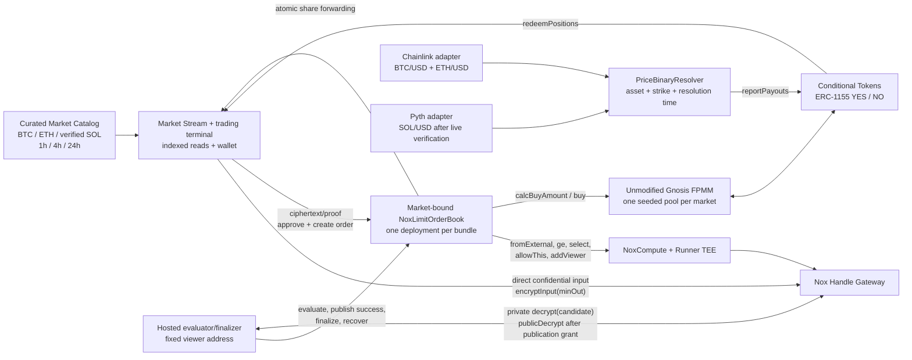
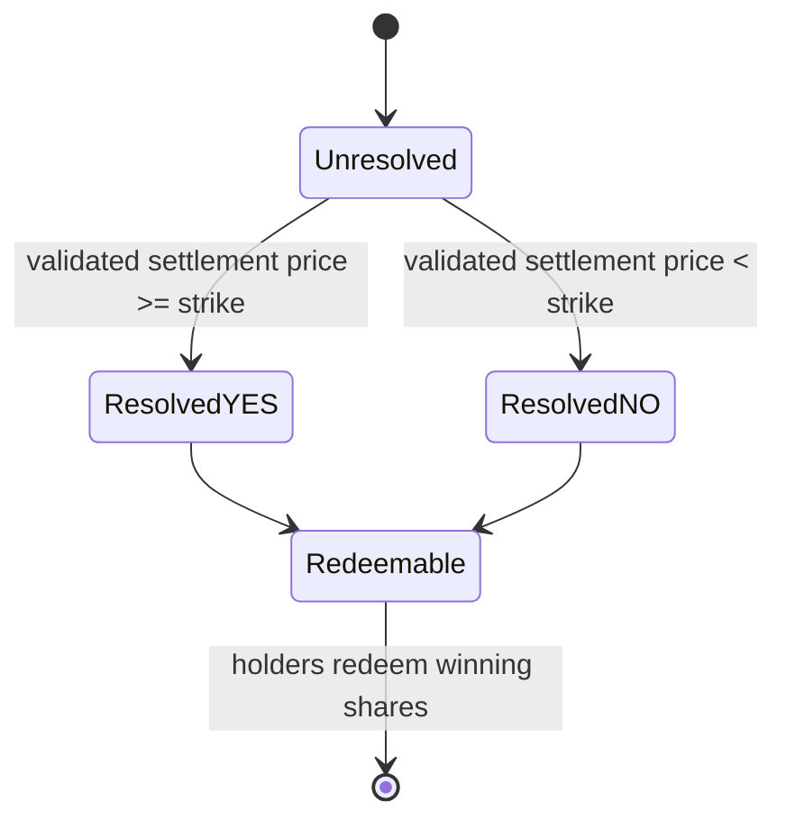

# NoxLimit System Architecture

**Date:** 2026-07-25; revised 2026-07-29 through Phase 6 BTC/ETH horizon activation
**Authority:** Canonical architecture for the selected hackathon direction and bounded critical-path
verification  
**Maturity:** User-approved; bounded Gate C critical path verified (`GO`); polished contracts,
protocol, catalog, service, web, and bounded operator hardening verified; live BTC/ETH deployment,
seven browser-off fills and two generations of paired successor activation committed; one full BTC
browser-resolution/user-redemption/LP-redemption vertical verified; ETH terminally rejected by its
immutable one-hour observation bound; corrected 14,400-second BTC/ETH successors deployed,
verified, seeded, activated together in catalog revision 8, and live-service verified. Four
corrected-route orders and browser-off fills are verified. BTC/ETH 1h and 24h bundles are also
deployed, verified, seeded, and active beside the 4h pair in catalog revision 12; corrected-route
objective settlement, user/builder redemption, public hosting, and submission assets remain pending
**Spike substrate:** Unmodified Gnosis Conditional Tokens + Fixed Product Market Maker on Ethereum
Sepolia

## Decision

NoxLimit is the current product direction:

> A trader escrows a public amount, immutable for that order, for a public `YES` or `NO` outcome
> and leaves a confidential maximum price represented as a minimum-output threshold. Nox compares
> that threshold with a real outcome-share
> pool quote while the order rests. In the honest-worker path, the worker requests public
> decryption only for an eligible nonzero candidate. That request ends the resting privacy phase;
> one replay-safe proof authorization then attempts one real, atomically protected pool buy.

This document consolidates architecture that was already spread across the product hypothesis,
market-reality brief, reassessment, and reaffirmation. The user approved it on 2026-07-28 and
advanced the already-defined bounded Prompt 3 spike. The later executable result verifies that the
live Nox/Gateway/FPMM path passed. The 2026-07-28 refinement adds the user-approved multi-asset
product surface, DeepBook-informed terminal/API patterns, and valid post-gate Opus corrections
without replacing the verified execution topology.

## Executable Spike Status — 2026-07-28

The approved topology executes locally against the released Nox `0.2.4` stack and exact pinned
Gnosis contracts. A clean run passes 8 Nox primitive tests, 8 combined adapter/adversarial tests,
and 8 independent market/math tests. Prompt 3 then reproduced the quiet/withheld inference trace
and mined the combined Nox-authorized FPMM buy on Ethereum Sepolia. The final receipt
`0xbae85703bb59878fa63838e03c1bc57cdcdc46f6e2f74ac701b38fc85d088caa`
passed every terminal postcondition, so the bounded technical verdict is `GO`.

The disposable harness is evidence for primitives and adversarial paths, not the authoritative
product state/timing model. Its enum ordinals and some late-finalize behavior intentionally differ
from `NoxLimitOrderBook`; product APIs therefore use named statuses and derive timing from the
OrderBook's onchain fields.

The independent `DROP` audit is historical evidence, not current workflow authority. The current
authority order is defined in
[`../decisions/AUDIT-GATES.md`](../decisions/AUDIT-GATES.md) and
[`../decisions/CURRENT.md`](../decisions/CURRENT.md).

## Phase 6 Live Product Status — 2026-07-29 settlement and revision-12 reconciliation

The product deployment has advanced beyond local readiness on branch
`codex/noxlimit-polished-product`:

- historical paired cutover commit `c073643` published runtime catalog revision `5` at
  [`../../packages/catalog/sepolia/markets-2026-07-29-btc-eth-4h-rotated.json`](../../packages/catalog/sepolia/markets-2026-07-29-btc-eth-4h-rotated.json),
  catalog hash `0x8aa65b0b5a91025ed1fd0e1487b9c9058b44ca05889632e9f85baf3bb3885899`;
- the original BTC/USD and ETH/USD 4h bundles and their revision-5 successors are now `RETIRED`;
- three committed predecessor-market traces cover real direct-Gateway order creation, browser
  closure, automatic Nox-authorized FPMM fill, and fresh-browser reconstruction;
- the retired BTC predecessor subsequently resolved from its exact adjacent first-observation pair;
  the real browser wallet redeemed the winning YES position, and the builder redeemed its retained
  LP outcome position in transaction
  `0x706c0c6f38518a8cd536eb4b177939a642434979153f5ee9c62f105f186c3f0c`
  at receipt block `11375232`;
- the retired ETH predecessor is terminally unresolvable under its immutable 3,600-second bound:
  the exact first post-deadline observation arrived at `+3,624s`, 24 seconds too late. The selector
  rejected accountlessly before any write; resolver settlement fields and the Conditional Tokens
  payout remain unset, so ETH user and LP positions remain unredeemable;
- both revision-5 successors inherited the same known 3,600-second settlement-liveness risk and
  were retired without settlement after their NoxLimit close;
- corrected BTC market
  `0x37a7b5826c9ba1209470b98cd38a38f4e3e6cb448c353333138bfced7fbaf0a2`
  was deployed, immutable-validated, seeded with 50,000,000 YES / 50,000,000 NO atoms, and staged
  `SUCCESSOR` in catalog revision `6`; corrected ETH market
  `0xa5219adaa2c86c0419cc7d9b05188784192ee023a7c3c27bab3f0cc8eaf8fc8a`
  has the same verified seed and was added as `SUCCESSOR` in revision `7`;
- both corrected resolvers use the enforced 14,400-second bound and started at the shared
  revision-5 close / successor boundary `2026-07-29T13:50:00Z`. Revisions `6` and `7` remain
  immutable staging history and were never served;
- commit `d28f307` publishes the single atomic revision `8` at
  [`../../packages/catalog/sepolia/markets-2026-07-29-btc-eth-4h-corrected-rotated.json`](../../packages/catalog/sepolia/markets-2026-07-29-btc-eth-4h-corrected-rotated.json),
  hash `0x577593192efb7cf139267b3d076eb5e846fd15d1ab080611f9d504b716b4b427`,
  hash-linked to revision `7`
  (`0xe20fc416f695552619d5701ece6b4dd05ad934890387807551237b5fb424dcca`). Its consensus-safe
  activation point is block `11375905`, timestamp `2026-07-29T13:53:36Z`, block hash
  `0x2a37a64bd6e1c86dd4bbb80f67cf803be9f58d93427fc84d26f59861fcbf1c76`;
- the accountless activation operator validated the complete revision `0` through `8` chain and
  emitted no onchain writes. Because revisions `6`/`7` were intentionally never served, runtime
  adoption used a controlled single-writer stop, pointer swap, and one clean startup from revision
  `8`; the ordinary adjacent-revision SIGHUP path remains supported;
- the service reported `READY` on revision `8`; corrected BTC
  `0x37a7b5826c9ba1209470b98cd38a38f4e3e6cb448c353333138bfced7fbaf0a2` and corrected ETH
  `0xa5219adaa2c86c0419cc7d9b05188784192ee023a7c3c27bab3f0cc8eaf8fc8a` remain catalog
  `ACTIVE`. At the `2026-07-29T15:34:12Z` service snapshot, both were ordering-open and dynamically
  `TRADEABLE`. This is timestamped runtime evidence, not a durable lifecycle or public-hosting
  claim;
- the retired revision-5 BTC successor LP was closed in transaction
  `0xe811190d41186d666b5b90b7938edcdd974a1a8c48fad9fa7f18b8ebf9946b4b` at block
  `11375985`; the retired revision-5 ETH successor LP was closed in transaction
  `0xcfd96ad20aec7d2a6f82c30f908cfbb021d62a7118e7a861f0bf9b88a4ed52b5` at block
  `11375990`. Each LP balance is zero and each owner retains 50,000,000 YES plus 50,000,000 NO
  atoms pending objective resolution;
- both corrected OrderBooks now return `nextOrderId = 3`. BTC NO/YES orders `1`/`2` and ETH
  YES/NO orders `1`/`2` were created through the browser, filled by the browser-off worker, and
  confirmed in fresh browsers. Their receipt-verified outcome positions are respectively
  1,941,161, 1,978,831, 1,941,161, and 1,978,831 atoms, with zero matching OrderBook dust. The
  redacted records are [BTC NO](../evidence/2026-07-29-r8-corrected-btc-no-order.json),
  [BTC YES](../evidence/2026-07-29-r8-corrected-btc-yes-order.json),
  [ETH YES](../evidence/2026-07-29-r8-corrected-eth-yes-order.json), and
  [ETH NO](../evidence/2026-07-29-r8-corrected-eth-no-order.json). Objective settlement and
  user/builder redemption remain pending;
- the [horizon strike plan](../evidence/2026-07-29-sepolia-btc-eth-1h-24h-strike-plan.json) and four
  deployment records add BTC 1h
  `0x0c552e5f150ec05e4ef39c4a7913ec4ac0a94b9fe71170538d452d3661e7b7ed`, ETH 1h
  `0x47d1776ad85039be6705753f9aa6879ae7349a617540a3b0a0ef71e2915bee07`, BTC 24h
  `0x5fdb953c06530f97653d665624c576d2303e62a64c5fd40f4ccfa84276a4a4e5`, and ETH 24h
  `0xd171e879c281a1321dd37b9f2085554f155d717307477181fd3c42ac1231edbd`. Every pool independently
  validates 50,000,000 YES, 50,000,000 NO, and 50,000,000 LP atoms;
- sequential catalog revisions `9`, `10`, `11`, and `12` have hashes
  `0x3fdb8c17958a56f89b19b8ab491ba458629d2762c69eacf4ad2b436c92d561f3`,
  `0xe0f239053009afa5c78d21df58cd66cc2200aa93222529d989e231da2c5776bd`,
  `0x855f7b2de0298c831efc8510786d63bdfa062b8996c45fda3ed60037c72fb303`, and
  `0x21083cbce01a121d253ff1114b77c9d12035e596ce89c9ad58411f3e06711a6e` respectively. Current
  revision `12` is
  [`../../packages/catalog/sepolia/markets-2026-07-29-btc-eth-horizons-eth-24h.json`](../../packages/catalog/sepolia/markets-2026-07-29-btc-eth-horizons-eth-24h.json),
  effective at block `11376650` and `2026-07-29T16:27:00Z`. It has ten records—four retired and six
  active—and the service is `READY` on its exact hash. At adoption the new 1h/24h routes correctly
  reported `UPCOMING` before their shared `2026-07-29T17:30:00Z` start;
- the first BTC 1h treasury-collateral top-up reverted out of gas under an exact estimate. The
  [recovery record](../evidence/2026-07-29-sepolia-btc-usd-1h-deployment-recovery.json) preserves the
  failed attempt; explicit attempt-bound `RETRY` succeeded after the
  Hardhat gas multiplier was raised to `1.2`. A runtime-acceptance bug that rejected future
  catalog-`ACTIVE` routes was fixed and covered; r9→r12 then adopted sequentially, with one
  controlled restart to load the fix and adjacent verified adoption thereafter;
- fresh root `pnpm check` passes contracts `84`, protocol `14`, catalog `6`, service `69`, and web
  `62` tests (`235` total), including compile, type-check, test, and build; service/web container
  builds and local smoke checks pass, but no public deployment is verified.

This establishes one complete BTC product vertical, not a paired BTC/ETH completion. Evidence is
[`../evidence/2026-07-29-phase6-btc-resolution-redemption.json`](../evidence/2026-07-29-phase6-btc-resolution-redemption.json),
[`../evidence/2026-07-29-sepolia-btc-usd-4h-liquidity-redemption.json`](../evidence/2026-07-29-sepolia-btc-usd-4h-liquidity-redemption.json),
and
[`../evidence/2026-07-29-sepolia-eth-usd-4h-resolution-policy-rejection.json`](../evidence/2026-07-29-sepolia-eth-usd-4h-resolution-policy-rejection.json).
The corrected deployment state is anchored by
[`../evidence/2026-07-29-sepolia-corrected-successor-strike-plan.json`](../evidence/2026-07-29-sepolia-corrected-successor-strike-plan.json),
[`../evidence/2026-07-29-sepolia-btc-usd-4h-corrected-successor-deployment.json`](../evidence/2026-07-29-sepolia-btc-usd-4h-corrected-successor-deployment.json),
and
[`../evidence/2026-07-29-sepolia-eth-usd-4h-corrected-successor-deployment.json`](../evidence/2026-07-29-sepolia-eth-usd-4h-corrected-successor-deployment.json).
Retired revision-5 liquidity state is recorded in
[`../evidence/2026-07-29-sepolia-btc-usd-4h-successor-liquidity-close.json`](../evidence/2026-07-29-sepolia-btc-usd-4h-successor-liquidity-close.json)
and
[`../evidence/2026-07-29-sepolia-eth-usd-4h-successor-liquidity-close.json`](../evidence/2026-07-29-sepolia-eth-usd-4h-successor-liquidity-close.json).
No later ETH round may be substituted and no rejected observation may be presented as a winner.
Public frontend/service URLs, video, X post, and form/contact fields remain unverified.

## Product Boundary

### First complete product loop

- one hybrid discovery/terminal experience that lists only real deployed and seeded market
  bundles: a vertical Market Stream for fast discovery and a full trading terminal for analysis,
  order review, and durable ownership;
- BTC/USD and ETH/USD markets, plus SOL/USD once its Pyth settlement adapter passes the dedicated
  live test;
- 1-hour, 4-hour, and 24-hour market horizons, with separate user-selected order expiries;
- one public side (`YES` or `NO`) and public variable collateral amount, immutable per order;
- one confidential maximum buy price, represented exactly as `minOutcomeTokensToBuy`;
- browser-off evaluation by a hosted worker under an explicit privacy/check budget;
- real escrow, real FPMM liquidity, real ERC-1155 outcome shares;
- one-wallet onboarding that sponsors measured native Sepolia ETH for gas and supplies clearly
  labeled six-decimal NoxLimit Test USDC as collateral after a short-lived wallet-signed request;
  no automatic replenishment, only an explicit low-balance refill subject to target, cooldown,
  per-refill, and lifetime caps;
- cancel, expiry, refund, objective resolution, positions, and redemption.

### Explicit non-goals

- no permissionless market factory, CLOB, matching engine, or Polymarket routing;
- no two-threshold stop-limit in the first slice;
- no sells, partial fills, hidden side, hidden size, leverage, or LP console;
- no anonymity, FHE, production-mainnet, organic-liquidity, or audit-complete claim.

`tradingClosesAt` is enforced by the market-bound NoxLimit OrderBook, not by the unchanged legacy
FPMM, whose `buy` entry point has no time guard. The curated deployment operation must therefore
stop new NoxLimit actions and remove builder-seeded LP liquidity before objective resolution (or
explicitly expose any residual direct-pool interval as a testnet limitation). Product copy must not
claim that the FPMM bytecode itself closes at that timestamp.

## Component View



The pool and Conditional Tokens contracts remain unmodified. NoxLimit owns only the confidential
order, escrow, authorization, and adapter layer.

The released browser Handle client sends the encoded plaintext input directly to the official Nox
Handle Gateway confidential-input endpoint and receives the encrypted handle/proof. The NoxLimit
application API, database, and analytics must never proxy, log, or persist that initial plaintext;
the worker is not on the order-creation input path. During evaluation, the worker privately learns
zero for an ineligible candidate or the exact derived `minOut` for an eligible candidate and must
not log/persist the latter. The Gateway TEE is part of the disclosed confidentiality boundary;
this is not a claim that the secret never leaves the user's device.

## Public and Confidential Data

| Data | Visibility | Why |
|---|---|---|
| owner, recipient, pool, condition, side | Public | Immutable execution binding |
| collateral token and per-order immutable input amount | Public | Real escrow and pool accounting |
| order expiry, evaluation timing, fill, cancellation | Public | Onchain state transitions |
| encrypted input and derived handles | Public handles, private values | Nox computation inputs/state |
| exact `minOut` value while genuinely resting | Not public; encrypted/TEE-confidential under the Nox trust model | Public metadata may narrow a range; the fixed worker learns the exact value once an eligible candidate is privately decrypted |
| evaluation quote | Public | It comes from the public FPMM |
| worker's private candidate | Worker learns `0` when ineligible; exact `minOut` when eligible | Supports an honest nonzero-only publication policy; the contract still handles a published zero safely |
| candidate after `allowPublicDecryption` | Publicly retrievable before finalization; a nonzero value is the exact `minOut` | Publication ends the resting privacy phase even if the later pool execution fails |
| positions, resolution, redemption | Public | NoxLimit is not an anonymity product |

Each evaluation emits observable activity, including viewer-grant metadata, and its public FPMM
quote is derivable. Under an honest and timely publication assumption, a quiet evaluation is
evidence that `quote < minOut`; worker delay, censorship, or Gateway failure creates the same
result-neutral public event shape, so silence is not deterministic proof of that inequality.
Repeated checks can therefore create only an assumption-dependent bracket while the order rests.
The worker has a stronger view: it learns `quote < minOut` from a zero candidate, and it learns the
exact `minOut` from any eligible candidate even before publication or when it withholds
publication. Once `allowPublicDecryption` is granted, the candidate is publicly retrievable before
proof finalization; a nonzero value exposes the exact `minOut` even if the later pool execution
fails and the order becomes refundable. Product copy must not claim an invisible or perfectly
sealed resting order, and raw receipts must not be called identical—only the result-dependent
public transcript after normalizing order/nonce/handle fields.

## Contract Topology

### `NoxLimitOrderBook`

For each curated market bundle, one contract deliberately combines:

- immutable order registration;
- ERC-20 collateral escrow;
- encrypted-threshold ingestion and persistence;
- evaluation lifecycle and cadence;
- candidate-handle binding;
- public-proof validation and replay protection;
- the FPMM adapter;
- ERC-1155 receiver support;
- cancellation, expiry, and refunds.

This is the smallest topology that keeps asset and authorization invariants inspectable. One
OrderBook still serves only one market; the product obtains breadth by composing several identical,
independently bound deployments through a catalog. A generalized multi-market custody contract
would increase cross-contract ACL, approval, and custody risk without improving the user path.

Each deployment is deliberately single-market. Its constructor hard-binds and validates the curated
FPMM, Conditional Tokens contract, collateral token, condition, outcome count, position IDs, and
market trading-close time.
Order creation accepts only `YES` or `NO` for that deployment; a user cannot supply an arbitrary
pool or collateral target. A versioned catalog/read model maps an asset and horizon to complete
deployed bundles. It lists a bundle only after resolver, condition, seeded FPMM, and OrderBook
addresses are all verified. The catalog is not a permissionless market factory and never overrides
the contracts as source of truth.

The first catalog keeps liquidity concentrated with one active near-the-money bundle per tracked
asset/horizon. `1h`, `4h`, and `24h` describe the original market windows; each bundle also exposes
its live remaining close/resolution countdown. A deterministic, resolver-first successor is
verified before the active bundle closes, then activated through the versioned catalog. Resolved
bundles remain readable history rather than being overwritten.

Logical `marketId`/Conditional Tokens `questionId` values are deterministic hashes of stable market
content—chain, tracked asset/feed, strike, trading close, resolution time, collateral, and resolver
policy—not deployment wall-clock time. Each deployed instance is versioned by its `conditionId`.
Each immutable market record exposes all addresses, resolver/feed provenance, configuration,
check/recovery policy, deployment evidence, and verification result. A separate hash-linked catalog
revision routes exactly one `ACTIVE` market per asset/horizon and may label verified replacements
`SUCCESSOR` or historical bundles `RETIRED`; activation never rewrites the immutable record. The
read model keeps immutable verification, catalog activation, objective lifecycle, dynamic
tradeability, and derived badges as separate facts. Cross-market order identity is the composite
`(chainId, orderBook, orderId)`, because numeric `orderId` is local to one OrderBook.

Catalog adoption is atomic at runtime. For one direct hash-linked successor, an operator publishes
the next immutable manifest revision and invokes a non-public reload command. The service validates
the hash chain, one-active invariant, all new immutable records, activation times/blocks, bindings,
seeding, and successor cutover; it then completes the new OrderBook recovery replay before swapping
one in-memory catalog pointer. Failure preserves the previous still-valid revision. When immutable
staging revisions are deliberately skipped and must never be served, the single writer instead
stops and restarts from the final reviewed manifest; after the predecessor's close boundary a failed
start remains fail-closed rather than reviving the closed catalog. The web consumes the service's
`catalogRevision` rather than bundling an independently mutable copy.

The Sepolia deployment operator implements that resolver-first topology through a durable,
plan-bound journal created before the first transaction. A fresh journal freezes the exact plan
hash, operator, chain, catalog/evidence output paths, ordered expected steps, and funding plan. A
cross-process lock prevents two operators from advancing the same journal. Each transaction moves
through `INTENT → SUBMITTED → CONFIRMED`; confirmed and pending/successful submitted work resumes
without replacement. A `SUBMITTED` step can enter a new attempt only under explicit attempt-bound
`RETRY` after the runner verifies the exact persisted receipt is reverted at the configured
confirmation depth and that its sender is the bound operator; the failed receipt is preserved in
the journal before one new intent is created. Pending, successful, mismatched, or stale-attempt
cases fail closed without submitting. A crash leaving only `INTENT` still requires explicit
attempt-bound `ADOPT` with the exact transaction hash or `RETRY`. The journal rejects secret-bearing
JSON and undeclared/out-of-order steps. It stages and hash-verifies final evidence/catalog payloads
before publishing create-only outputs, then safely detects and resumes a crash between either
output.

Operator market inputs are canonical rather than prose-equivalent: the interval from `startsAt` to
`resolvesAt` must equal the declared `1h`, `4h`, or `24h` duration exactly, and the question must
equal the canonical asset/strike/resolution-UTC string. A later bundle may reuse the shared
six-decimal Test USDC only after verifying its code, metadata, and operator issuer. The operator
mints exactly the computed shortfall needed to reach the frozen pool-seed and funding-treasury
targets; it never blindly remints a full allowance.

The FPMM buy and share forwarding execute inside a restricted external self-call such as
`executeAndForward`. The outer finalizer calls it with `try/catch`:

- success persists `Filled`;
- any pool, receiver, or forwarding revert rolls back the nested trade and lets the outer call
  persist `DisclosedRefundable`.

Without this boundary, a plain revert would also erase the disclosed/refundable state and falsely
present an already-published threshold as confidential-pending again.

`FPMM.buy` returns no share amount. The self-call therefore snapshots the adapter's bound position
balance before and after the buy and forwards only the positive delta for this execution. Its
ERC-1155 callback accepts only the bound Conditional Tokens contract, expected FPMM operator,
expected position ID, and active execution context. Pre-existing dust is never swept into a later
order.

The polished OrderBook adds immutable `tradingClosesAt` and enforces it independently of the UI and
catalog. `createOrder` requires `expiresAt <= tradingClosesAt`; evaluation, publication, and
nonzero finalization must occur before both order expiry and market close. A proof arriving after
either boundary moves disclosed escrow to `DisclosedRefundable` without trading. This prevents a
direct caller from creating or executing an order after the market stops trading or has resolved.

### `PriceBinaryResolver` and settlement adapters

Every resolver binds one condition to:

- a tracked asset and immutable settlement-price adapter;
- a strike;
- a trading-close time and resolution time;
- one terminal payout vector.

The deployment order is mandatory because the resolver address participates in the Conditional
Tokens condition identity:

1. deploy and validate the settlement adapter and resolver;
2. prepare the Conditional Tokens condition with that resolver;
3. deploy and seed the bound FPMM;
4. deploy the OrderBook bound to the complete market;
5. verify addresses and invariants, then register the bundle in the catalog.

BTC/USD and ETH/USD initially use official Ethereum Sepolia Chainlink feeds through a round
adapter. Resolution must use a positive, complete observation selected by the declared rule at or
immediately after the market's resolution time, rejecting invalid, stale, or earlier data.
Round selection must account for Chainlink phase boundaries and current aggregator guidance; it
must not rely on the deprecated `answeredInRound` check.

The Chainlink adapter must prove that the selected observation is the **first chronological feed
observation at or after** `resolvesAt`: the selected observation has `updatedAt >= resolvesAt`, its
verified adjacent predecessor has `updatedAt < resolvesAt`, and the pair is adjacent under the
proxy's phase-aware round scheme. Merely accepting any valid later round is caller-cherry-pickable
and forbidden. If adjacency across a phase transition cannot be verified, settlement must stop
rather than guess.

The delay bound is a separate liveness policy, not a license to select a later observation. Live
Sepolia evidence showed that BTC/USD and ETH/USD proxy observations commonly arrive slightly more
than one hour apart: the retired ETH predecessor's unique first observation arrived after 3,624
seconds and permanently exceeded its immutable 3,600-second bound. For every future official
Sepolia BTC/USD or ETH/USD deployment, the operator therefore enforces
`maximumObservationDelaySeconds >= 14,400`. The four-hour minimum tolerates ordinary cadence jitter
and two missed roughly-hourly reports while the adjacency proof still identifies exactly one
chronological observation. The public quote-freshness policy remains separately 3,600 seconds; it
must not be widened merely because the settlement-liveness bound is wider. Existing deployed
resolvers cannot be repaired in place because the bound participates in immutable market identity.
The corrected BTC/ETH deployments demonstrate this replacement rule: each is a distinct
resolver-first market identity with a 14,400-second bound and verified 50,000,000-atom complete-set
seed. Their shared `startsAt = 2026-07-29T13:50:00Z` matched the close of both revision-5 routes;
revision `8` then activated both corrected identities together after the consensus-safe boundary.

SOL/USD uses a Pyth historical-price adapter only after a dedicated live test proves the exact
update-verification, publish-time window, fee, decimals/exponent normalization, and one-shot
settlement path. The Hermes “first update at or after timestamp” response alone is not an onchain
uniqueness proof; the adapter's accepted-window rule and operator assumptions must be explicit.

Every adapter must normalize to a common signed price/decimals interface. A manually chosen payout
proves plumbing only and cannot support the no-mock claim.

### Hosted worker

The TypeScript worker:

- monitors open orders and permitted evaluation times;
- evaluates once after creation, then on a material public quote change or a conservative heartbeat,
  subject to the onchain minimum interval and remaining check budget;
- submits evaluation transactions;
- privately decrypts only the stored candidate for its fixed viewer key;
- takes no result-specific onchain action when the candidate is zero; a fixed, result-neutral
  evaluation timeout returns the order to its open storage state, while the consumed nonce/check
  remains spent;
- is the only account allowed to request irreversible candidate publication and should do so only
  after privately observing a nonzero candidate;
- may obtain the public proof and call finalization, while finalization itself remains permissionless
  so another account can rescue an abandoned publication;
- deduplicates receipts, tolerates reorgs/retries, and pays its own gas.

The check count is a deliberate privacy budget because every observable evaluation can narrow the
threshold range. The worker and UI expose the exact remaining checks. An order with no remaining
checks is `MonitoringExhausted` at the product/read-model layer even if the legacy storage enum is
still `Open`; it is never described as actively monitored. The owner can cancel/refund and replace
it with a new order and a fresh deployment-policy budget. Internal evaluation and publication recovery windows are
configured independently from live service measurements; the disposable runner's 45-second value
is not product configuration or an SLA.

The worker can delay or censor. Because the contract cannot know the candidate plaintext before a
proof is submitted, a malicious or mistaken worker can also request publication for a zero
candidate, force public evaluation-result disclosure, and—if no permissionless finalizer rescues
the order before timeout—force a terminal refundable state. It cannot change an order, withdraw
collateral, redirect outcome shares, weaken `minOut`, make a zero candidate trade, or prevent a
third party from finalizing after publication. This is an explicit liveness/privacy trust boundary,
not an asset-custody permission.

## Order Record

The exact Solidity layout is a spike decision, but every order must bind at least:

| Field | Purpose |
|---|---|
| `orderId`, `owner`, `recipient` | Identity and immutable asset destination |
| `outcomeIndex` | `YES` or `NO` in the deployment-bound curated pool |
| `amountIn` | Public variable input, immutable for this order, and its fixed-input quote |
| `expiresAt` | This order's monitoring/liveness boundary; contract-enforced at or before immutable `tradingClosesAt` |
| `encryptedMinOut` | Persistent confidential limit handle |
| `evaluationNonce`, `candidateHandle` | Bind one active, nonce-distinct evaluation |
| `evaluationCount` plus deployment `maximumEvaluations` | Enforce and expose the order's inherited privacy/check budget |
| `lastEvaluationAt`, `phaseTimeoutAt` | Enforce cadence and neutral evaluation/publication recovery windows |
| `status` | Prevent races and double-spends |

Global guards must reject reused encrypted-input handles and consumed
`(candidateHandle, plaintextResult)` pairs. Finalization loads the candidate from storage; callers
never supply an arbitrary handle. Candidate handles must differ across evaluation nonces even when
the private threshold and integer FPMM quote are identical, because public ACL grants and Gateway
proofs bind to a handle and plaintext, not to an application order or nonce.

## Price-to-`minOut` Conversion

The user enters a private maximum fee-inclusive average price, but Nox and FPMM compare integer
outcome-share amounts. With `PRICE_SCALE = 1e18`:

`minOut = ceilDiv(amountIn × PRICE_SCALE, maxAveragePriceWad)`

`amountIn` is the gross collateral input, so the resulting bound includes the pool fee. FPMM's
`calcBuyAmount` returns the net shares after that fee. The frontend uses one audited overflow-safe
integer helper shared with contract tests; it never uses floating-point math. The spike must test
rounding, collateral decimals, exact-boundary quotes, tiny inputs, extreme reserves, and the
property that any successful fill's fee-inclusive average price is no worse than the private
maximum.

## Order Creation and Evaluation

```mermaid
sequenceDiagram
    autonumber
    actor T as Trader
    participant UI as Web app
    participant O as NoxLimitOrderBook
    participant F as FPMM
    participant N as Nox
    participant W as Hosted worker
    participant G as Handle Gateway

    T->>UI: Choose side, public amount, private max price, order expiry
    UI->>UI: Convert max price to exact minOut
    UI->>G: encryptInput(minOut, owner, app)
    T->>O: approve collateral + createOrder(ciphertext, proof, immutable fields)
    O->>O: require order expiry <= immutable market close
    O->>O: escrow; fromExternal; allowThis; reject reused input handle

    W->>O: requestEvaluation(orderId)
    O->>F: calcBuyAmount(amountIn, outcomeIndex)
    F-->>O: public fixed-input quote
    O->>N: freshZero = sub(public nonce, same public nonce)
    O->>N: evaluationMinOut = add(encryptedMinOut, freshZero)
    O->>N: eligible = quote >= evaluationMinOut
    O->>N: candidate = select(eligible, evaluationMinOut, 0)
    O->>O: persist candidate under orderId + nonce; grant fixed worker viewer

    W->>G: decrypt(candidate) as viewer
    alt candidate is zero
        G-->>W: 0 privately
        W-->>W: Take no result-specific onchain action
        Note over O,W: Result-neutral timeout ends this attempt; next request increments nonce
    else candidate is nonzero
        G-->>W: minOut privately
        W->>O: requestSuccessPublication(orderId, nonce)
        O->>N: allowPublicDecryption(stored candidate)
        W->>G: handleClient.publicDecrypt(stored candidate)
        G-->>W: minOut + proof
        W->>O: finalize(orderId, nonce, proof); any caller may rescue
        O->>O: minOut = publicDecrypt(stored candidate, proof)
        O->>O: reject/recover zero; consume nonzero candidate; bind state
        O->>F: buy(amountIn, outcomeIndex, minOut)
        F-->>O: ERC-1155 callback; no return value
        O->>O: compute bound-position balance delta
        O->>T: forward only this execution's delta
    end
```

The contract permits only one active evaluation nonce. Each evaluation creates a nonce-distinct,
value-preserving `evaluationMinOut` by adding a fresh encrypted zero derived from the public nonce.
The proposed v0.2.4 construction is
`freshZero = Nox.sub(Nox.toEuint256(nonce), Nox.toEuint256(nonce))`, followed by
`evaluationMinOut = Nox.add(encryptedMinOut, freshZero)`. The released local stack now proves that
identical threshold/quote pairs produce distinct candidates, ACLs do not bleed between nonces, and
an old proof fails for a new nonce. The live run also produced four distinct candidates, kept the
three earlier/withheld candidates non-public, and rejected the successful proof against an earlier
handle.

A contract-enforced minimum interval and bounded evaluation count limit worker probing; they do not
eliminate metadata inference. The product scheduler checks after creation, on material public quote
movement, or on a conservative heartbeat rather than spending checks in a tight polling loop. After
a result-neutral evaluation timeout, anyone can end the active attempt and return the stored status
to `Open`. The current nonce is consumed but not incremented by the timeout; the next successful
`requestEvaluation` increments it and creates the next nonce-distinct candidate. The stale attempt
can never be published or finalized from the now-incompatible status. The timeout path is identical
whether the worker saw zero, failed, or disappeared, so no zero-specific transaction is emitted. A
timed-out attempt still counts against the explicit check budget because its public metadata has
already occurred.

## State Model

Order execution and market settlement are separate state machines.

```mermaid
stateDiagram-v2
    [*] --> Open: escrow + encrypted limit stored
    Open --> Evaluating: request evaluation
    Evaluating --> Open: result-neutral timeout; checks remain
    Evaluating --> MonitoringExhausted: result-neutral timeout; no checks remain
    Open --> MonitoringExhausted: remaining checks = 0
    Evaluating --> PublicationPending: fixed worker requests irreversible publication
    PublicationPending --> Open: valid public proof = 0; checks remain
    PublicationPending --> MonitoringExhausted: valid public proof = 0; no checks remain
    PublicationPending --> Executing: any caller submits valid nonzero proof
    PublicationPending --> DisclosedRefundable: publication timeout / order expiry
    Executing --> Filled: pool buy + forwarding succeeds
    Executing --> DisclosedRefundable: nested execution reverts

    Open --> Cancelled: owner cancels
    MonitoringExhausted --> Cancelled: owner cancels/replaces
    Evaluating --> Cancelled: owner cancels; nonce invalidated
    Open --> Expired: expiry reached
    Evaluating --> Expired: expiry reached; nonce invalidated

    Cancelled --> Refunded: owner claims escrow
    Expired --> Refunded: owner claims escrow
    DisclosedRefundable --> Refunded: owner claims escrow

    Filled --> [*]
    Refunded --> [*]
```





Cancellation or expiry makes every outstanding attempt non-actionable before refundability. Once
public decryption has been granted, the owner cannot cancel or abandon the order: that would create
a post-disclosure free option. Only successful finalization, publication/order timeout, a valid
zero recovery, or nested execution failure advances it. A later proof for a terminal nonce cannot
revive the order. `MonitoringExhausted` is a truthful derived product state until the contract enum is
extended; it is computed only when status is `Open`, no evaluation is active, and the remaining
budget is zero.

`ExpiryReady` is another derived product/API state, not a Solidity ordinal. It applies when an
otherwise expirable `Open`/`Evaluating` order has reached `expiresAt` or `tradingClosesAt` but the
permissionless expiry-advance transaction has not yet confirmed. The UI exposes `Expire order` in
that state; only confirmed `Expired` exposes `Claim refund`. A `PublicationPending` order that
reaches either boundary follows the disclosed-refundable recovery path instead.

## Finalization Invariants

Before any external trade, finalization validates the proof. A valid zero proof—possible if a
malicious or mistaken worker publishes an ineligible candidate—ends that attempt and safely returns
storage to `Open` without moving assets because nonce-distinct candidate handles and ACL isolation
now execute locally on the released stack. If the check budget is now zero, the product state is
immediately `MonitoringExhausted`; a new evaluation cannot be requested. A publication timeout
instead routes to `DisclosedRefundable`; neither path may merely revert and strand the order in
`PublicationPending`.

Finalization is permissionless and accepts only `(orderId, evaluationNonce, decryptionProof)`. It
loads the stored candidate and obtains the sole plaintext source with the released v0.2.4 typed
wrapper `Nox.publicDecrypt(storedCandidate, decryptionProof)`, which internally calls
`INoxCompute.validateDecryptionProof`. Offchain,
`handleClient.publicDecrypt(storedCandidate)` retrieves the value and proof after publication. A
caller cannot separately supply `minOut`. Prompt 3 now compiles and executes this exact typed
wrapper in both the harness and the real OrderBook path.

For a nonzero result:

1. order is `PublicationPending`;
2. caller's nonce equals the one active stored nonce;
3. order has not expired or been cancelled;
4. the immutable market trading-close time has not passed;
5. the proof validates the stored candidate and returns the plaintext;
6. plaintext is nonzero after the zero-recovery branch;
7. candidate/result has not been consumed globally;
8. recipient, curated pool, side, amount, and collateral come from bound state/deployment
   immutables, while `minOut` comes only from the validated stored-candidate proof;
9. state and replay guards are consumed before the external self-call.

The restricted self-call then:

1. approves only the exact collateral amount to the bound pool;
2. calls unmodified
   `FPMM.buy(amountIn, outcomeIndex, minOut)`;
3. relies on FPMM's current-reserve recalculation and atomic minimum-output check;
4. validates the ERC-1155 callback against the active execution context;
5. computes the bound-position pre/post balance delta because FPMM returns no amount;
6. forwards only that delta to the immutable recipient;
7. returns success to the outer finalizer.

The fixed worker never receives token approval.

## Replay, Race, and Failure Rules

- Reject an encrypted input handle already assigned to any order.
- Reject any order target outside the deployment-bound pool, Conditional Tokens contract,
  collateral, condition, outcome count, and position IDs.
- Store and load candidate handles by `(orderId, evaluationNonce)`.
- Make `candidateOf` status-aware: return an actionable handle only for the active nonce in an
  evaluation/publication-compatible status; stale, cancelled, expired, filled, or refunded
  candidates must not appear actionable.
- Expose `remainingEvaluations(orderId)` and derive `MonitoringExhausted` instead of leaving a
  zero-budget order visibly `Open`.
- Make the confidential evaluation graph nonce-distinct and reject any candidate handle already
  assigned to another evaluation; verify identical-quote recurrence on the live release.
- Reject caller-selected handles, non-current nonces, expired orders, and terminal states; handle a
  validated zero without trading and invalidate its nonce.
- Reject order creation with `expiresAt > tradingClosesAt`, and reject evaluation, publication, or
  trade after the immutable market close even when called directly without the frontend/catalog.
- Consume candidate/result globally before the external action.
- Use checks-effects-interactions plus a reentrancy guard around the outer asset transition.
- Validate the callback source/operator/position/amount and forward only a per-execution balance
  delta, never the adapter's pre-existing balance.
- Let a nested pool/forward failure roll back the nested asset movement while the outer call records
  `DisclosedRefundable`.
- Forbid owner cancellation/abandonment from `PublicationPending`; after disclosure is requested,
  only valid proof finalization, publication/order timeout, zero recovery, or nested execution
  failure may advance the state.
- Let publication timeout or order expiry make disclosed escrow refundable; never leave
  `PublicationPending` dependent on the worker forever.
- Let cancellation win by invalidating the nonce before making funds refundable.
- Treat a successful fill as terminal; retries must observe the receipt/state and stop.

## Hackathon Gate Versus Production Hardening

### Passed by Prompt 3 before the polished build

The following bounded technical gates passed locally and, where service integration matters, on
live Ethereum Sepolia:

- released Nox private-viewer and success-publication path works live;
- false evaluation needs no explicit public proof;
- repeated checks and a delayed-eligible control establish the honest public-inference boundary;
- nonce-distinct candidates prevent proof or irreversible-ACL bleed across evaluations;
- one real FPMM buy occurs through the actual adapter on Ethereum Sepolia;
- successful-bound `minOut`, immutable binding, share forwarding, and replay rejection work live;
  adverse-bound rollback, cancel, expiry, and refund work in the local adversarial suite;
- real outcome shares reach the immutable recipient;
- no mock quote, share, proof, or execution is used in the bounded Gate C trace.

### Polished workspace and live Phase 6 evidence — 2026-07-29

- the hardened market-bound OrderBook, objective Chainlink resolver, six-decimal collateral, and
  bounded funding treasury are implemented; the current contract suite passes `84` tests;
- the shared protocol and catalog packages pass `14` and `6` tests respectively, including
  JSON-safe types, independent disclosure provenance, deterministic catalog validation, and
  unsigned transaction builders;
- the Fastify service passes `69` tests covering chain projections, restart/recovery, worker,
  funding, read APIs, phase-aware history, and atomic verified catalog adoption; the exercised
  Phase 6 service reported `READY` on revision `8`;
- the responsive Next application passes `62` web tests. The fresh dedicated Playwright snapshot
  records `45` passing journeys, `21` intentional project/viewport skips, and zero failures,
  including direct Gateway privacy, funding, and reload-safe exact-hash transaction locks; rerun it
  at the submission commit;
- the bounded operator path passes its journal, exact-horizon/question, external binding,
  shared-collateral shortfall, and create-only output regression coverage;
- the operator used that path to publish verified BTC/ETH bundles, three predecessor browser-off real fills,
  two predecessor LP-close artifacts, and atomic paired successor activation at `c073643`;
- the retired BTC predecessor then completed objective browser resolution, winning-user redemption,
  and builder-LP redemption with durable receipts and exact position/collateral deltas;
- the retired ETH predecessor produced a durable terminal policy-rejection artifact: the unique
  first observation was 24 seconds late, no write occurred, no payout vector exists, and the ETH
  positions remain unredeemable;
- future official Sepolia BTC/ETH deployments now fail configuration below a 14,400-second
  observation-delay minimum; the retired revision-5 successors predated that guard and retain
  their known 3,600-second historical risk;
- corrected BTC/ETH successors now pass that floor, immutable binding validation, and real
  50,000,000 YES / 50,000,000 NO seeding. Revision `8` activates both atomically; revisions `6`
  and `7` remain unserved staging history. The live service accepted revision `8` and, at the
  `2026-07-29T15:34:12Z` snapshot, reported both corrected markets ordering-open and `TRADEABLE`;
- revision `8` hash-links revision `7`, uses consensus-safe activation block `11375905`, and was
  published at commit `d28f307`. The accountless operator validated revisions `0`–`8` without an
  onchain write; runtime adoption intentionally used stop → pointer swap → single clean startup
  because the two staging revisions were skipped. Adjacent-revision SIGHUP adoption remains the
  ordinary supported path;
- verified BTC/ETH 1h and 24h bundles extend the immutable chain through revisions `9`–`12`.
  Current revision `12` has ten records—four retired and six active—covering BTC/ETH 1h/4h/24h.
  Its hash is `0x21083cbce01a121d253ff1114b77c9d12035e596ce89c9ad58411f3e06711a6e`, and the service is
  `READY` on that exact revision. The new routes were honestly `UPCOMING` before their shared start;
- both retired revision-5 LP balances are zero after confirmed close transactions, with each LP
  owner retaining 50,000,000 YES and 50,000,000 NO atoms while the conditions remain unresolved;
- reproducible service and web container builds plus local smoke checks pass; this remains local
  release evidence, not a public-hosting claim;
- the six local `Complement` HTML files are the durable design source; their sample data is not
  loaded as live product state.

These results establish one full BTC create-to-redeem journey and an honest ETH liveness failure,
not a paired successful journey or a public hosted release. The historical Prompt 3 Gate C trace
remains valid evidence and is not reclassified as the final product bundle.

### Still required for the live product and submission gate

- preserve the complete BTC proof and the ETH terminal rejection; do not poll, resolve, or invent a
  payout for the retired ETH condition and do not substitute a later favorable round;
- preserve revision `12` as the only current routing manifest; do not serve the historical
  revisions `6`/`7`, roll back to revision `8`, reopen the retired revision-5 pools, or claim the
  retained unresolved outcome positions are redeemed;
- preserve the four real corrected-route order → browser-off Nox fill records, then complete
  objective resolution, winning-user redemption, and builder-LP redemption. Order/fill is proven;
  neither corrected route is a complete vertical until the settlement/redemption evidence exists;
- preserve the completed BTC/ETH 1h and 24h breadth deployment and sequential r9→r12 adoption;
- keep SOL absent until its separate Pyth live gate passes;
- after explicit user cost/provider authorization, provision and verify durable public web/service
  hosting. The proposed Cloud Run topology is billable; do not create resources from build
  authorization alone. Then publish final deployment evidence, limitations, privacy boundary,
  video, X post, and organizer form/contact fields.

### Important after the hackathon, not a pre-build veto

- professional audit and formal verification;
- production mainnet migration;
- decentralized/multiple workers;
- organic liquidity and production manipulation economics;
- latency SLA/P95 guarantees;
- sells, partial fills, permissionless market creation, and richer order types.

## Market Stream and DeepBook-Informed Product Surface

DeepBook V3 Spot supplies the terminal grammar; DeepBook Predict supplies useful catalog,
quote/position, and unsigned-transaction API patterns. A TikTok-like vertical stream supplies the
mobile discovery grammar: one real market at a time, snap-scroll focus, and immediate YES/NO entry.
Neither reference supplies NoxLimit's execution mechanic. The product therefore uses a hybrid,
not a feed-only or terminal-only layout.

Mobile:

```text
DISCOVER / MARKET STREAM
one real market card per snap
question + asset/horizon + close countdown
oracle vs strike + YES/NO prices + liquidity + truthful chart preview
→ Open market / Trade YES / Trade NO
→ full-context Trade workspace with chart, terms, quote, ticket, and review
```

Desktop:

```text
┌──────────────┬────────────────────────────────────┬───────────────────────┐
│ Market Stream│ Selected market                    │ Private order ticket  │
│ scroll cards │ Oracle + YES/NO price history      │ Side: YES / NO        │
│ BTC/ETH/SOL  │ Liquidity + AMM quote ladder       │ Public amount         │
│ 1h/4h/24h    │ Public fills/activity              │ Private maximum price │
│ close/status │                                    │ Order expiry + submit │
├──────────────┴────────────────────────────────────┴───────────────────────┤
│ My Orders                 │ Positions                 │ Activity            │
└──────────────────────────────────────────────────────────────────────────┘
```

The TikTok analogy is limited to discovery interaction. The first release has no personalized
ranking, likes/comments, autoplay media, fake popularity, or one-tap execution. Live cards come
only from verified deployed/seeded catalog entries and sort through visible deterministic controls
for `Closing soon`, `Recently opened`, or `Liquidity`; asset, horizon, and lifecycle remain filters.
The three comparators use close time ascending, open time descending, or numeric
`completeSetDepthAtoms` descending respectively, then `marketId` ascending. The initial expected depth is BTC/USD and ETH/USD
across three horizons—up to six live cards—plus SOL only after its resolver gate. Resolved or
resolving bundles remain in explicit history/lifecycle views.

The catalog exposes `opensAt` and `opensAtBlock` as the effective time/block of the first valid
revision that routes the market `ACTIVE`, never deployment wall-clock time; those values remain
stable in later revisions. All sorts use stable `marketId` tie-breaking. Prices, liquidity,
freshness, and countdowns update inside a card without moving the focused card. A deliberate
filter, sort, or refresh action applies any changed ranking.

On mobile, `Trade YES` or `Trade NO` preselects market and side in a full-height Trade workspace,
not a bare ticket. That view retains the full question, oracle-versus-outcome distinction,
size-aware quote, liquidity and terms, and an expandable full chart before review and the
Gateway/wallet sequence. On desktop, deliberate stream-card selection updates the center workspace.
Public fields may remain in volatile per-market state, but switching a dirty market requires
confirmation and then clears the private maximum; mobile dismiss/back/swipe has the same
keep-editing/discard behavior. The private value is never persisted. The full-size chart remains
the central analytical surface even though each stream card may include a compact truthful preview.

The central liquidity view is computed from real `calcBuyAmount` calls for several public input
sizes and may display average execution price and price impact. It is not an order book. Private
resting orders never appear as bids, asks, or public depth; only completed fills appear on the
public activity tape.

The typed client surface is deliberately small. These examples show JSON-safe wire types; domain
adapters validate decimal strings and convert them to `bigint` without floating point:

```ts
type OrderRef = { chainId: number; orderBook: Address; orderId: string }
type MarketListQuery = {
  asset?: "BTC/USD" | "ETH/USD" | "SOL/USD"
  horizon?: "1h" | "4h" | "24h"
  lifecycle?: "LIVE" | "RESOLVING" | "RESOLVED"
  sort: "CLOSING_SOON" | "RECENTLY_OPENED" | "LIQUIDITY"
  limit?: number
  cursor?: string
  snapshot?: string
}
type MarketListPage = {
  catalogRevision: string
  snapshot: string
  items: MarketStreamCardView[]
  nextCursor?: string
}

markets.list(query: MarketListQuery): Promise<MarketListPage>
markets.get(marketId)
markets.history({ marketId, mode, range, sampling, cursor })
markets.quote({ marketId, side, amount })
orders.preparePrivateLimit({ marketId, side, amount, maxPrice, expiresAt, clientRequestId })
orders.get(orderRef)
orders.list(address)
orders.cancel(orderRef)
orders.expire(orderRef)
orders.refund(orderRef)
positions.list(address)
positions.redeem(positionId)
```

`CLOSING_SOON` sorts by `tradingClosesAt ASC`; `RECENTLY_OPENED` by `opensAt DESC`; and
`LIQUIDITY` by numeric `completeSetDepthAtoms DESC`. Every comparator ends with `marketId ASC`.
Asset, horizon, and lifecycle are filters. Card YES/NO reference prices are the fee-inclusive
average prices returned by `calcBuyAmount` for exactly `1.000000 Test USDC` input.
`completeSetDepthAtoms` is the numeric minimum of the pool's YES and NO reserves in six-decimal
complete-set units. Market-list snapshots freeze the ordering while live values update in place.

Public catalog/history reads may use a cached indexer or backend-for-frontend. Wallet-scoped reads
remain address-bound. The final quote, threshold conversion, direct browser-to-Gateway
confidential-input request, and transaction build are refreshed at the trust boundary; the wallet
signs the write. The NoxLimit backend never receives the plaintext maximum price, while the
official Gateway TEE necessarily does under the released Handle protocol. Evaluator
decrypt/publication operations are internal worker capabilities and are not exposed as public
trading tools.

`clientRequestId` is a caller correlation/idempotency key for building and tracking a proposal; it
does not replace the onchain composite identity `(chainId, orderBook, orderId)`. Public API statuses
are named strings, not Solidity enum ordinals, because the disposable harness and product
OrderBook intentionally have different enums and late-finalize behavior. The product must not show
synthetic order-book midpoint, OHLC, or volume data unless it is derived and labeled from real
oracle/pool/trade history.

### User flow

1. Browse the deterministic Market Stream, optionally filter by asset/horizon/lifecycle, and choose
   one deployed/seeded bundle. Mobile uses vertical one-market-at-a-time discovery; desktop uses the
   stream as the terminal rail.
2. Inspect its question, strike, trading close, resolution time, oracle price, YES/NO pool prices,
   liquidity, and real-size quote ladder.
3. Choose YES or NO, public amount, private maximum average price, and order expiry.
4. Refresh the exact pool quote, derive integer `minOut`, send it directly from the browser through
   the released Handle client to the official Nox Gateway, then approve collateral and sign order
   creation with the returned encrypted input/proof.
5. Close the browser if desired. The worker evaluates under the visible check budget; the indexer
   and chain reconstruct `Resting`, `Evaluating`, `Publication pending`, `Filled`,
   `Monitoring exhausted`, `Expiry ready`, `Expired`, or `Refundable` state.
6. An eligible order publishes and executes one atomically protected FPMM buy. Outcome shares go
   directly to the immutable recipient. An ineligible order remains resting until another allowed
   check, cancellation, expiry, or budget exhaustion.
7. A cancelled, expired, or disclosed-refundable order exposes the separate refund transaction;
   the client never treats cancellation alone as returning collateral.
8. After objective resolution, the holder redeems the winning shares from `Positions`.

Market horizon and order expiry are intentionally separate. “BTC,” “ETH,” and “SOL” identify the
oracle-tracked asset; all contracts, pools, orders, and outcome shares execute on Ethereum Sepolia.

## Performance and Product Experience

One observed Nox resolution around 12 seconds proves asynchronous behavior, not a distribution.
The UI must therefore be durable and explicit:

- order submission confirms immediately;
- evaluation, publication, and fill are separately visible pending states;
- recovery countdowns derive from onchain timestamps, show whether a retry consumes a remaining
  check, and distinguish retryable evaluation from irreversible publication;
- closing and reopening the browser reconstructs state from chain/worker receipts;
- retries are idempotent;
- “try in 30 seconds” means understanding and entering the loop without local setup, faucet hunting,
  or a second wallet—not a guaranteed Nox fill latency. This is the normal first-use experience for
  every user, not a separate reduced evaluation route.

The central terminal chart is a first-class product surface: one real underlying-oracle view with
strike/close/resolution markers, one real YES/NO outcome-price history reconstructed from pool
state/completed fills, and a size-aware `calcBuyAmount` quote ladder. The chart library is only a
renderer; the product never fabricates candles, volume, public depth, or fills.

The compact Market Stream preview is a discovery derivative of that same real data, not a separate
synthetic chart. Mobile snap motion degrades to ordinary scrolling under reduced-motion or assistive
input, and every card exposes a visible position/count and keyboard/switch-accessible next/previous
path.

## Evidence Basis

This architecture consolidates:

- [`../research/2026-07-24-noxlimit-product-and-market-reality.md`](../research/2026-07-24-noxlimit-product-and-market-reality.md)
- [`../ideas/2026-07-24-noxlimit-product-hypothesis.md`](../ideas/2026-07-24-noxlimit-product-hypothesis.md)
- [`../verification/2026-07-24-noxlimit-drop-verdict-reassessment.md`](../verification/2026-07-24-noxlimit-drop-verdict-reassessment.md)
- [`../verification/2026-07-24-noxlimit-reaudit-reaffirmation.md`](../verification/2026-07-24-noxlimit-reaudit-reaffirmation.md)
- [`../verification/2026-07-28-noxlimit-critical-path.md`](../verification/2026-07-28-noxlimit-critical-path.md)
- [`../research/2026-07-28-deepbook-patterns-for-noxlimit.md`](../research/2026-07-28-deepbook-patterns-for-noxlimit.md)
- [`../verification/2026-07-28-noxlimit-product-surface-and-opus-reconciliation.md`](../verification/2026-07-28-noxlimit-product-surface-and-opus-reconciliation.md)
- [`../sources/source-manifest.md`](../sources/source-manifest.md)

The pinned FPMM source and local execution provide the required fixed-input quote and atomic
minimum-output check. The released Nox source and local stack establish the necessary primitives,
viewer role, and combined adapter behavior. The live Prompt 3 evidence adds the bounded recovered
orchestration, success-only publication, independent proof rescue, real FPMM action, asset deltas,
and terminal cleanup on Ethereum Sepolia. The owner/deployer funded finalizer gas after order
creation. The Phase 6 product evidence now adds bounded user funding, serialized browser-off worker
writes, seven real browser-off fills, two generations of verified paired successor cutover, confirmed
revision-5 LP closure, one complete BTC browser/user/LP redemption vertical, one honest terminal ETH
policy rejection, and verified BTC/ETH 1h/24h breadth. Revision `12` is current and live-service
verified with six active BTC/ETH 1h/4h/24h routes. Durable public hosting remains live-release work.

The DeepBook research establishes the product/terminal/API patterns and the boundary between its
real CLOB mechanics and NoxLimit's FPMM mechanics. The post-gate reconciliation records the
multi-asset catalog, check-budget semantics, resolver-first deployment, status-aware reads, and
tests required by the focused Opus review. Those are adopted polished-build requirements; they do
not retroactively change the successful bounded Gate C evidence.

## Next Authorized Action

The user approved this architecture, accepted the passed bounded Gate C critical path, and
explicitly authorized Codex to build the polished product. The product now has one complete BTC
vertical and one terminal ETH policy-rejection trace. Preserve both outcomes: do not keep polling or
write the retired ETH resolver, do not infer an ETH winner, and do not substitute a later round.
Revision `12` is current, hash-linked, and live-service verified; its six BTC/ETH 1h/4h/24h routes
are catalog `ACTIVE`, while dynamic lifecycle/tradeability remains time-dependent. At adoption the
four new routes correctly reported `UPCOMING` until `2026-07-29T17:30:00Z`. Both retired revision-5
LP positions are closed and remain as unresolved
50,000,000 YES + 50,000,000 NO holdings per market. Keep revisions `6`/`7` as unserved staging
history. Both corrected OrderBooks now return `nextOrderId = 3`, and four browser-created,
browser-off fills are verified. Complete objective settlement and user/builder redemptions before
claiming either corrected route as a full vertical. Preserve the completed 1h/24h BTC/ETH breadth
and sequential revision-9→12 adoption. Local container builds and smoke checks pass; billable Cloud
Run/public hosting requires explicit user cost/provider authorization, after which video, X, and
organizer form/contact fields remain release work. Work
continues from the current implementation and accepted product-surface contract rather than
restarting discovery, repeating Gate C, or creating a competing design. Executable evidence may
refine this architecture; it may not silently replace the product, privacy boundary, or hackathon
risk standard.
