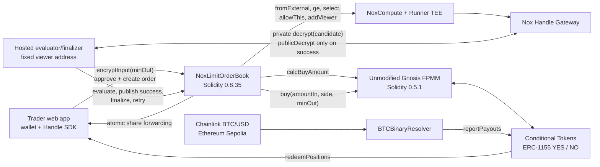
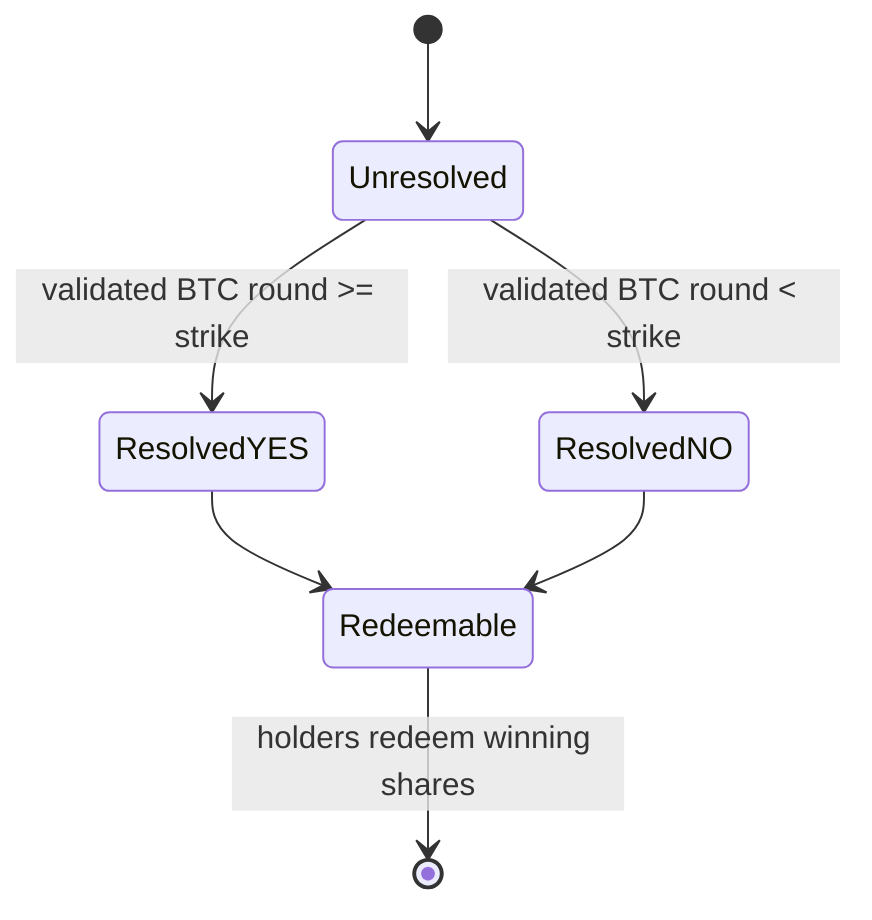

# NoxLimit System Architecture

**Date:** 2026-07-25  
**Authority:** Canonical architecture for the selected hackathon direction and bounded critical-path
verification  
**Maturity:** User-approved; local critical path verified, live Ethereum Sepolia receipt pending
**Spike substrate:** Unmodified Gnosis Conditional Tokens + Fixed Product Market Maker on Ethereum
Sepolia

## Decision

NoxLimit is the current product direction:

> A trader escrows a fixed public amount for a public `YES` or `NO` outcome and leaves a
> confidential minimum-output threshold. Nox compares that threshold with a real outcome-share
> pool quote while the order rests. In the honest-worker path, only an eligible order publishes its
> threshold-derived `minOut`, and one replay-safe authorization causes one real, atomically
> protected pool buy.

This document consolidates architecture that was already spread across the product hypothesis,
market-reality brief, reassessment, and reaffirmation. The user approved it on 2026-07-28 and
advanced the already-defined bounded Prompt 3 spike. That approval selects what to test; it does not
claim that the live Nox/Gateway/FPMM path has already passed.

## Executable Spike Status — 2026-07-28

The approved topology now executes locally against the released Nox `0.2.4` stack and exact pinned
Gnosis contracts. A clean run passes 8 Nox primitive tests, 8 combined adapter/adversarial tests,
and 8 independent market/math tests. Live SDK encryption and input-proof validation also pass
against Ethereum Sepolia. The remaining pre-polish gate is one funded live run that reproduces the
quiet/withheld inference trace and mines the combined Nox-authorized FPMM buy. Until that receipt
exists, the verdict is `CONDITIONAL GO`, not `GO`.

The independent `DROP` audit is historical evidence, not current workflow authority. The current
authority order is defined in
[`../decisions/AUDIT-GATES.md`](../decisions/AUDIT-GATES.md) and
[`../decisions/CURRENT.md`](../decisions/CURRENT.md).

## Product Boundary

### First complete product loop

- one curated BTC/USD binary market;
- one public side (`YES` or `NO`);
- one fixed public collateral input;
- one confidential buy limit, represented exactly as `minOutcomeTokensToBuy`;
- browser-off evaluation by a hosted worker;
- real escrow, real FPMM liquidity, real ERC-1155 outcome shares;
- cancel, expiry, refund, objective resolution, and redemption.

### Explicit non-goals

- no market factory, CLOB, matching engine, or Polymarket routing;
- no two-threshold stop-limit in the first slice;
- no sells, partial fills, hidden side, hidden size, leverage, LP console, or portfolio suite;
- no anonymity, FHE, production-mainnet, organic-liquidity, or audit-complete claim.

## Component View



The pool and Conditional Tokens contracts remain unmodified. NoxLimit owns only the confidential
order, escrow, authorization, and adapter layer.

## Public and Confidential Data

| Data | Visibility | Why |
|---|---|---|
| owner, recipient, pool, condition, side | Public | Immutable execution binding |
| collateral token and fixed input amount | Public | Real escrow and pool accounting |
| expiry, evaluation timing, fill, cancellation | Public | Onchain state transitions |
| encrypted input and derived handles | Public handles, private values | Nox computation inputs/state |
| exact `minOut` value while genuinely resting | Not public; encrypted/TEE-confidential under the Nox trust model | Public metadata may narrow a range; the fixed worker learns the exact value once an eligible candidate is privately decrypted |
| evaluation quote | Public | It comes from the public FPMM |
| worker's private candidate | Worker learns `0` when ineligible; exact `minOut` when eligible | Required for success-only publication; stronger than a single readiness bit on success |
| `minOut` at successful publication/fill | Public | Unmodified FPMM must enforce plaintext `minOut` |
| positions, resolution, redemption | Public | NoxLimit is not an anonymity product |

Each evaluation emits observable activity, including viewer-grant metadata, and its public FPMM
quote is derivable. Under an honest and timely publication assumption, a quiet evaluation is
evidence that `quote < minOut`; worker delay, censorship, or Gateway failure creates the same
result-neutral public event shape, so silence is not deterministic proof of that inequality.
Repeated checks can therefore create only an assumption-dependent bracket while the order rests.
The worker has a stronger view: it learns `quote < minOut` from a zero candidate, and it learns the
exact `minOut` from any eligible candidate even before publication or when it withholds
publication. The first published success makes that exact value public. Product copy must not
claim an invisible or perfectly sealed resting order, and raw receipts must not be called
identical—only the result-dependent public transcript after normalizing order/nonce/handle fields.

## Contract Topology

### `NoxLimitOrderBook`

For the hackathon, one contract deliberately combines:

- immutable order registration;
- ERC-20 collateral escrow;
- encrypted-threshold ingestion and persistence;
- evaluation lifecycle and cadence;
- candidate-handle binding;
- public-proof validation and replay protection;
- the FPMM adapter;
- ERC-1155 receiver support;
- cancellation, expiry, and refunds.

This is the smallest topology that keeps asset and authorization invariants inspectable. Production
modularization can follow the spike; adding contracts now would increase cross-contract ACL,
approval, and custody risk without improving the judge path.

The hackathon deployment is deliberately single-market. Its constructor hard-binds and validates
the curated FPMM, Conditional Tokens contract, collateral token, condition, outcome count, and
position IDs. Order creation accepts only `YES` or `NO` for that deployment; a user cannot supply an
arbitrary pool or collateral target. Supporting multiple allowlisted markets is post-spike work.

The FPMM buy and share forwarding execute inside a restricted external self-call such as
`executeAndForward`. The outer finalizer calls it with `try/catch`:

- success persists `Filled`;
- any pool, receiver, or forwarding revert rolls back the nested trade and lets the outer call
  persist `DisclosedRefundable`.

Without this boundary, a plain revert would also erase the disclosed/refundable state and falsely
present an already-published threshold as confidential-pending again.

`FPMM.buy` returns no share amount. The self-call therefore snapshots the adapter's bound position
balance before and after the buy and forwards only the positive delta for this execution. Its
ERC-1155 callback accepts only the bound Conditional Tokens contract, expected FPMM operator,
expected position ID, and active execution context. Pre-existing dust is never swept into a later
order.

### `BTCBinaryResolver`

The resolver binds one condition to:

- the official Ethereum Sepolia BTC/USD feed;
- a strike;
- a UTC deadline;
- one terminal payout vector.

Resolution must use a positive, complete Chainlink round at or immediately after the deadline and
reject stale or pre-deadline observations. The spike must specify and test exact round selection,
decimals, freshness, and one-shot `reportPayouts`; a manually chosen payout proves plumbing only
and cannot support the no-mock claim.

### Hosted worker

The TypeScript worker:

- monitors open orders and permitted evaluation times;
- submits evaluation transactions;
- privately decrypts only the stored candidate for its fixed viewer key;
- takes no result-specific onchain action when the candidate is zero; a fixed, result-neutral
  evaluation timeout reopens the order;
- is the only account allowed to request irreversible candidate publication and should do so only
  after privately observing a nonzero candidate;
- may obtain the public proof and call finalization, while finalization itself remains permissionless
  so another account can rescue an abandoned publication;
- deduplicates receipts, tolerates reorgs/retries, and pays its own gas.

The worker can delay or censor. Because the contract cannot know the candidate plaintext before a
proof is submitted, a malicious or mistaken worker can also request publication for a zero
candidate, force public evaluation-result disclosure, and—if no permissionless finalizer rescues
the order before timeout—force a terminal refundable state. It cannot change an order, withdraw
collateral, redirect outcome shares, weaken `minOut`, make a zero candidate trade, or prevent a
third party from finalizing after publication. This is an explicit liveness/privacy trust boundary,
not an asset-custody permission.

## Order Record

The exact Solidity layout is a spike decision, but every order must bind at least:

| Field | Purpose |
|---|---|
| `orderId`, `owner`, `recipient` | Identity and immutable asset destination |
| `outcomeIndex` | `YES` or `NO` in the deployment-bound curated pool |
| `amountIn` | Escrow and fixed-input quote in the deployment-bound collateral |
| `expiresAt` | Terminal liveness boundary |
| `encryptedMinOut` | Persistent confidential limit handle |
| `evaluationNonce`, `candidateHandle` | Bind one active, nonce-distinct evaluation |
| `lastEvaluationAt`, `phaseDeadline` | Enforce cadence and neutral evaluation/publication timeouts |
| `status` | Prevent races and double-spends |

Global guards must reject reused encrypted-input handles and consumed
`(candidateHandle, plaintextResult)` pairs. Finalization loads the candidate from storage; callers
never supply an arbitrary handle. Candidate handles must differ across evaluation nonces even when
the private threshold and integer FPMM quote are identical, because public ACL grants and Gateway
proofs bind to a handle and plaintext, not to an application order or nonce.

## Price-to-`minOut` Conversion

The user enters a private maximum fee-inclusive average price, but Nox and FPMM compare integer
outcome-share amounts. With `PRICE_SCALE = 1e18`:

`minOut = ceilDiv(amountIn × PRICE_SCALE, maxAveragePriceWad)`

`amountIn` is the gross collateral input, so the resulting bound includes the pool fee. FPMM's
`calcBuyAmount` returns the net shares after that fee. The frontend uses one audited overflow-safe
integer helper shared with contract tests; it never uses floating-point math. The spike must test
rounding, collateral decimals, exact-boundary quotes, tiny inputs, extreme reserves, and the
property that any successful fill's fee-inclusive average price is no worse than the private
maximum.

## Order Creation and Evaluation

```mermaid
sequenceDiagram
    autonumber
    actor T as Trader
    participant UI as Web app
    participant O as NoxLimitOrderBook
    participant F as FPMM
    participant N as Nox
    participant W as Hosted worker
    participant G as Handle Gateway

    T->>UI: Choose side, fixed amount, private max price
    UI->>UI: Convert max price to exact minOut
    UI->>G: encryptInput(minOut, owner, app)
    T->>O: approve collateral + createOrder(ciphertext, proof, immutable fields)
    O->>O: escrow; fromExternal; allowThis; reject reused input handle

    W->>O: requestEvaluation(orderId)
    O->>F: calcBuyAmount(amountIn, outcomeIndex)
    F-->>O: public fixed-input quote
    O->>N: freshZero = sub(public nonce, same public nonce)
    O->>N: evaluationMinOut = add(encryptedMinOut, freshZero)
    O->>N: eligible = quote >= evaluationMinOut
    O->>N: candidate = select(eligible, evaluationMinOut, 0)
    O->>O: persist candidate under orderId + nonce; grant fixed worker viewer

    W->>G: decrypt(candidate) as viewer
    alt candidate is zero
        G-->>W: 0 privately
        W-->>W: Take no result-specific onchain action
        Note over O,W: Fixed evaluation timeout later invalidates nonce and reopens
    else candidate is nonzero
        G-->>W: minOut privately
        W->>O: requestSuccessPublication(orderId, nonce)
        O->>N: allowPublicDecryption(stored candidate)
        W->>G: handleClient.publicDecrypt(stored candidate)
        G-->>W: minOut + proof
        W->>O: finalize(orderId, nonce, proof); any caller may rescue
        O->>O: minOut = publicDecrypt(stored candidate, proof)
        O->>O: reject/recover zero; consume nonzero candidate; bind state
        O->>F: buy(amountIn, outcomeIndex, minOut)
        F-->>O: ERC-1155 callback; no return value
        O->>O: compute bound-position balance delta
        O->>T: forward only this execution's delta
    end
```

The contract permits only one active evaluation nonce. Each evaluation creates a nonce-distinct,
value-preserving `evaluationMinOut` by adding a fresh encrypted zero derived from the public nonce.
The proposed v0.2.4 construction is
`freshZero = Nox.sub(Nox.toEuint256(nonce), Nox.toEuint256(nonce))`, followed by
`evaluationMinOut = Nox.add(encryptedMinOut, freshZero)`. The released local stack now proves that
identical threshold/quote pairs produce distinct candidates, ACLs do not bleed between nonces, and
an old proof fails for a new nonce. The prepared live run rechecks distinct candidates and
cross-handle proof rejection before promotion to `GO`.

A fixed cadence, contract-enforced minimum interval, and bounded evaluation count limit worker
probing; they do not eliminate metadata inference. After a fixed evaluation timeout, anyone can
reopen the order with a new nonce; the stale nonce remains invalid forever. The timeout path is
identical whether the worker saw zero, failed, or disappeared, so no zero-specific transaction is
emitted.

## State Model

Order execution and market settlement are separate state machines.

```mermaid
stateDiagram-v2
    [*] --> Open: escrow + encrypted limit stored
    Open --> Evaluating: request evaluation
    Evaluating --> Open: result-neutral timeout / nonce invalidated
    Evaluating --> PublicationPending: fixed worker requests irreversible publication
    PublicationPending --> Open: valid public proof = 0; no trade
    PublicationPending --> Executing: any caller submits valid nonzero proof
    PublicationPending --> DisclosedRefundable: publication timeout / expiry / owner abandons
    Executing --> Filled: pool buy + forwarding succeeds
    Executing --> DisclosedRefundable: nested execution reverts

    Open --> Cancelled: owner cancels
    Evaluating --> Cancelled: owner cancels; nonce invalidated
    Open --> Expired: expiry reached
    Evaluating --> Expired: expiry reached; nonce invalidated

    Cancelled --> Refunded: owner claims escrow
    Expired --> Refunded: owner claims escrow
    DisclosedRefundable --> Refunded: owner claims escrow

    Filled --> [*]
    Refunded --> [*]
```





Cancellation or expiry invalidates every outstanding nonce before refundability. Once public
decryption has been granted, timeout, expiry, or owner abandonment routes to
`DisclosedRefundable`, not back to a confidential state. A later proof for that nonce cannot revive
the order.

## Finalization Invariants

Before any external trade, finalization validates the proof. A valid zero proof—possible if a
malicious or mistaken worker publishes an ineligible candidate—invalidates that nonce and safely
reopens the order without moving assets because nonce-distinct candidate handles and ACL isolation
now execute locally on the released stack. A publication timeout instead routes to
`DisclosedRefundable`; neither path may merely revert and strand the order in
`PublicationPending`.

Finalization is permissionless and accepts only `(orderId, evaluationNonce, decryptionProof)`. It
loads the stored candidate and obtains the sole plaintext source with the released v0.2.4 typed
wrapper `Nox.publicDecrypt(storedCandidate, decryptionProof)`, which internally calls
`INoxCompute.validateDecryptionProof`. Offchain,
`handleClient.publicDecrypt(storedCandidate)` retrieves the value and proof after publication. A
caller cannot separately supply `minOut`. Prompt 3 now compiles and executes this exact typed
wrapper in both the harness and the real OrderBook path.

For a nonzero result:

1. order is `PublicationPending`;
2. caller's nonce equals the one active stored nonce;
3. order has not expired or been cancelled;
4. the proof validates the stored candidate and returns the plaintext;
5. plaintext is nonzero after the zero-recovery branch;
6. candidate/result has not been consumed globally;
7. recipient, curated pool, side, amount, and collateral come from bound state/deployment
   immutables, while `minOut` comes only from the validated stored-candidate proof;
8. state and replay guards are consumed before the external self-call.

The restricted self-call then:

1. approves only the exact collateral amount to the bound pool;
2. calls unmodified
   `FPMM.buy(amountIn, outcomeIndex, minOut)`;
3. relies on FPMM's current-reserve recalculation and atomic minimum-output check;
4. validates the ERC-1155 callback against the active execution context;
5. computes the bound-position pre/post balance delta because FPMM returns no amount;
6. forwards only that delta to the immutable recipient;
7. returns success to the outer finalizer.

The fixed worker never receives token approval.

## Replay, Race, and Failure Rules

- Reject an encrypted input handle already assigned to any order.
- Reject any order target outside the deployment-bound pool, Conditional Tokens contract,
  collateral, condition, outcome count, and position IDs.
- Store and load candidate handles by `(orderId, evaluationNonce)`.
- Make the confidential evaluation graph nonce-distinct and reject any candidate handle already
  assigned to another evaluation; verify identical-quote recurrence on the live release.
- Reject caller-selected handles, non-current nonces, expired orders, and terminal states; handle a
  validated zero without trading and invalidate its nonce.
- Consume candidate/result globally before the external action.
- Use checks-effects-interactions plus a reentrancy guard around the outer asset transition.
- Validate the callback source/operator/position/amount and forward only a per-execution balance
  delta, never the adapter's pre-existing balance.
- Let a nested pool/forward failure roll back the nested asset movement while the outer call records
  `DisclosedRefundable`.
- Let publication timeout, expiry, or abandonment invalidate the nonce and make escrow refundable;
  never leave `PublicationPending` dependent on the worker forever.
- Let cancellation win by invalidating the nonce before making funds refundable.
- Treat a successful fill as terminal; retries must observe the receipt/state and stop.

## Hackathon Gate Versus Production Hardening

### Must pass before the polished build

- released Nox private-viewer and success-publication path works live;
- false evaluation needs no explicit public proof;
- repeated checks and a delayed-eligible control establish the honest public-inference boundary;
- nonce-distinct candidates prevent proof or irreversible-ACL bleed across evaluations;
- one real FPMM buy occurs through the actual adapter on Ethereum Sepolia;
- atomic `minOut`, immutable binding, replay rejection, cancel, expiry, and refund work;
- real outcome shares reach the immutable recipient;
- no mock price, share, proof, execution, or second human is used on the judge path;
- privacy copy accurately discloses worker knowledge and public metadata.

### Important after the hackathon, not a pre-build veto

- professional audit and formal verification;
- production mainnet migration;
- decentralized/multiple workers;
- organic liquidity and production manipulation economics;
- latency SLA/P95 guarantees;
- full phase-boundary handling for long-lived oracle rounds;
- sells, partial fills, multiple markets, and richer order types.

## Performance and Product Experience

One observed Nox resolution around 12 seconds proves asynchronous behavior, not a distribution.
The UI must therefore be durable and explicit:

- order submission confirms immediately;
- evaluation, publication, and fill are separately visible pending states;
- closing and reopening the browser reconstructs state from chain/worker receipts;
- retries are idempotent;
- “try in 30 seconds” means understanding and entering the loop without local setup, faucet hunting,
  or a second wallet—not a guaranteed Nox fill latency.

## Evidence Basis

This architecture consolidates:

- [`../research/2026-07-24-noxlimit-product-and-market-reality.md`](../research/2026-07-24-noxlimit-product-and-market-reality.md)
- [`../ideas/2026-07-24-noxlimit-product-hypothesis.md`](../ideas/2026-07-24-noxlimit-product-hypothesis.md)
- [`../verification/2026-07-24-noxlimit-drop-verdict-reassessment.md`](../verification/2026-07-24-noxlimit-drop-verdict-reassessment.md)
- [`../verification/2026-07-24-noxlimit-reaudit-reaffirmation.md`](../verification/2026-07-24-noxlimit-reaudit-reaffirmation.md)
- [`../verification/2026-07-28-noxlimit-critical-path.md`](../verification/2026-07-28-noxlimit-critical-path.md)
- [`../sources/source-manifest.md`](../sources/source-manifest.md)

The pinned FPMM source and local execution provide the required fixed-input quote and atomic
minimum-output check. The released Nox source and local stack establish the necessary primitives,
viewer role, and combined adapter behavior. The combined live orchestration and privacy trace
remain the bounded Prompt 3 verification target.

## Next Authorized Action

The user approved this architecture on 2026-07-28. Local Gates A/B and the combined adapter pass.
The only authorized action is the funded live runner described in
[`../../prompts/03-critical-path-verification.md`](../../prompts/03-critical-path-verification.md),
followed by its recorded verdict and user checkpoint before any polished frontend/full
implementation. Executable evidence may refine this architecture; it may not silently replace the
product, privacy boundary, or hackathon risk standard.
