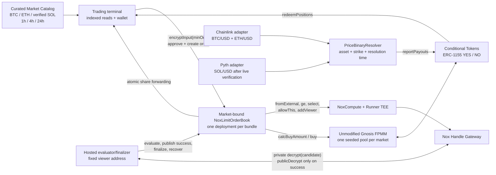
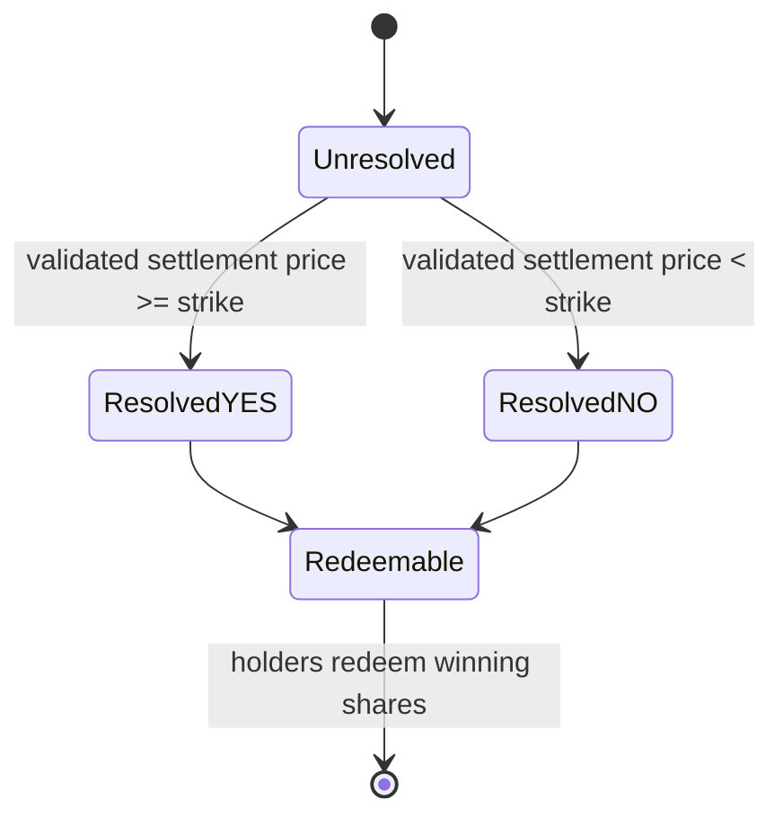

# NoxLimit System Architecture

**Date:** 2026-07-25; revised 2026-07-28 after the live gate and DeepBook/Opus product review
**Authority:** Canonical architecture for the selected hackathon direction and bounded critical-path
verification  
**Maturity:** User-approved; local and live Ethereum Sepolia critical path verified (`GO`);
awaiting the user's polished-build checkpoint
**Spike substrate:** Unmodified Gnosis Conditional Tokens + Fixed Product Market Maker on Ethereum
Sepolia

## Decision

NoxLimit is the current product direction:

> A trader escrows a public amount, immutable for that order, for a public `YES` or `NO` outcome
> and leaves a confidential maximum price represented as a minimum-output threshold. Nox compares
> that threshold with a real outcome-share
> pool quote while the order rests. In the honest-worker path, only an eligible order publishes its
> threshold-derived `minOut`, and one replay-safe authorization causes one real, atomically
> protected pool buy.

This document consolidates architecture that was already spread across the product hypothesis,
market-reality brief, reassessment, and reaffirmation. The user approved it on 2026-07-28 and
advanced the already-defined bounded Prompt 3 spike. The later executable result verifies that the
live Nox/Gateway/FPMM path passed. The 2026-07-28 refinement adds the user-approved multi-asset
product surface, DeepBook-informed terminal/API patterns, and valid post-gate Opus corrections
without replacing the verified execution topology.

## Executable Spike Status — 2026-07-28

The approved topology executes locally against the released Nox `0.2.4` stack and exact pinned
Gnosis contracts. A clean run passes 8 Nox primitive tests, 8 combined adapter/adversarial tests,
and 8 independent market/math tests. Prompt 3 then reproduced the quiet/withheld inference trace
and mined the combined Nox-authorized FPMM buy on Ethereum Sepolia. The final receipt
`0xbae85703bb59878fa63838e03c1bc57cdcdc46f6e2f74ac701b38fc85d088caa`
passed every terminal postcondition, so the bounded technical verdict is `GO`.

The disposable harness is evidence for primitives and adversarial paths, not the authoritative
product state/timing model. Its enum ordinals and some late-finalize behavior intentionally differ
from `NoxLimitOrderBook`; product APIs therefore use named statuses and derive timing from the
OrderBook's onchain fields.

The independent `DROP` audit is historical evidence, not current workflow authority. The current
authority order is defined in
[`../decisions/AUDIT-GATES.md`](../decisions/AUDIT-GATES.md) and
[`../decisions/CURRENT.md`](../decisions/CURRENT.md).

## Product Boundary

### First complete product loop

- one curated terminal that lists only real deployed and seeded market bundles;
- BTC/USD and ETH/USD markets, plus SOL/USD once its Pyth settlement adapter passes the dedicated
  live test;
- 1-hour, 4-hour, and 24-hour market horizons, with separate user-selected order expiries;
- one public side (`YES` or `NO`) and public variable collateral amount, immutable per order;
- one confidential maximum buy price, represented exactly as `minOutcomeTokensToBuy`;
- browser-off evaluation by a hosted worker under an explicit privacy/check budget;
- real escrow, real FPMM liquidity, real ERC-1155 outcome shares;
- cancel, expiry, refund, objective resolution, positions, and redemption.

### Explicit non-goals

- no permissionless market factory, CLOB, matching engine, or Polymarket routing;
- no two-threshold stop-limit in the first slice;
- no sells, partial fills, hidden side, hidden size, leverage, or LP console;
- no anonymity, FHE, production-mainnet, organic-liquidity, or audit-complete claim.

## Component View



The pool and Conditional Tokens contracts remain unmodified. NoxLimit owns only the confidential
order, escrow, authorization, and adapter layer.

## Public and Confidential Data

| Data | Visibility | Why |
|---|---|---|
| owner, recipient, pool, condition, side | Public | Immutable execution binding |
| collateral token and per-order immutable input amount | Public | Real escrow and pool accounting |
| order expiry, evaluation timing, fill, cancellation | Public | Onchain state transitions |
| encrypted input and derived handles | Public handles, private values | Nox computation inputs/state |
| exact `minOut` value while genuinely resting | Not public; encrypted/TEE-confidential under the Nox trust model | Public metadata may narrow a range; the fixed worker learns the exact value once an eligible candidate is privately decrypted |
| evaluation quote | Public | It comes from the public FPMM |
| worker's private candidate | Worker learns `0` when ineligible; exact `minOut` when eligible | Required for success-only publication; stronger than a single readiness bit on success |
| `minOut` at successful publication/fill | Public | Unmodified FPMM must enforce plaintext `minOut` |
| positions, resolution, redemption | Public | NoxLimit is not an anonymity product |

Each evaluation emits observable activity, including viewer-grant metadata, and its public FPMM
quote is derivable. Under an honest and timely publication assumption, a quiet evaluation is
evidence that `quote < minOut`; worker delay, censorship, or Gateway failure creates the same
result-neutral public event shape, so silence is not deterministic proof of that inequality.
Repeated checks can therefore create only an assumption-dependent bracket while the order rests.
The worker has a stronger view: it learns `quote < minOut` from a zero candidate, and it learns the
exact `minOut` from any eligible candidate even before publication or when it withholds
publication. The first published success makes that exact value public. Product copy must not
claim an invisible or perfectly sealed resting order, and raw receipts must not be called
identical—only the result-dependent public transcript after normalizing order/nonce/handle fields.

## Contract Topology

### `NoxLimitOrderBook`

For each curated market bundle, one contract deliberately combines:

- immutable order registration;
- ERC-20 collateral escrow;
- encrypted-threshold ingestion and persistence;
- evaluation lifecycle and cadence;
- candidate-handle binding;
- public-proof validation and replay protection;
- the FPMM adapter;
- ERC-1155 receiver support;
- cancellation, expiry, and refunds.

This is the smallest topology that keeps asset and authorization invariants inspectable. One
OrderBook still serves only one market; the product obtains breadth by composing several identical,
independently bound deployments through a catalog. A generalized multi-market custody contract
would increase cross-contract ACL, approval, and custody risk without improving the judge path.

Each deployment is deliberately single-market. Its constructor hard-binds and validates the curated
FPMM, Conditional Tokens contract, collateral token, condition, outcome count, position IDs, and
market trading-close time.
Order creation accepts only `YES` or `NO` for that deployment; a user cannot supply an arbitrary
pool or collateral target. A versioned catalog/read model maps an asset and horizon to complete
deployed bundles. It lists a bundle only after resolver, condition, seeded FPMM, and OrderBook
addresses are all verified. The catalog is not a permissionless market factory and never overrides
the contracts as source of truth.

Logical `marketId`/Conditional Tokens `questionId` values are deterministic hashes of stable market
content—chain, tracked asset/feed, strike, trading close, resolution time, collateral, and resolver
policy—not deployment wall-clock time. Each deployed instance is versioned by its `conditionId`.
The committed catalog exposes all addresses, resolver/feed provenance, configuration version,
check/recovery policy, and active/retired status. Cross-market order identity is the composite
`(chainId, orderBook, orderId)`, because numeric `orderId` is local to one OrderBook.

The FPMM buy and share forwarding execute inside a restricted external self-call such as
`executeAndForward`. The outer finalizer calls it with `try/catch`:

- success persists `Filled`;
- any pool, receiver, or forwarding revert rolls back the nested trade and lets the outer call
  persist `DisclosedRefundable`.

Without this boundary, a plain revert would also erase the disclosed/refundable state and falsely
present an already-published threshold as confidential-pending again.

`FPMM.buy` returns no share amount. The self-call therefore snapshots the adapter's bound position
balance before and after the buy and forwards only the positive delta for this execution. Its
ERC-1155 callback accepts only the bound Conditional Tokens contract, expected FPMM operator,
expected position ID, and active execution context. Pre-existing dust is never swept into a later
order.

The polished OrderBook adds immutable `tradingClosesAt` and enforces it independently of the UI and
catalog. `createOrder` requires `expiresAt <= tradingClosesAt`; evaluation, publication, and
nonzero finalization must occur before both order expiry and market close. A proof arriving after
either boundary moves disclosed escrow to `DisclosedRefundable` without trading. This prevents a
direct caller from creating or executing an order after the market stops trading or has resolved.

### `PriceBinaryResolver` and settlement adapters

Every resolver binds one condition to:

- a tracked asset and immutable settlement-price adapter;
- a strike;
- a trading-close time and resolution time;
- one terminal payout vector.

The deployment order is mandatory because the resolver address participates in the Conditional
Tokens condition identity:

1. deploy and validate the settlement adapter and resolver;
2. prepare the Conditional Tokens condition with that resolver;
3. deploy and seed the bound FPMM;
4. deploy the OrderBook bound to the complete market;
5. verify addresses and invariants, then register the bundle in the catalog.

BTC/USD and ETH/USD initially use official Ethereum Sepolia Chainlink feeds through a round
adapter. Resolution must use a positive, complete observation selected by the declared rule at or
immediately after the market's resolution time, rejecting invalid, stale, or earlier data.
Round selection must account for Chainlink phase boundaries and current aggregator guidance; it
must not rely on the deprecated `answeredInRound` check.

The Chainlink adapter must prove that the selected observation is the **first chronological feed
observation at or after** `resolvesAt`: the selected observation has `updatedAt >= resolvesAt`, its
verified adjacent predecessor has `updatedAt < resolvesAt`, and the pair is adjacent under the
proxy's phase-aware round scheme. Merely accepting any valid later round is caller-cherry-pickable
and forbidden. If adjacency across a phase transition cannot be verified, settlement must stop
rather than guess.

SOL/USD uses a Pyth historical-price adapter only after a dedicated live test proves the exact
update-verification, publish-time window, fee, decimals/exponent normalization, and one-shot
settlement path. The Hermes “first update at or after timestamp” response alone is not an onchain
uniqueness proof; the adapter's accepted-window rule and operator assumptions must be explicit.

Every adapter must normalize to a common signed price/decimals interface. A manually chosen payout
proves plumbing only and cannot support the no-mock claim.

### Hosted worker

The TypeScript worker:

- monitors open orders and permitted evaluation times;
- evaluates once after creation, then on a material public quote change or a conservative heartbeat,
  subject to the onchain minimum interval and remaining check budget;
- submits evaluation transactions;
- privately decrypts only the stored candidate for its fixed viewer key;
- takes no result-specific onchain action when the candidate is zero; a fixed, result-neutral
  evaluation timeout returns the order to its open storage state, while the consumed nonce/check
  remains spent;
- is the only account allowed to request irreversible candidate publication and should do so only
  after privately observing a nonzero candidate;
- may obtain the public proof and call finalization, while finalization itself remains permissionless
  so another account can rescue an abandoned publication;
- deduplicates receipts, tolerates reorgs/retries, and pays its own gas.

The check count is a deliberate privacy budget because every observable evaluation can narrow the
threshold range. The worker and UI expose the exact remaining checks. An order with no remaining
checks is `MonitoringExhausted` at the product/read-model layer even if the legacy storage enum is
still `Open`; it is never described as actively monitored. The owner can cancel/refund and replace
it with a new order and a fresh deployment-policy budget. Internal evaluation and publication recovery windows are
configured independently from live service measurements; the disposable runner's 45-second value
is not product configuration or an SLA.

The worker can delay or censor. Because the contract cannot know the candidate plaintext before a
proof is submitted, a malicious or mistaken worker can also request publication for a zero
candidate, force public evaluation-result disclosure, and—if no permissionless finalizer rescues
the order before timeout—force a terminal refundable state. It cannot change an order, withdraw
collateral, redirect outcome shares, weaken `minOut`, make a zero candidate trade, or prevent a
third party from finalizing after publication. This is an explicit liveness/privacy trust boundary,
not an asset-custody permission.

## Order Record

The exact Solidity layout is a spike decision, but every order must bind at least:

| Field | Purpose |
|---|---|
| `orderId`, `owner`, `recipient` | Identity and immutable asset destination |
| `outcomeIndex` | `YES` or `NO` in the deployment-bound curated pool |
| `amountIn` | Public variable input, immutable for this order, and its fixed-input quote |
| `expiresAt` | This order's monitoring/liveness boundary; contract-enforced at or before immutable `tradingClosesAt` |
| `encryptedMinOut` | Persistent confidential limit handle |
| `evaluationNonce`, `candidateHandle` | Bind one active, nonce-distinct evaluation |
| `evaluationCount` plus deployment `maximumEvaluations` | Enforce and expose the order's inherited privacy/check budget |
| `lastEvaluationAt`, `phaseTimeoutAt` | Enforce cadence and neutral evaluation/publication recovery windows |
| `status` | Prevent races and double-spends |

Global guards must reject reused encrypted-input handles and consumed
`(candidateHandle, plaintextResult)` pairs. Finalization loads the candidate from storage; callers
never supply an arbitrary handle. Candidate handles must differ across evaluation nonces even when
the private threshold and integer FPMM quote are identical, because public ACL grants and Gateway
proofs bind to a handle and plaintext, not to an application order or nonce.

## Price-to-`minOut` Conversion

The user enters a private maximum fee-inclusive average price, but Nox and FPMM compare integer
outcome-share amounts. With `PRICE_SCALE = 1e18`:

`minOut = ceilDiv(amountIn × PRICE_SCALE, maxAveragePriceWad)`

`amountIn` is the gross collateral input, so the resulting bound includes the pool fee. FPMM's
`calcBuyAmount` returns the net shares after that fee. The frontend uses one audited overflow-safe
integer helper shared with contract tests; it never uses floating-point math. The spike must test
rounding, collateral decimals, exact-boundary quotes, tiny inputs, extreme reserves, and the
property that any successful fill's fee-inclusive average price is no worse than the private
maximum.

## Order Creation and Evaluation

```mermaid
sequenceDiagram
    autonumber
    actor T as Trader
    participant UI as Web app
    participant O as NoxLimitOrderBook
    participant F as FPMM
    participant N as Nox
    participant W as Hosted worker
    participant G as Handle Gateway

    T->>UI: Choose side, public amount, private max price, order expiry
    UI->>UI: Convert max price to exact minOut
    UI->>G: encryptInput(minOut, owner, app)
    T->>O: approve collateral + createOrder(ciphertext, proof, immutable fields)
    O->>O: require order expiry <= immutable market close
    O->>O: escrow; fromExternal; allowThis; reject reused input handle

    W->>O: requestEvaluation(orderId)
    O->>F: calcBuyAmount(amountIn, outcomeIndex)
    F-->>O: public fixed-input quote
    O->>N: freshZero = sub(public nonce, same public nonce)
    O->>N: evaluationMinOut = add(encryptedMinOut, freshZero)
    O->>N: eligible = quote >= evaluationMinOut
    O->>N: candidate = select(eligible, evaluationMinOut, 0)
    O->>O: persist candidate under orderId + nonce; grant fixed worker viewer

    W->>G: decrypt(candidate) as viewer
    alt candidate is zero
        G-->>W: 0 privately
        W-->>W: Take no result-specific onchain action
        Note over O,W: Result-neutral timeout ends this attempt; next request increments nonce
    else candidate is nonzero
        G-->>W: minOut privately
        W->>O: requestSuccessPublication(orderId, nonce)
        O->>N: allowPublicDecryption(stored candidate)
        W->>G: handleClient.publicDecrypt(stored candidate)
        G-->>W: minOut + proof
        W->>O: finalize(orderId, nonce, proof); any caller may rescue
        O->>O: minOut = publicDecrypt(stored candidate, proof)
        O->>O: reject/recover zero; consume nonzero candidate; bind state
        O->>F: buy(amountIn, outcomeIndex, minOut)
        F-->>O: ERC-1155 callback; no return value
        O->>O: compute bound-position balance delta
        O->>T: forward only this execution's delta
    end
```

The contract permits only one active evaluation nonce. Each evaluation creates a nonce-distinct,
value-preserving `evaluationMinOut` by adding a fresh encrypted zero derived from the public nonce.
The proposed v0.2.4 construction is
`freshZero = Nox.sub(Nox.toEuint256(nonce), Nox.toEuint256(nonce))`, followed by
`evaluationMinOut = Nox.add(encryptedMinOut, freshZero)`. The released local stack now proves that
identical threshold/quote pairs produce distinct candidates, ACLs do not bleed between nonces, and
an old proof fails for a new nonce. The live run also produced four distinct candidates, kept the
three earlier/withheld candidates non-public, and rejected the successful proof against an earlier
handle.

A contract-enforced minimum interval and bounded evaluation count limit worker probing; they do not
eliminate metadata inference. The product scheduler checks after creation, on material public quote
movement, or on a conservative heartbeat rather than spending checks in a tight polling loop. After
a result-neutral evaluation timeout, anyone can end the active attempt and return the stored status
to `Open`. The current nonce is consumed but not incremented by the timeout; the next successful
`requestEvaluation` increments it and creates the next nonce-distinct candidate. The stale attempt
can never be published or finalized from the now-incompatible status. The timeout path is identical
whether the worker saw zero, failed, or disappeared, so no zero-specific transaction is emitted. A
timed-out attempt still counts against the explicit check budget because its public metadata has
already occurred.

## State Model

Order execution and market settlement are separate state machines.

```mermaid
stateDiagram-v2
    [*] --> Open: escrow + encrypted limit stored
    Open --> Evaluating: request evaluation
    Evaluating --> Open: result-neutral timeout; checks remain
    Evaluating --> MonitoringExhausted: result-neutral timeout; no checks remain
    Open --> MonitoringExhausted: remaining checks = 0
    Evaluating --> PublicationPending: fixed worker requests irreversible publication
    PublicationPending --> Open: valid public proof = 0; checks remain
    PublicationPending --> MonitoringExhausted: valid public proof = 0; no checks remain
    PublicationPending --> Executing: any caller submits valid nonzero proof
    PublicationPending --> DisclosedRefundable: publication timeout / order expiry
    Executing --> Filled: pool buy + forwarding succeeds
    Executing --> DisclosedRefundable: nested execution reverts

    Open --> Cancelled: owner cancels
    MonitoringExhausted --> Cancelled: owner cancels/replaces
    Evaluating --> Cancelled: owner cancels; nonce invalidated
    Open --> Expired: expiry reached
    Evaluating --> Expired: expiry reached; nonce invalidated

    Cancelled --> Refunded: owner claims escrow
    Expired --> Refunded: owner claims escrow
    DisclosedRefundable --> Refunded: owner claims escrow

    Filled --> [*]
    Refunded --> [*]
```





Cancellation or expiry makes every outstanding attempt non-actionable before refundability. Once
public decryption has been granted, the owner cannot cancel or abandon the order: that would create
a post-disclosure free option. Only successful finalization, publication/order timeout, a valid
zero recovery, or nested execution failure advances it. A later proof for a terminal nonce cannot
revive the order. `MonitoringExhausted` is a truthful derived product state until the contract enum is
extended; it is computed only when status is `Open`, no evaluation is active, and the remaining
budget is zero.

## Finalization Invariants

Before any external trade, finalization validates the proof. A valid zero proof—possible if a
malicious or mistaken worker publishes an ineligible candidate—ends that attempt and safely returns
storage to `Open` without moving assets because nonce-distinct candidate handles and ACL isolation
now execute locally on the released stack. If the check budget is now zero, the product state is
immediately `MonitoringExhausted`; a new evaluation cannot be requested. A publication timeout
instead routes to `DisclosedRefundable`; neither path may merely revert and strand the order in
`PublicationPending`.

Finalization is permissionless and accepts only `(orderId, evaluationNonce, decryptionProof)`. It
loads the stored candidate and obtains the sole plaintext source with the released v0.2.4 typed
wrapper `Nox.publicDecrypt(storedCandidate, decryptionProof)`, which internally calls
`INoxCompute.validateDecryptionProof`. Offchain,
`handleClient.publicDecrypt(storedCandidate)` retrieves the value and proof after publication. A
caller cannot separately supply `minOut`. Prompt 3 now compiles and executes this exact typed
wrapper in both the harness and the real OrderBook path.

For a nonzero result:

1. order is `PublicationPending`;
2. caller's nonce equals the one active stored nonce;
3. order has not expired or been cancelled;
4. the immutable market trading-close time has not passed;
5. the proof validates the stored candidate and returns the plaintext;
6. plaintext is nonzero after the zero-recovery branch;
7. candidate/result has not been consumed globally;
8. recipient, curated pool, side, amount, and collateral come from bound state/deployment
   immutables, while `minOut` comes only from the validated stored-candidate proof;
9. state and replay guards are consumed before the external self-call.

The restricted self-call then:

1. approves only the exact collateral amount to the bound pool;
2. calls unmodified
   `FPMM.buy(amountIn, outcomeIndex, minOut)`;
3. relies on FPMM's current-reserve recalculation and atomic minimum-output check;
4. validates the ERC-1155 callback against the active execution context;
5. computes the bound-position pre/post balance delta because FPMM returns no amount;
6. forwards only that delta to the immutable recipient;
7. returns success to the outer finalizer.

The fixed worker never receives token approval.

## Replay, Race, and Failure Rules

- Reject an encrypted input handle already assigned to any order.
- Reject any order target outside the deployment-bound pool, Conditional Tokens contract,
  collateral, condition, outcome count, and position IDs.
- Store and load candidate handles by `(orderId, evaluationNonce)`.
- Make `candidateOf` status-aware: return an actionable handle only for the active nonce in an
  evaluation/publication-compatible status; stale, cancelled, expired, filled, or refunded
  candidates must not appear actionable.
- Expose `remainingEvaluations(orderId)` and derive `MonitoringExhausted` instead of leaving a
  zero-budget order visibly `Open`.
- Make the confidential evaluation graph nonce-distinct and reject any candidate handle already
  assigned to another evaluation; verify identical-quote recurrence on the live release.
- Reject caller-selected handles, non-current nonces, expired orders, and terminal states; handle a
  validated zero without trading and invalidate its nonce.
- Reject order creation with `expiresAt > tradingClosesAt`, and reject evaluation, publication, or
  trade after the immutable market close even when called directly without the frontend/catalog.
- Consume candidate/result globally before the external action.
- Use checks-effects-interactions plus a reentrancy guard around the outer asset transition.
- Validate the callback source/operator/position/amount and forward only a per-execution balance
  delta, never the adapter's pre-existing balance.
- Let a nested pool/forward failure roll back the nested asset movement while the outer call records
  `DisclosedRefundable`.
- Forbid owner cancellation/abandonment from `PublicationPending`; after disclosure is requested,
  only valid proof finalization, publication/order timeout, zero recovery, or nested execution
  failure may advance the state.
- Let publication timeout or order expiry make disclosed escrow refundable; never leave
  `PublicationPending` dependent on the worker forever.
- Let cancellation win by invalidating the nonce before making funds refundable.
- Treat a successful fill as terminal; retries must observe the receipt/state and stop.

## Hackathon Gate Versus Production Hardening

### Passed by Prompt 3 before the polished build

The following bounded technical gates passed locally and, where service integration matters, on
live Ethereum Sepolia:

- released Nox private-viewer and success-publication path works live;
- false evaluation needs no explicit public proof;
- repeated checks and a delayed-eligible control establish the honest public-inference boundary;
- nonce-distinct candidates prevent proof or irreversible-ACL bleed across evaluations;
- one real FPMM buy occurs through the actual adapter on Ethereum Sepolia;
- successful-bound `minOut`, immutable binding, share forwarding, and replay rejection work live;
  adverse-bound rollback, cancel, expiry, and refund work in the local adversarial suite;
- real outcome shares reach the immutable recipient;
- no mock quote, share, proof, or execution is used in the bounded Gate C trace.

### Still required in the polished build and submission gate

- a self-serve judge path without local setup, faucet hunting, owner-operated gas top-ups, or a
  second human;
- a direct DeepBook-inspired terminal with a truthful FPMM quote ladder, private order ticket,
  durable order states, positions, and activity;
- a curated BTC/USD and ETH/USD catalog across useful horizons, plus SOL/USD only after the Pyth
  settlement adapter passes its dedicated live test;
- objective settlement and redemption through the product UI;
- explicit check-budget reads, `MonitoringExhausted`, and status-aware candidate access;
- durable worker/finalizer gas provisioning and restart recovery;
- mutation-strength tests for reentrancy, finalizer gas reserve, and global result consumption;
- exact check-exhaustion, timeout-boundary, late-finalize, order-expiry-precedence,
  zero/degenerate-configuration, and publication-disclosure tests;
- custom-error-pinned rejection tests and truthful reconstructed-state provenance;
- a fresh final deployment with production-intended cadence/check-budget guards enabled;
- privacy copy that accurately discloses worker knowledge, TEE trust, and public metadata.

### Important after the hackathon, not a pre-build veto

- professional audit and formal verification;
- production mainnet migration;
- decentralized/multiple workers;
- organic liquidity and production manipulation economics;
- latency SLA/P95 guarantees;
- full phase-boundary handling for long-lived oracle rounds;
- sells, partial fills, permissionless market creation, and richer order types.

## DeepBook-Informed Product Surface

DeepBook V3 Spot supplies the terminal grammar; DeepBook Predict supplies useful catalog,
quote/position, and unsigned-transaction API patterns. Neither supplies NoxLimit's execution
mechanic. The product therefore uses this layout:

```text
┌──────────────┬────────────────────────────────────┬───────────────────────┐
│ Market list  │ Selected market                    │ Private order ticket  │
│ BTC/ETH/SOL  │ Oracle + YES/NO price history      │ Side: YES / NO        │
│ 1h/4h/24h    │ Liquidity + AMM quote ladder       │ Public amount         │
│ live/status  │ Public fills/activity              │ Private maximum price │
│              │                                    │ Order expiry + submit │
├──────────────┴────────────────────────────────────┴───────────────────────┤
│ My Orders                 │ Positions                 │ Activity            │
└──────────────────────────────────────────────────────────────────────────┘
```

The central liquidity view is computed from real `calcBuyAmount` calls for several public input
sizes and may display average execution price and price impact. It is not an order book. Private
resting orders never appear as bids, asks, or public depth; only completed fills appear on the
public activity tape.

The typed client surface is deliberately small:

```ts
type OrderRef = { chainId: number; orderBook: Address; orderId: bigint }

markets.list({ asset, horizon })
markets.get(marketId)
markets.quote({ marketId, side, amount })
orders.preparePrivateLimit({ marketId, side, amount, maxPrice, expiresAt, clientRequestId })
orders.get(orderRef)
orders.list(address)
orders.cancel(orderRef)
orders.expire(orderRef)
orders.refund(orderRef)
positions.list(address)
positions.redeem(positionId)
```

Public catalog/history reads may use a cached indexer or backend-for-frontend. Wallet-scoped reads
remain address-bound. The final quote, threshold conversion, encryption, and transaction build are
refreshed at the trust boundary; encryption occurs in the browser and the wallet signs the write.
The backend never receives the plaintext maximum price. Evaluator decrypt/publication operations
are internal worker capabilities and are not exposed as public trading tools.

`clientRequestId` is a caller correlation/idempotency key for building and tracking a proposal; it
does not replace the onchain composite identity `(chainId, orderBook, orderId)`. Public API statuses
are named strings, not Solidity enum ordinals, because the disposable harness and product
OrderBook intentionally have different enums and late-finalize behavior. The product must not show
synthetic order-book midpoint, OHLC, or volume data unless it is derived and labeled from real
oracle/pool/trade history.

### User flow

1. Filter real markets by tracked asset and horizon, then choose one deployed/seeded bundle.
2. Inspect its question, strike, trading close, resolution time, oracle price, YES/NO pool prices,
   liquidity, and real-size quote ladder.
3. Choose YES or NO, public amount, private maximum average price, and order expiry.
4. Refresh the exact pool quote, derive integer `minOut`, encrypt it in the browser, approve
   collateral, and sign order creation.
5. Close the browser if desired. The worker evaluates under the visible check budget; the indexer
   and chain reconstruct `Resting`, `Evaluating`, `Publication pending`, `Filled`,
   `Monitoring exhausted`, `Expired`, or `Refundable` state.
6. An eligible order publishes and executes one atomically protected FPMM buy. Outcome shares go
   directly to the immutable recipient. An ineligible order remains resting until another allowed
   check, cancellation, expiry, or budget exhaustion.
7. A cancelled, expired, or disclosed-refundable order exposes the separate refund transaction;
   the client never treats cancellation alone as returning collateral.
8. After objective resolution, the holder redeems the winning shares from `Positions`.

Market horizon and order expiry are intentionally separate. “BTC,” “ETH,” and “SOL” identify the
oracle-tracked asset; all contracts, pools, orders, and outcome shares execute on Ethereum Sepolia.

## Performance and Product Experience

One observed Nox resolution around 12 seconds proves asynchronous behavior, not a distribution.
The UI must therefore be durable and explicit:

- order submission confirms immediately;
- evaluation, publication, and fill are separately visible pending states;
- recovery countdowns derive from onchain timestamps, show whether a retry consumes a remaining
  check, and distinguish retryable evaluation from irreversible publication;
- closing and reopening the browser reconstructs state from chain/worker receipts;
- retries are idempotent;
- “try in 30 seconds” means understanding and entering the loop without local setup, faucet hunting,
  or a second wallet—not a guaranteed Nox fill latency.

## Evidence Basis

This architecture consolidates:

- [`../research/2026-07-24-noxlimit-product-and-market-reality.md`](../research/2026-07-24-noxlimit-product-and-market-reality.md)
- [`../ideas/2026-07-24-noxlimit-product-hypothesis.md`](../ideas/2026-07-24-noxlimit-product-hypothesis.md)
- [`../verification/2026-07-24-noxlimit-drop-verdict-reassessment.md`](../verification/2026-07-24-noxlimit-drop-verdict-reassessment.md)
- [`../verification/2026-07-24-noxlimit-reaudit-reaffirmation.md`](../verification/2026-07-24-noxlimit-reaudit-reaffirmation.md)
- [`../verification/2026-07-28-noxlimit-critical-path.md`](../verification/2026-07-28-noxlimit-critical-path.md)
- [`../research/2026-07-28-deepbook-patterns-for-noxlimit.md`](../research/2026-07-28-deepbook-patterns-for-noxlimit.md)
- [`../verification/2026-07-28-noxlimit-product-surface-and-opus-reconciliation.md`](../verification/2026-07-28-noxlimit-product-surface-and-opus-reconciliation.md)
- [`../sources/source-manifest.md`](../sources/source-manifest.md)

The pinned FPMM source and local execution provide the required fixed-input quote and atomic
minimum-output check. The released Nox source and local stack establish the necessary primitives,
viewer role, and combined adapter behavior. The live Prompt 3 evidence adds the bounded recovered
orchestration, success-only publication, independent proof rescue, real FPMM action, asset deltas,
and terminal cleanup on Ethereum Sepolia. The owner/deployer funded finalizer gas after order
creation, so durable product-operated gas provisioning remains build work.

The DeepBook research establishes the product/terminal/API patterns and the boundary between its
real CLOB mechanics and NoxLimit's FPMM mechanics. The post-gate reconciliation records the
multi-asset catalog, check-budget semantics, resolver-first deployment, status-aware reads, and
tests required by the focused Opus review. Those are adopted polished-build requirements; they do
not retroactively change the successful bounded Gate C evidence.

## Next Authorized Action

The user approved this architecture on 2026-07-28, and local Gates A/B plus live Gate C now pass.
The next authorized action is the user's polished-build checkpoint. If the user authorizes that
phase, implementation must derive from this architecture and the recorded Prompt 3 evidence rather
than restarting discovery or creating a competing design. Executable evidence may refine this
architecture; it may not silently replace the product, privacy boundary, or hackathon risk
standard.
