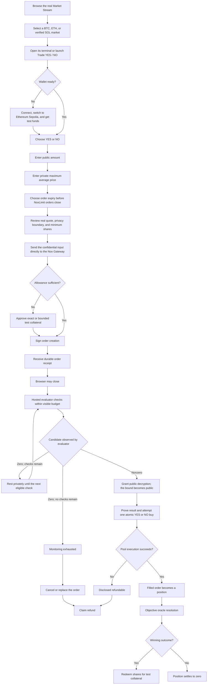
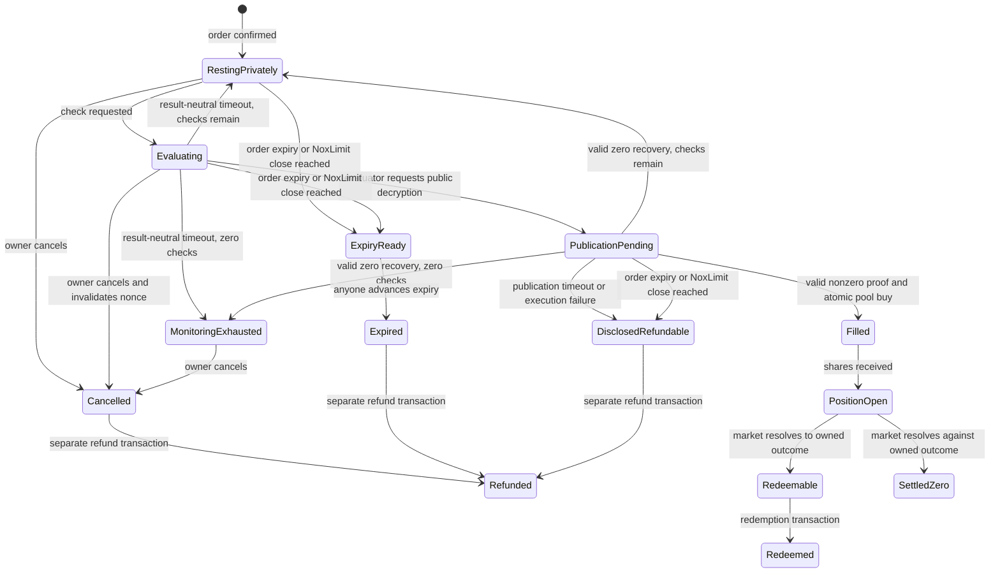

# NoxLimit Product Surface Map

**Status:** Designer and implementation contract  
**Mode:** External designer handoff  
**Stories:**
[`../stories/2026-07-28-noxlimit-product-stories.md`](../stories/2026-07-28-noxlimit-product-stories.md)  
**Architecture:**
[`../architecture/2026-07-25-noxlimit-system-architecture.md`](../architecture/2026-07-25-noxlimit-system-architecture.md)  
**Discovery decision:**
[`../decisions/2026-07-28-noxlimit-market-stream-experience.md`](../decisions/2026-07-28-noxlimit-market-stream-experience.md)

## 1. The product in one screen

NoxLimit combines a vertical Market Stream for rapid prediction-market discovery with a full
trading terminal where a trader can buy real YES/NO outcome shares through a seeded onchain AMM
while keeping one instruction—maximum average buy price—encrypted during the resting phase. A
hosted Nox evaluator keeps checking after the browser closes. When a real pool quote satisfies the
encrypted bound, the order publishes the minimum-output protection and performs one atomic buy.

The terminal must make four things understandable without a tutorial:

1. **What event am I trading?** Asset, strike, NoxLimit order close, resolution time, and rule.
2. **What can I buy right now?** Real YES/NO AMM prices, liquidity, and size-aware quotes.
3. **What am I keeping private?** Maximum average price only; amount and side are public.
4. **What happens after I leave?** A bounded hosted evaluator checks, fills, or reaches a recoverable
   state while the app reconstructs durable progress.

## 2. Navigation model

### Desktop

The product opens directly into the first active market/terminal rather than a marketing landing
page. The left rail is a vertically scrollable Market Stream: richer market cards for rapid
selection, not a static symbol list.

```text
┌──────────────────────────────────────────────────────────────────────────────┐
│ NoxLimit  Ethereum Sepolia  System status             Test funds  0x71…9A2C │
├───────────────┬────────────────────────────────────────┬─────────────────────┤
│ MARKET STREAM │ SELECTED MARKET                        │ PRIVATE ORDER       │
│ scroll cards  │ question + market facts                │ YES / NO            │
│ asset/horizon │ oracle / outcome-price chart           │ public amount       │
│ close + prices│ real AMM quote ladder + recent fills   │ private max price   │
│ liquidity     │                                        │ expiry + preview    │
├───────────────┴────────────────────────────────────────┴─────────────────────┤
│ MY ORDERS                  POSITIONS                     ACTIVITY             │
└──────────────────────────────────────────────────────────────────────────────┘
```

The portfolio area may be a fixed lower workspace, resizable tray, or route-backed section, but its
three concepts remain adjacent and directly reachable from the terminal.

### Mobile

Mobile is not a squeezed three-column desktop. Its normal entry is a TikTok-like `Discover`
interaction—vertical snap-scroll focus on one real market at a time—followed by the full analytical
and reviewed transaction flow. It uses:

- a vertical Market Stream of full-height or near-full-height real market cards;
- a visible card position/count, exactly three deterministic sorts—`Closing soon`, `Recently
  opened`, and `Liquidity`—plus asset, horizon, and lifecycle filters rather than a personalized
  `For You` ranking;
- cards with the real question, original horizon, remaining order-close countdown, oracle versus
  strike, YES/NO prices, liquidity, freshness/lifecycle, and a truthful compact chart preview;
- `Open market`, `Trade YES`, and `Trade NO` entry actions;
- tabs or bottom navigation for `Discover`, `Trade`, `Orders`, `Positions`, and `Activity`;
- a full-height Trade workspace launched by `Trade YES` / `Trade NO`: full question, oracle versus
  strike, YES/NO prices, liquidity/size-aware quote, close/resolution terms, expandable full chart,
  and the order ticket with only market/side preselected;
- a full market view with one full-size chart or liquidity panel at a time;
- receipt and status details as routes or full-height sheets, not narrow side drawers.

The card action may preselect market and side, but it never opens a bare form or executes
immediately. The user still receives full analytical context and reviews the real quote, amount,
private limit, expiry, disclosure boundary, and wallet steps. Snap behavior degrades to ordinary
scrolling for reduced-motion and assistive-input users.

Browsing and trading use separate selection state:

- `focusedMarketId` follows the currently settled or keyboard-focused Discover card;
- `selectedMarketId` identifies the market loaded into the Trade workspace and changes only after
  `Open market`, `Trade YES/NO`, explicit desktop activation, or a confirmed dirty switch.

### Route contract

The implementation may refine route syntax, but the information architecture needs these stable
destinations:

| Destination | Suggested route | Deep-link requirement |
|---|---|---|
| Responsive shell / Market Stream | `/` | Canonical entry; desktop composes terminal + rail, mobile composes Discover; preserves deterministic filters |
| Discover alias | `/discover` | Optional redirect/alias to `/`; never a second interaction tree |
| Market terminal | `/markets/:marketId` | Preserves asset/horizon selection |
| Orders | `/orders` | Wallet-scoped; prompts connection if needed |
| Order detail | `/orders/:chainId/:orderBook/:orderId` | Composite identity; never `orderId` alone |
| Positions | `/positions` | Wallet-scoped |
| Position/market resolution | `/positions/:positionId` or market detail | Links accepted oracle evidence |
| Activity | `/activity` | Real transactions/events only |
| How privacy works | drawer, sheet, or `/privacy` | Available before wallet connection |

The root route composes responsively: desktop opens the selected terminal with the stream rail;
mobile opens the Discover stream. `/markets/:marketId` remains the durable cross-viewport market
deep link. Sort/filter state may use public query parameters; private drafts never do. Do not use
viewport-dependent server branching or render duplicate hidden interactive trees.

## 3. Shortest successful user journey



### Alternate exits

- `Resting privately` → owner cancels → `Cancelled` → owner claims refund → `Refunded`.
- `Evaluating` → owner cancels and invalidates the active nonce → `Cancelled` → refund.
- Order expiry or NoxLimit trading close reached → derived `Expiry ready` → permissionless
  `Expire order` transaction → `Expired` → separate refund.
- `Publication pending` cannot be owner-cancelled. It must finalize, recover a valid zero, time out
  to `Disclosed refundable`, or record execution failure as `Disclosed refundable`.
- `Monitoring exhausted` is not filled and is not silently monitored. The user cancels/refunds or
  creates a replacement with a fresh budget if the market remains open.

## 4. Screen inventory and specifications

Priority key:

- **P0:** Required for the core user journey.
- **P1:** Required for a coherent complete product.
- **P2:** Useful diagnostics or post-core depth.

### PS-01 — Global application shell — P0

Purpose: establish that this is a live testnet trading product and expose system readiness without
making the user read documentation.

Required elements:

- NoxLimit product identity and a short descriptor such as `Private limits for onchain outcomes`;
- fixed `Ethereum Sepolia` execution-chain indicator;
- wallet connection and truncated address;
- Test ETH and Test USDC readiness or a combined `Test funds` entry;
- compact health for catalog/RPC, oracle freshness, and evaluator availability;
- always-available privacy explainer;
- visible testnet label that cannot be mistaken for production mainnet.

States:

| State | Presentation and action |
|---|---|
| Booting | Shell skeleton; no fake balances or market numbers |
| Read-only | Markets work; wallet-scoped tabs explain that connection is required |
| Wrong network | Preserve market context; one `Switch to Ethereum Sepolia` action |
| Connected, unfunded | Show exact missing resources and `Get test funds` |
| Ready | Compact balances and address |
| Degraded RPC/indexer | Non-blocking banner if safe reads still work; trust-critical writes disabled when not safe |
| Evaluator unavailable | Existing orders remain visible; new-order ticket states monitoring is temporarily unavailable |

### PS-02 — Curated Market Stream/catalog — P0

Purpose: let the user discover real, active market bundles with one-market-at-a-time focus without
turning NoxLimit into a broad market-creation platform or a social wagering feed.

Responsive composition:

- **Mobile:** full-height or near-full-height vertical snap cards. The settled card is the current
  discovery focus. `Open market`, `Trade YES`, and `Trade NO` lead into a full-context Trade
  workspace, never a bare ticket.
- **Desktop:** a vertically scrollable stream rail beside the selected-market terminal. A deliberate
  card click/keyboard activation changes the selected market. Scrolling past a card must not erase a
  dirty order ticket. Public fields may remain in volatile per-market state, but switching requires
  confirmation and clears the private maximum price after confirmation.

Required controls and data:

- asset filters: `All`, `BTC`, `ETH`, and conditionally `SOL`;
- horizon filters: `1h`, `4h`, `24h`;
- lifecycle filters or grouped sections: `Live`, `Resolving`, `Resolved`;
- exactly three deterministic sort choices: `Closing soon` (`tradingClosesAt ASC`), `Recently
  opened` (`opensAt DESC`), and `Liquidity` (numeric `completeSetDepthAtoms DESC`), each then
  `marketId ASC`; asset, horizon, and lifecycle are filters, and there is no personalized `For You`
  claim. Never compare decimal strings lexicographically or use floating-point conversion for
  onchain-sized values;
- live values update inside cards, but background ranking cannot move the focused card; a deliberate
  filter/sort action or `Refresh order` affordance applies the new order;
- each card: asset icon/symbol, full or expandable question, strike/comparison, original horizon,
  current oracle versus strike, YES price, NO price, pool liquidity, freshness, and lifecycle;
- separate remaining countdown to `NoxLimit orders close`, because a 4h market may have far less
  than four hours remaining when the user arrives;
- a compact, truthful real-data preview: underlying oracle line with strike or YES/NO outcome-price
  lines. It may not fabricate candles, volume, or activity;
- `Open market`, `Trade YES`, and `Trade NO`; trade actions preselect only market/side and open a
  full-context Trade workspace containing the full question, oracle-versus-outcome distinction,
  size-aware quote, liquidity/terms, expandable full chart, amount, private limit, expiry, privacy
  disclosure, transaction review, and wallet signing;
- visible stream position/count on mobile and current-selection/keyboard-focus states everywhere;
- no likes, comments, autoplay media, fake popularity, engagement counters, or `Create market`;
- only deployed, seeded, resolver-verified bundles in `Live` inventory.

Initial catalog expectation:

- BTC/USD and ETH/USD across 1h, 4h, and 24h can provide up to six simultaneous live cards;
- SOL/USD adds up to three only after the accepted Pyth live gate;
- one active near-the-money bundle per asset/horizon avoids splitting liquidity merely to make the
  stream feel infinite;
- resolving/resolved cards are explicitly filtered/history content, never disguised as live trades.

Card truth contract:

- `Live` inventory means immutable deployment `VERIFIED`, catalog activation `ACTIVE`, lifecycle
  `ORDERING_OPEN`, and no `NO_LIQUIDITY` reason. Dynamic tradeability remains separate: only
  `TRADEABLE` enables entry, while a temporarily stale, indexer-unsafe, or evaluator-down active
  market stays visible with every exact disabled reason. A drained/unseeded market disappears from
  live discovery but remains reachable through a direct link and wallet/history views.
  `CLOSING_SOON` is a derived badge, never a lifecycle state.
- The `Resolving` filter maps to `ORDERING_CLOSED` or `AWAITING_RESOLUTION`; `Resolved` maps to
  `RESOLVED_YES` or `RESOLVED_NO`. `UPCOMING` successors do not appear as live trade inventory.
- Card YES/NO prices are fee-inclusive average prices for the canonical `1.000000 Test USDC`
  fixed-input `calcBuyAmount` reference quote. They are not marginal probability or executable
  quotes for arbitrary size.
- Card liquidity/sort uses `completeSetDepthAtoms = min(FPMM YES reserve, FPMM NO reserve)` in
  six-decimal Test-USDC-equivalent complete-set units. Compare the integer atom strings numerically,
  then format `completeSetDepth` for display.
- Each compact preview contains at most 24 deterministic real points with source, as-of time/block,
  and staleness. Underlying points come from phase-aware oracle round reads; outcome points come from
  reconstructed FPMM reserves/fills. Fewer than two points shows `Limited history` or unavailable—no
  invented curve. Cards use a lightweight accessible SVG/sparkline; Lightweight Charts is reserved
  for the selected terminal.

Tradeability and badges are deterministic at the response `asOf` time:

- `tradeabilityReasons` contains every applicable reason in this fixed precedence:
  `UNVERIFIED`, `NOT_ACTIVE`, `ORDERING_CLOSED`, `INDEXER_UNSAFE`, `ORACLE_STALE`,
  `NO_LIQUIDITY`, `EVALUATOR_UNAVAILABLE`. `tradeability` is the first reason or `TRADEABLE` when
  the array is empty; user copy may show the primary reason and an expandable complete list.
- `INDEXER_UNSAFE` means a detected unresolved reorg or head minus safe block greater than six.
  `ORACLE_STALE` uses the verified per-feed `oracleMaxAgeSeconds` stored in the immutable market
  record. `NO_LIQUIDITY` means either pool reserve is zero or either canonical 1-Test-USDC quote
  fails/returns zero. `EVALUATOR_UNAVAILABLE` means no healthy heartbeat within 60 seconds.
- `NEW` means `0 <= asOf - opensAt < min(3600 seconds, horizon / 4)`. `CLOSING_SOON` means
  `0 < tradingClosesAt - asOf <= min(3600 seconds, horizon / 4)`. `LOW_LIQUIDITY` means
  `0 < completeSetDepthAtoms < 50_000_000` (50 six-decimal complete sets). `STALE` means the
  oracle or pool snapshot is stale; pool quote freshness is 60 seconds. These are first-release
  constants and must be versioned together if evidence changes them.

States:

- catalog loading with structural card skeletons but no invented values;
- ready with live markets and visible current card/total count;
- next-card prefetch pending without blocking the current card;
- filter-empty with `Clear filters`;
- no active markets with honest operational explanation;
- stale card data with timestamp and refresh behavior; trade entry disabled if trust-critical reads
  are unsafe;
- retired/unavailable bundle shown only in wallet history, not as live inventory;
- SOL hidden or labeled `Verification pending` outside the tradable list until its resolver passes;
- reduced-motion/assistive-input mode using ordinary scrolling and explicit previous/next controls.
- dirty mobile Trade workspace dismissal/back/swipe with `Keep editing` and `Discard private draft`;
  discard, confirmed market switch, account switch, or chain switch clears the private value.

Adjacent-card prefetch is limited to public market detail and compact history for the previous and
next IDs in the frozen ordering snapshot. It is deduplicated, abortable on focus/filter/sort/
snapshot changes, and non-blocking on failure. It never invokes the Nox Gateway, wallet or funding
reads, writes, or the uncached final quote endpoint.

### PS-03 — Selected-market header and facts — P0

Purpose: state the contract the user is trading.

Required elements:

- full binary question;
- tracked asset and horizon;
- strike and comparison operator;
- current oracle price with source and freshness;
- separate `NoxLimit orders close` and `Resolves` timestamps;
- YES and NO indicative prices;
- total pool liquidity and fee;
- lifecycle badge;
- expandable contract provenance: condition, FPMM, OrderBook, resolver, feed, deployment version.

Critical copy rule: `BTC`, `ETH`, and `SOL` describe oracle-tracked assets. A nearby chain label must
make clear that all trading contracts execute on Ethereum Sepolia.

Market states:

| State | Ticket behavior |
|---|---|
| Live | Enabled if all other prerequisites pass |
| Closing soon | Enabled, but expiry choices are clamped before NoxLimit trading close |
| NoxLimit orders closed | New NoxLimit orders/quotes disabled; existing order recovery remains available |
| Awaiting resolution | New orders disabled; show expected oracle observation process |
| Resolved YES / Resolved NO | Show accepted observation and redemption state |
| Oracle stale | Disable new proposal creation until current safety rule passes |
| Pool unavailable/unseeded | Never show as live; if reached by stale deep link, explain unavailable bundle |

### PS-04 — Price workspace/chart — P0

Purpose: provide the trading context people expect from a terminal without fabricating CLOB or
historical market data.

Required modes:

1. `Underlying`: timestamped oracle observations for the tracked asset, with strike and resolution
   markers.
2. `Outcome prices`: real YES and NO price history derived from pool state and completed trades.

Required behavior:

- explicit axis units (`USD` for oracle, `Test USDC per share` for outcome prices);
- strike line, trading-close marker, and resolution marker where relevant;
- hover/crosshair values tied to actual observations;
- range controls only for ranges supported by real data;
- source/freshness label;
- line or step visualization when only point observations exist; candlesticks only if real OHLC is
  correctly derived and labeled;
- no synthetic volume, midpoint, depth, or candles.

States:

- loading skeleton with axes omitted until scale is known;
- ready;
- sparse history with visible points and `Limited history` copy;
- temporarily stale with last-known timestamp;
- unavailable source with chart-specific retry, while static market terms remain readable;
- resolved market with accepted settlement observation emphasized.

### PS-05 — AMM liquidity and quote ladder — P0

Purpose: show executable pool reality for multiple public sizes.

Required columns:

- side (`YES` or `NO`);
- input size in Test USDC;
- estimated shares received;
- fee-inclusive average price per share;
- price impact;
- quote timestamp or block.

The selected side may control one ladder, or YES/NO may be adjacent. Rows come from real
`calcBuyAmount` calls. A row can seed the order ticket amount, but never the private maximum price.

States:

- loading;
- ready;
- one side unavailable;
- insufficient liquidity for a size;
- stale block/RPC retry;
- `NoxLimit orders closed` (read-only historical FPMM references if accurately retained; otherwise
  no executable NoxLimit quote). Do not imply that the unchanged FPMM bytecode has a clock.

### PS-06 — Recent public fills — P1

Purpose: add truthful market activity and terminal texture.

Each row may include time, side, collateral spent, shares received, realized average price, and
transaction. A trader/recipient address appears only when the indexer can join the pool fill to a
NoxLimit order owner or recipient; the OrderBook/adapter contract caller must never be mislabeled as
the trader. Private resting orders and failed confidential evaluations do not become public
bids/asks.

States: loading, empty (`No fills yet`), ready, indexer delayed with last indexed block.

### PS-07 — Private order ticket — P0

Purpose: create the signature product action.

Required input order:

1. outcome side: `Buy YES` / `Buy NO`;
2. public amount in Test USDC;
3. private maximum average price per share;
4. order expiry, separate from market resolution;
5. review summary and primary action.

Required calculated values:

- current expected shares and current average price from a fresh real quote;
- exact minimum shares implied by the maximum price;
- minimum protected winning redemption if execution occurs exactly at the entered limit, with copy
  explaining that a better fill can return more shares;
- approximate upside and risk in collateral terms, labeled appropriately;
- remaining time to order expiry and to NoxLimit order close;
- monitoring/check budget.

Required labels:

- `Public amount`;
- `Private while resting` beside maximum price;
- `Minimum shares` rather than raw `minOut` in the primary interface;
- `Order expiry` rather than `Market deadline`;
- `Current pool quote` rather than `Market price` when ambiguity exists.

Ticket states:

| State | Primary action / message |
|---|---|
| Read-only | `Connect wallet to trade` |
| Wrong network | `Switch to Ethereum Sepolia` |
| Needs funds | `Get test funds` |
| Empty/invalid | Disabled; inline field-specific repair |
| Quote refreshing | Prevent stale submission; preserve inputs |
| Resting price | Explain that the current quote is above the private maximum |
| Eligible now | Warn that the first evaluation may execute soon |
| Approval required | `Review private order`; approval appears in the next sequence |
| Allowance sufficient | `Review private order` |
| Market closed/oracle unsafe/evaluator down | Disabled with exact reason |

Validation rules designers must account for:

- amount above zero and above any honest minimum;
- maximum price within supported fixed-point bounds;
- sufficient collateral and gas;
- expiry in the future and no later than the immutable NoxLimit order close;
- a live, seeded catalog bundle;
- quote and oracle freshness rules;
- exact integer rounding may make minimum shares slightly more protective than a decimal preview.

### PS-08 — Review, encryption, approval, and signing flow — P0

Purpose: make a multi-step wallet operation feel like one comprehensible product action.

Recommended step model:

1. `Review`: public fields, confidential field, fees, expiry, monitoring budget, privacy statement.
2. `Send to Nox`: the browser calls the official Nox Gateway confidential-input path directly;
   this is application progress, not a wallet transaction.
3. `Approve Test USDC` when allowance is insufficient.
4. `Create order`: wallet signature/transaction.
5. `Confirmed`: transition to the durable receipt.

Required failure and recovery states:

- user rejects approval;
- approval transaction pending, confirmed, reverted, replaced, or dropped;
- encryption unavailable/failed;
- user rejects order transaction;
- order transaction pending, confirmed, reverted, replaced, or dropped;
- RPC/indexer temporarily disagrees after confirmation;
- duplicate `clientRequestId` or already-submitted proposal;
- wallet account or network changes mid-flow.

Never animate a fake success before the order creation receipt is confirmed. Preserve inputs when a
retry is safe; if a new quote or encryption is required, say why.

### PS-09 — Order receipt — P0

Purpose: prove the order is real and explain what happens after the browser closes.

Required fields:

- status `Resting privately` or actual immediate state;
- composite reference `(chain, OrderBook, order ID)` in human-readable/truncated form;
- transaction and explorer link;
- market question and bundle version;
- side, public amount, recipient;
- order expiry and NoxLimit order close;
- checks remaining / maximum checks;
- `Monitoring continues if you close this page`;
- privacy disclosure link.

Within the creation session, the UI may repeat the maximum price as locally known. Durable public
views must not imply the server can retrieve it. After a reload, show `Encrypted private limit`
only while the order is `Resting privately` or `Evaluating`. From `Publication pending` onward,
show the publicly retrievable `Published minimum shares` and equivalent effective limit when
available—including Filled and Disclosed-refundable history. V1 never persists or restores a
personal copy of the pre-publication maximum price.

Primary actions: `View order`, `Return to market`. `Cancel order` may appear only if the state
allows it and must not suggest that cancellation itself completes the refund.

### PS-10 — My Orders — P0

Purpose: make browser-off monitoring legible and actionable.

Required row fields:

- market and outcome;
- public amount;
- named status;
- created time;
- order expiry and NoxLimit order close;
- checks remaining;
- last check / next eligible check where meaningful;
- context-sensitive primary action;
- composite reference in the detail view.

Status/action contract:

| Named status | Meaning | Valid primary actions |
|---|---|---|
| Resting privately | Escrowed; no active check | View, cancel |
| Evaluating | One nonce/check active | View; cancel only while onchain rules allow |
| Publication pending | Public decryption was granted; the candidate is publicly retrievable while proof/finalization is pending | View only; permissionless finalize may be exposed in detail |
| Filled | Atomic buy succeeded | View position |
| Monitoring exhausted | No checks remain; not executing | Cancel/replace, then refund after cancellation |
| Expiry ready | Order expiry or NoxLimit trading close passed, but onchain expiry is not advanced yet | Expire order |
| Cancelled | No longer executable; collateral claim remains | Claim refund |
| Expired | Expiry/NoxLimit close advanced; collateral claim remains | Claim refund |
| Disclosed refundable | Publication/execution recovery ended safely | Claim refund |
| Refund pending | Refund transaction submitted | View transaction |
| Refunded | Collateral returned | View receipt |

The row can use compact progress, but status color alone is insufficient. Countdown labels must say
what they count toward; there is no generic `Deadline` field.

### PS-11 — Order detail and execution timeline — P0

Purpose: answer “What exactly is happening to my order?”

Sections:

- immutable order summary;
- privacy summary;
- evaluation budget and cadence;
- chronological timeline from creation through checks/publication/fill/recovery;
- current valid actions;
- transaction and Gateway/worker evidence links where safe and useful;
- technical details collapsed by default.

Timeline event vocabulary:

- Order created;
- Evaluation requested (`check n of N`);
- Evaluation ended without publication;
- Public decryption requested;
- Candidate became publicly retrievable;
- Fill finalized;
- Evaluation timed out;
- Monitoring exhausted;
- Cancellation requested/confirmed;
- Expiry became actionable;
- Expiry advanced by transaction;
- Refund claimed;
- Execution failed and became refundable.

Do not assert that every quiet evaluation was definitively ineligible: worker/Gateway failure or
censorship can produce the same result-neutral public shape.

### PS-12 — Positions — P0

Purpose: show that filled orders create real owned outcome shares.

Required row/card fields:

- market question and selected outcome;
- shares held;
- realized average entry price and collateral spent;
- current indicative pool reference value if available, labeled non-executable because v1 has no
  sell/cash-out path;
- winning redemption value;
- market resolution state;
- redeemable collateral or terminal zero outcome;
- source fill transaction(s).

States:

- empty (`Filled private orders will appear here`);
- active/unresolved;
- NoxLimit orders closed, awaiting resolution;
- resolved winner and redeemable;
- resolved loser;
- redemption pending;
- redeemed;
- wallet balance/indexer mismatch with refresh/reconciliation behavior.

No sell/cash-out control appears in the first product unless executable evidence expands the
approved scope.

### PS-13 — Resolution and redemption detail — P0

Purpose: make objective settlement auditable and complete the product loop.

Required data:

- original binary question and strike;
- configured resolution time;
- oracle source and adapter/resolver;
- accepted first valid observation at/after resolution and its timestamp;
- adjacent prior observation used to prove chronology where applicable;
- winning outcome and payout vector;
- user's shares and redeemable amount;
- resolution and redemption transactions.

States:

- before resolution;
- observation not yet available;
- ready for a permissionless resolver transaction after the configured time;
- resolution transaction pending;
- resolved YES;
- resolved NO;
- redeemable;
- redemption pending;
- redeemed;
- resolver error requiring operational attention without inventing an outcome.

### PS-14 — Activity — P1

Purpose: provide a truthful, inspectable record.

Views may include `Market` and `Mine` filters. Event types include real fills, market resolution,
redemption, user order creation, cancellation, expiry, refund, and meaningful evaluation lifecycle
events. Each event has time/block, named action, market, amount when applicable, address, status,
and explorer link.

States: loading, empty, ready, indexer lag, pagination/end. Never synthesize activity for visual
density.

### PS-15 — Testnet onboarding and funding — P0

Purpose: remove faucet hunting from every new user's journey while remaining honest about testnet
assets.

The surface checks separately for:

- connected wallet;
- Ethereum Sepolia network;
- enough native Sepolia ETH for transactions;
- enough `NoxLimit Test USDC` for the intended order;
- any funding-service eligibility/cooldown.

The selected onboarding uses one wallet-signed, short-lived funding request that costs the user no
gas. The NoxLimit sponsor service validates the signature and tops the wallet toward measured native
Sepolia ETH and six-decimal NoxLimit Test USDC starting targets from a bounded testnet
treasury/faucet. This does not make normal trading transactions gasless.

There is no automatic refill. A genuinely low-balance returning user may explicitly request a
cooldown- and lifetime-capped refill; the service tops toward configured targets rather than adding
the full grant repeatedly. The amount gate remains real, and the exact starting gas target is
derived from measured costs for one complete lifecycle plus recovery.

Support states for connect, network switch, checking balances, review/sign request, funding
submitted, Sepolia ETH received, Test USDC received, partial funding/retry, cooldown/rate limit,
per-refill/lifetime cap reached, treasury low, service unavailable, and complete. No separate
product account or external faucet is part of the normal flow. Every collateral balance and product
action is visibly labeled `Test` or `Sepolia`.

### PS-16 — Privacy explainer — P0

Purpose: make the product's differentiator and limitations understandable in one minute.

Required structure:

1. `Direct confidential input`: the browser sends the initial value to the official Nox Handle
   Gateway; the NoxLimit application API, database, and analytics never receive it.
2. `Checked while you are away`: the hosted evaluator privately sees zero for an ineligible check
   and learns the exact derived limit for an eligible check, under a fixed viewer permission and
   visible check budget.
3. `Published before execution`: the honest worker requests public decryption only after observing
   a nonzero candidate. The contract also safely handles a malicious or mistaken zero publication.
   Once public decryption is granted, the candidate is publicly retrievable before finalization.
4. `Executed by the real pool`: a proved nonzero result lets the unchanged FPMM atomically enforce
   minimum shares. A failed pool execution does not make the published value private again.
5. `What remains public`: wallet, market, side, amount, timing, evaluation metadata, quotes, fills,
   positions, and redemption.
6. `What becomes public at publication`: a nonzero candidate is the minimum-output bound and reveals
   the effective maximum price, even if the later pool call fails.

Canonical short disclosure:

> Your maximum price goes directly to the Nox Gateway and stays encrypted while resting—not
> invisible. Our application backend never receives the initial plaintext. The evaluator learns
> the exact derived limit on an eligible check, and public decryption exposes it before the pool
> trade is finalized.

### PS-17 — Operational diagnostics — P2

Purpose: help the team demonstrate and debug real behavior without contaminating the trader UI.

This may be a protected or query-flagged view showing current catalog version, RPC/indexed blocks,
worker cursor, active evaluations, finalizer balance, oracle freshness, pool reserves, and external
contract addresses. It is not authoritative product state and must never be required for the
normal user journey.

## 5. Cross-surface state machine



The product API may use `DisclosedRefundable`; primary copy can say `Refundable` with a detail
explaining that publication had already begun. Named strings are authoritative for UI mapping;
Solidity enum ordinals are not.

## 6. Data shapes the design must support

The names below describe product concepts and JSON-facing views, not finalized internal domain
types. Block numbers, order IDs, and other unbounded integers cross the Fastify/JSON boundary as
decimal strings; viem/domain code may convert them to `bigint` only after parsing.

```ts
type MarketVerification = "VERIFIED" | "VERIFICATION_PENDING" | "VERIFICATION_FAILED"
type CatalogActivation = "ACTIVE" | "SUCCESSOR" | "RETIRED"
type MarketLifecycle =
  | "UPCOMING"
  | "ORDERING_OPEN"
  | "ORDERING_CLOSED"
  | "AWAITING_RESOLUTION"
  | "RESOLVED_YES"
  | "RESOLVED_NO"
type MarketTradeability =
  | "TRADEABLE"
  | "UNVERIFIED"
  | "NOT_ACTIVE"
  | "ORDERING_CLOSED"
  | "INDEXER_UNSAFE"
  | "ORACLE_STALE"
  | "NO_LIQUIDITY"
  | "EVALUATOR_UNAVAILABLE"
type MarketTradeabilityReason = Exclude<MarketTradeability, "TRADEABLE">
type MarketBadge = "NEW" | "CLOSING_SOON" | "LOW_LIQUIDITY" | "STALE"

type MarketRuntimePolicy = {
  oracleMaxAgeSeconds: number
  poolQuoteMaxAgeSeconds: 60
  indexerMaxLagBlocks: 6
  evaluatorHeartbeatMaxAgeSeconds: 60
  lowLiquidityDepthAtoms: "50000000"
}

type MarketView = {
  marketId: string
  chainId: 11155111
  asset: "BTC/USD" | "ETH/USD" | "SOL/USD"
  horizon: "1h" | "4h" | "24h"
  question: string
  comparison: ">="
  strikeUsd: string
  opensAt: string
  opensAtBlock: string
  tradingClosesAt: string
  resolvesAt: string
  verification: MarketVerification
  catalogActivation: CatalogActivation
  lifecycle: MarketLifecycle
  tradeability: MarketTradeability
  tradeabilityReasons: MarketTradeabilityReason[]
  badges: MarketBadge[]
  oracle: { source: "Chainlink" | "Pyth"; priceUsd: string; observedAt: string; stale: boolean }
  pool: {
    referenceAmount: "1.000000"
    yesAveragePrice: string
    noAveragePrice: string
    completeSetDepth: string
    completeSetDepthAtoms: string
    feeBps: number
    quotedAt: string
    quotedAtBlock: string
    stale: boolean
  }
  indexerSafeBlock: string
  asOf: string
  runtimePolicy: MarketRuntimePolicy
  contracts: { resolver: Address; conditionId: Hex; fpmm: Address; orderBook: Address; version: string }
}

type MarketStreamSort = "CLOSING_SOON" | "RECENTLY_OPENED" | "LIQUIDITY"

type MarketStreamState = {
  focusedMarketId: string
  selectedMarketId?: string
  orderedMarketIds: string[]
  sort: MarketStreamSort
  orderingSnapshotAt: string
  rankingRefreshAvailable: boolean
}

type MarketStreamCardView = {
  marketId: string
  question: string
  asset: "BTC/USD" | "ETH/USD" | "SOL/USD"
  horizon: "1h" | "4h" | "24h"
  strikeUsd: string
  oraclePriceUsd: string
  oracleObservedAt: string
  yesAveragePrice: string
  noAveragePrice: string
  referenceAmount: "1.000000"
  completeSetDepth: string
  completeSetDepthAtoms: string
  opensAt: string
  opensAtBlock: string
  tradingClosesAt: string
  resolvesAt: string
  verification: MarketVerification
  catalogActivation: CatalogActivation
  lifecycle: MarketLifecycle
  tradeability: MarketTradeability
  tradeabilityReasons: MarketTradeabilityReason[]
  badges: MarketBadge[]
  oracleStale: boolean
  poolQuotedAt: string
  poolQuotedAtBlock: string
  poolStale: boolean
  indexerSafeBlock: string
  asOf: string
  preview:
    | { mode: "UNDERLYING"; source: "Chainlink" | "Pyth"; feedRef: string; asOf: string; stale: boolean; points: Array<{ observedAt: string; priceUsd: string }>; limitedHistory: boolean }
    | { mode: "OUTCOME_PRICES"; source: "FPMM_RECONSTRUCTED"; asOf: string; asOfBlock: string; stale: boolean; points: Array<{ observedAt: string; yesAveragePrice: string; noAveragePrice: string }>; limitedHistory: boolean }
  positionInFilteredStream: number
  filteredStreamCount: number
}

type MarketHistoryView = {
  marketId: string
  mode: "UNDERLYING" | "OUTCOME_PRICES"
  source: "Chainlink" | "Pyth" | "FPMM_RECONSTRUCTED"
  range: "1h" | "4h" | "24h" | "ALL"
  sampling: "CARD_24_MAX" | "TERMINAL_240_MAX"
  asOf: string
  fromBlock?: string
  toSafeBlock: string
  stale: boolean
  limitedHistory: boolean
  points: Array<{ observedAt: string; primaryValue: string; secondaryValue?: string; sourceRef: string }>
  nextCursor?: string
}

type QuoteLadderRow = {
  marketId: string
  side: "YES" | "NO"
  amountIn: string
  sharesOut: string
  averagePrice: string
  priceImpactBps: number
  quotedAtBlock: string
}

type OrderRef = { chainId: number; orderBook: Address; orderId: string }

type OrderView = {
  ref: OrderRef
  owner: Address
  recipient: Address
  marketId: string
  side: "YES" | "NO"
  amountIn: string
  privateLimitDisplay: "ENCRYPTED" | "KNOWN_IN_CURRENT_SESSION" | "PUBLISHED"
  publishedMinShares?: string
  createdAt: string
  expiresAt: string
  tradingClosesAt: string
  status: "RESTING_PRIVATELY" | "EVALUATING" | "PUBLICATION_PENDING" | "FILLED" |
    "MONITORING_EXHAUSTED" | "EXPIRY_READY" | "CANCELLED" | "EXPIRED" | "DISCLOSED_REFUNDABLE" |
    "REFUND_PENDING" | "REFUNDED"
  evaluationCount: number
  maximumEvaluations: number
  remainingEvaluations: number
  lastEvaluationAt?: string
  nextEvaluationEligibleAt?: string
  transactionHash: Hex
}

type PositionView = {
  positionId: Hex
  marketId: string
  owner: Address
  side: "YES" | "NO"
  shares: string
  collateralSpent: string
  realizedAveragePrice: string
  indicativeValue?: string
  maximumRedemption: string
  state: "OPEN" | "AWAITING_RESOLUTION" | "REDEEMABLE" | "SETTLED_ZERO" |
    "REDEMPTION_PENDING" | "REDEEMED"
}
```

## 7. Designer sample data

All values in this section are **design samples, not claims about a current deployment**. Designs
must keep them easy to replace with live data.

### Market Stream set

Use the same finite catalog across visual directions so layout quality is comparable. Each row
below represents one possible full mobile card and one desktop-stream card; none may be presented
as a deployed market until replaced by verified catalog data.

| Card | Full question | Horizon | Orders close in | Oracle / strike | YES / NO (1 Test USDC avg) | Complete-set depth |
|---|---|---:|---:|---|---|---:|
| 1 of 6 | Will BTC/USD be at or above $65,000 at 14:00 UTC? | 1h | 18m 42s | $64,872.13 / $65,000 | 0.47 / 0.54 | 5,000 Test USDC |
| 2 of 6 | Will ETH/USD be at or above $3,500 at 14:00 UTC? | 1h | 18m 42s | $3,486.24 / $3,500 | 0.45 / 0.56 | 4,200 Test USDC |
| 3 of 6 | Will BTC/USD be at or above $65,500 at 17:00 UTC? | 4h | 3h 18m | $64,872.13 / $65,500 | 0.39 / 0.62 | 6,500 Test USDC |
| 4 of 6 | Will ETH/USD be at or above $3,550 at 17:00 UTC? | 4h | 3h 18m | $3,486.24 / $3,550 | 0.36 / 0.65 | 5,800 Test USDC |
| 5 of 6 | Will BTC/USD be at or above $66,000 tomorrow at 13:00 UTC? | 24h | 23h 18m | $64,872.13 / $66,000 | 0.42 / 0.59 | 8,000 Test USDC |
| 6 of 6 | Will ETH/USD be at or above $3,600 tomorrow at 13:00 UTC? | 24h | 23h 18m | $3,486.24 / $3,600 | 0.38 / 0.63 | 7,250 Test USDC |

Every card also needs an oracle freshness timestamp, lifecycle state, compact real-data preview,
execution-chain label, and `Open market` / `Trade YES` / `Trade NO` actions. `Orders close in` must
offer the absolute close timestamp. A verified SOL launch extends the count; it does not reserve
empty placeholder cards beforehand.

### Selected market

| Field | Sample |
|---|---|
| Question | Will BTC/USD be at or above $65,000 at 14:00 UTC? |
| Asset / horizon | BTC/USD · 1h |
| Current oracle | $64,872.13 |
| Strike | $65,000.00 |
| NoxLimit orders close | 13:57 UTC |
| Resolves | 14:00 UTC |
| YES 1-Test-USDC average | 0.47 Test USDC/share |
| NO 1-Test-USDC average | 0.54 Test USDC/share |
| Complete-set depth | 5,000 Test-USDC-equivalent units |
| Fee | 2.00% |
| Execution chain | Ethereum Sepolia |

YES and NO quotes need not visually sum to exactly one because separate executable quotes include
pool shape, size, and fees.

### Order composition

| Field | Sample |
|---|---|
| Side | Buy YES |
| Public amount | 25.00 Test USDC |
| Private maximum average price | 0.44 Test USDC/share |
| Minimum shares | 56.818182 YES |
| Current size-aware quote | 53.191489 YES at 0.47 average |
| Interpretation | Rest until the pool offers at least 56.818182 YES for 25 Test USDC |
| Order expiry | 30 minutes |
| Monitoring budget | 8 checks |
| Minimum protected winning redemption at the limit | 56.818182 Test USDC; a better fill can be higher |

### Resting order

| Field | Sample |
|---|---|
| Reference | Sepolia · 0x9A7…21D · #184 |
| Status | Resting privately |
| Limit | Encrypted private limit |
| Checks | 2 used · 6 remaining |
| Last check | 13:09:18 UTC |
| Next eligible check | 13:12:18 UTC |
| Expires | 13:38 UTC |
| NoxLimit orders close | 13:57 UTC |

### Filled position

| Field | Sample |
|---|---|
| Outcome | YES |
| Collateral spent | 25.00 Test USDC |
| Shares received | 57.142857 YES |
| Realized average | 0.4375 Test USDC/share |
| Winning redemption | 57.142857 Test USDC |
| State | Awaiting resolution |

## 8. Content system

### Preferred vocabulary

- `Discover`
- `Market Stream`
- `Private maximum price`
- `Private while resting`
- `Resting privately`
- `Public amount`
- `Current pool quote`
- `AMM quote ladder`
- `Minimum shares`
- `Checks remaining`
- `NoxLimit orders close`
- `Resolves`
- `Order expires`
- `Claim refund`
- `Outcome shares`
- `Test USDC`

### Prohibited or misleading vocabulary

- `Anonymous`, `untraceable`, `invisible`, `fully private`
- `FHE` or `zero knowledge`
- `Order book`, `market depth`, `bid`, `ask`, `maker`, `taker` for the FPMM surface
- `Guaranteed fill`, `instant fill`, `zero latency`
- `Mainnet`, `production audited`, `organic liquidity`
- `Bet expires` when the UI means order expiry
- one generic `deadline` for multiple protocol times
- `Funds returned` before the separate refund transaction confirms
- `For You`, `Trending`, or popularity claims unless backed by an explicitly defined real metric;
  the initial stream uses visible deterministic sorting

### Price labels

Never use bare `Price` when the surrounding context could mean either:

- **Oracle price:** BTC/USD, ETH/USD, or SOL/USD observation used to settle the event.
- **Outcome-share price:** fee-inclusive Test USDC paid per YES or NO share through the FPMM.

Market Stream cards label outcome prices as the average for a `1 Test USDC reference quote`.
Larger user amounts always receive a fresh size-aware quote in the Trade workspace.

## 9. Responsive and accessibility laws

- All functionality is usable at 390px width without horizontal page scrolling.
- Tables become deliberate cards or horizontally contained data regions; important status/actions
  never disappear.
- Side, status, and positive/negative outcome are not communicated by color alone.
- Charts have textual current values, source, timestamps, and an accessible summary.
- Focus order follows Discover/Market Stream → selected market context → chart/liquidity → ticket
  → portfolio.
- Mobile cards expose their position in the filtered stream and support explicit previous/next
  navigation in addition to touch scrolling.
- Snap motion is not mandatory under `prefers-reduced-motion`; ordinary scrolling preserves every
  action and piece of information.
- Wallet modals/sheets return focus to the initiating action.
- Numerical inputs work with keyboard and screen readers and announce units.
- All countdowns have absolute timestamps available.
- Motion respects reduced-motion preferences and never blocks transaction/status comprehension.
- Contrast and interactive target sizing meet WCAG 2.2 AA.

## 10. Design ownership and constraints

### Fixed by product and engineering

- adopted hybrid information architecture: mobile Market Stream discovery, desktop stream rail,
  full analytical terminal, then reviewed private-order action;
- real market data and real AMM quote ladder;
- screen/state/action contract in this document;
- separation of oracle price from outcome price;
- public versus confidential labels and exact honesty boundary;
- composite order identity and order lifecycle;
- no fake CLOB/depth, fake trades, fake charts, or placeholder live markets;
- one-wallet, no-local-setup first-use path for every user;
- Ethereum Sepolia and explicit Test asset labeling.

### Owned by the designer

- art direction, palette, type system, density, spacing scale, iconography, and brand expression;
- exact chart visual grammar within the truthful-data constraints;
- exact mobile-card and desktop-stream visual composition within the fixed data/action contract;
- transitions and motion within accessibility/performance constraints;
- whether details use drawers, sheets, routes, or expandable panels by viewport;
- component styling and the visual signature that makes NoxLimit recognizable;
- high-fidelity desktop and mobile composition.

Avoid default “crypto dashboard” autopilot. The product should feel like a focused trading tool,
but the designer should derive its visual language from NoxLimit's core contrast: a transparent
public market surrounding one deliberately protected order instruction.

## 11. External design delivery batches

Each batch should contain 3–4 audited surfaces. Do not design the entire app and review only at the
end.

### Batch A — Core terminal

1. Mobile Market Stream + desktop stream rail, including selected, loading, stale, filter-empty,
   reduced-motion, and dirty-draft-switch behavior.
2. Selected-market header + oracle/outcome chart and stream-to-terminal transition.
3. AMM quote ladder + recent fills.
4. Private order ticket in ready, invalid, and eligible-now states.

Acceptance review: information hierarchy, oracle/outcome-price distinction, truthful liquidity,
one-screen comprehension, fast discovery without one-tap execution, and desktop/mobile structural
direction.

### Batch B — Create and monitor

1. Review/encrypt/approve/sign sequence.
2. Confirmed order receipt.
3. My Orders with lifecycle states.
4. Order detail timeline, including publication pending and monitoring exhausted.

Acceptance review: transaction clarity, private/public disclosure, browser-off confidence,
recovery actions, status accessibility.

### Batch C — Complete product loop

1. Positions and unresolved/resolved variants.
2. Resolution and redemption detail.
3. Testnet onboarding/funding.
4. Activity + privacy explainer.

Acceptance review: no-faucet-hunt route, real outcome ownership, resolution provenance, truthful
claims, empty/error/degraded states.

For every batch, deliver:

- desktop frames around 1440px and mobile frames around 390px;
- component variants and interaction notes;
- loading, empty, error, stale, disabled, pending, success, and recovery states that apply;
- design tokens or variable definitions;
- redlines/specification sufficient for implementation;
- a short note identifying any proposed product change rather than silently changing the flow.

## 12. Product-critical traceability

| Product moment | Required surfaces | Required real evidence |
|---|---|---|
| U0: enter without setup pain | PS-01, PS-02, PS-15 | Connected Sepolia wallet, test gas/collateral balance |
| U1: create private limit | PS-03–PS-09 | Real quote, direct Gateway confidential input, wallet approval/create receipt |
| U2: browser-off fill | PS-10, PS-11, PS-12, PS-14 | Worker check, nonzero-candidate publication, atomic FPMM fill, shares received |
| U3: resolve and redeem | PS-12, PS-13, PS-14 | Valid oracle observation, CTF resolution, redemption transaction |

## 13. Open implementation dependencies that design must tolerate

These are not invitations to redesign the product; the interface must support either valid
implementation outcome:

- exact self-serve Test ETH/Test USDC funding provider and cooldown behavior;
- indexer freshness interval and whether fallback direct reads are per panel or app-wide;
- final chart sampling/history depth available from real sources;
- whether SOL is active at launch or remains absent pending its Pyth proof;
- exact worker cadence and maximum evaluation budget chosen from measured product runs.

The designer should use stable capability language (`checks remaining`, `last updated`, `retry`) and
avoid inventing provider-specific promises.
