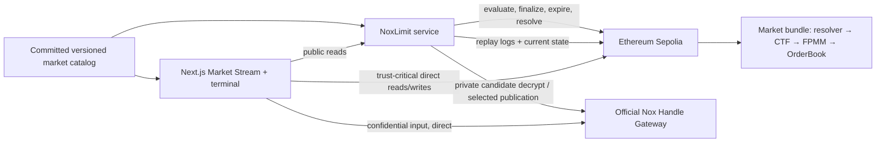

# NoxLimit Polished Product — Research-Backed Implementation Plan

**Status:** Active — Phases 0–5 and bounded operator hardening are complete. Phase 6 settlement is
partial/degraded: BTC has a complete real browser-resolution/winning-user-redemption/builder-LP-
redemption proof, while ETH is terminally rejected because its unique first post-deadline
observation arrived 24 seconds outside the immutable 3,600-second bound. Both active revision-5
successors retain that known one-hour liveness risk. Local container build/smoke passes; public
hosting and submission assets remain pending.
**Authorized:** 2026-07-28
**Authority:** Latest user build authorization →
[`../decisions/CURRENT.md`](../decisions/CURRENT.md) →
[`../architecture/2026-07-25-noxlimit-system-architecture.md`](../architecture/2026-07-25-noxlimit-system-architecture.md) →
[`../../prompts/04-polished-product-implementation.md`](../../prompts/04-polished-product-implementation.md)
**Designer contract:** [`../../DESIGNER_HANDOFF.md`](../../DESIGNER_HANDOFF.md) and
[`../design/2026-07-28-noxlimit-product-surface-map.md`](../design/2026-07-28-noxlimit-product-surface-map.md)

## 1. Outcome

Build and verify a polished Ethereum Sepolia product in which one wallet can:

1. browse a deterministic vertical Market Stream and enter a real curated BTC/USD or ETH/USD
   YES/NO market without local setup or faucet hunting;
2. inspect real oracle history, outcome-share history, seeded liquidity, and size-aware FPMM quotes;
3. create an order with a public side and amount plus a maximum average price sent directly from
   the browser to the official Nox Gateway confidential-input path;
4. close the browser while a bounded hosted evaluator monitors the real pool;
5. receive one atomic minimum-output-protected buy when eligible, or safely cancel/expire/refund;
6. see the resulting real outcome-share position;
7. observe objective settlement and redeem a winning position.

The first fresh product proof will cover one BTC/USD 4h and one ETH/USD 4h market. Additional
BTC/ETH horizons follow through deterministic bundle deployment. SOL is excluded from the live
catalog until its separate Pyth gate passes.

## 2. Reconciled starting point

### Established and accepted

- Nox `0.2.4`, Handle SDK `0.1.0-beta.13`, and Nox Hardhat plugin `0.1.0` are the released stack.
- The exact confidential comparison, viewer-only failed-check path, honest nonzero publication, proof
  validation, nonce isolation, replay rejection, and real FPMM buy execute locally.
- A live Ethereum Sepolia trace completed one Nox-authorized FPMM buy, forwarded exact outcome
  shares, left zero adapter dust/allowance, and rejected replay.
- The unmodified FPMM natively enforces `minOutcomeTokensToBuy` atomically.
- The canonical contract topology and post-gate A1–A3/F1–F3/C1–C3 corrections are accepted.
- Product selection, architecture selection, and Prompt 3 are closed.
- The root workspace now contains the hardened contracts, shared protocol, deterministic catalog,
  restart-safe service, and responsive web application; `spike/**` remains unchanged historical
  evidence.
- The fresh 2026-07-29 12:08Z root `pnpm check` records contracts `77`, protocol `14`, catalog `6`,
  service `65`, and web `61` passing tests (`223` total), including compile/type-check/test/build.
  The fresh dedicated Playwright snapshot records `45` passing journeys, `21` intentional
  project/viewport skips, and zero failures; rerun it at the submission commit.
- Phases 0–5 and bounded operator hardening are complete. On branch
  `codex/noxlimit-polished-product`, paired cutover commit `c073643` publishes runtime catalog
  revision `5` at `packages/catalog/sepolia/markets-2026-07-29-btc-eth-4h-rotated.json`, catalog
  hash `0x8aa65b0b5a91025ed1fd0e1487b9c9058b44ca05889632e9f85baf3bb3885899`.
- The original BTC/USD and ETH/USD 4h bundles are `RETIRED`, both verified revision-5 successors are
  `ACTIVE`, predecessor LP close evidence is committed, three real browser-off order/fill flows are
  committed, and the exercised service reported `READY`.
- The retired BTC predecessor completed objective browser resolution, real winning-user redemption,
  and builder-LP redemption. The retired ETH predecessor cannot resolve: its adjacent first
  post-deadline observation arrived after 3,624 seconds, 24 seconds outside its immutable one-hour
  bound; the selector rejected before a write and no payout/winner exists.
- New official Sepolia BTC/ETH deployments enforce a 14,400-second minimum observation-delay bound
  without changing first-observation adjacency. The active revision-5 successors predate the guard
  and retain their 3,600-second liveness risk. Runtime quote freshness stays independently 3,600
  seconds.
- Reproducible service/web container builds and local smoke checks pass. No durable public URL is
  verified.
- The six files in `.thoughts/design/html/` are the durable `Complement` design source. The
  production web implementation consumes the accepted design laws, not their sample values.

### Historical evidence, not product deployments

- `spike/market` and `spike/nox` remain immutable/reproducible evidence.
- The Gate C Sepolia bundle is disposable: it used a manual oracle/deployer, wall-clock question
  identity, permissive cadence, short recovery windows, and no objective resolver.
- Old `DROP`, `STOP`, checkpoint, and deadline-routing language does not control implementation.

### Genuine live-release unknowns and limitations

- replacement/retirement handling for the active revision-5 successors' known 3,600-second
  settlement-liveness risk before they are relied on for a public release;
- ETH recovery is not an unknown: the retired condition is terminally unresolvable and its user/LP
  positions remain unredeemable; no later round is authorized;
- durable public frontend/service URLs and final hosted-process monitoring evidence;
- final public repository/default-branch URL, demo video, X post, organizer form/contact values,
  final submission-commit test/browser run, and secret/artifact audit;
- Pyth historical-update semantics and live verification for SOL.

These unknowns are bounded implementation tasks. Only a failure of a load-bearing Nox, atomicity,
asset-safety, or objective-settlement assumption reopens the architecture.

## 3. Chosen product topology



### Database decision

The first product uses **no database**. Ethereum Sepolia is the durable event store; a committed
catalog identifies small, recent deployment ranges; one long-running service rebuilds an in-memory
read model from logs and authoritative current-state reads on every restart.

This is a deliberate product choice, not a mock shortcut:

- order and asset truth already lives onchain;
- a curated hackathon catalog keeps replay bounded;
- restarts are testable and do not depend on a hidden mutable database;
- it removes database deployment, migration, and split-brain failure from every user's path.

Add PostgreSQL only after the number/history of markets makes startup replay unacceptably slow, or
when multiple active service replicas need a shared cursor/cache. The database would remain a
rebuildable projection, never contract truth.

## 4. Integration Reality Matrix

| Surface | Current evidence | Product implementation | Verification / fallback |
|---|---|---|---|
| Nox contracts | Released `0.2.4`; local and live Gate C pass | Preserve exact contract primitives and typed proof wrapper | Clean Docker/Hardhat Nox tests; stop only on ABI/release failure |
| Handle Gateway | `beta.13` encrypt/decrypt/publicDecrypt path passed; source shows browser plaintext goes directly to `/v0/secrets` | Direct browser SDK call; worker sees zero or exact eligible limit, requests nonzero publication in the honest path, and never receives the initial input through the product API | Browser network test ensures no NoxLimit request/log contains the initial threshold; publication-state tests prove disclosure occurs before finalization; Gateway TEE/evaluator views are disclosed |
| FPMM/CTF | Exact pinned legacy packages; local lifecycle + live atomic buy pass | One seeded FPMM/condition per market; exact share-delta forwarding | Full local split/seed/buy/resolve/redeem; live vertical slice |
| Market close | Product OrderBook can time-gate; legacy FPMM cannot | Enforce close on every NoxLimit action; disable product quotes; remove builder LP before resolution | Boundary tests plus idempotent close-liquidity operator script; do not claim FPMM bytecode is time-gated |
| Chainlink BTC/ETH | Official Sepolia feeds verified; live cadence can exceed one hour and the retired ETH first observation arrived at +3,624s | Phase-aware adapter + one-shot resolver using the first chronological observation; future official-feed deployments require a 14,400s minimum delay bound | BTC resolved/redeemed; ETH produced a terminal no-write rejection; keep quote freshness at 3,600s and replace/retire risky one-hour successors before relying on them |
| Pyth SOL | Architecture/source candidate only | Separate historical-update adapter after BTC/ETH product works | SOL remains absent/verification-pending until fee, exponent, timestamp selection, and live redemption pass |
| Wallet | Injected wagmi/viem Sepolia connector, account/network guards, and wallet-signed writes are implemented | Keep one responsive wallet path; add another connector only if a real configured provider is required | Wrong-chain/account-change/rejection/duplicate-click browser tests pass locally; fresh live writes remain Phase 6 evidence |
| Charts | Oracle/FPMM history schemas and accessible real-point rendering are implemented | Lightweight accessible SVG/line rendering with explicit source, time, and sparse/unavailable states | Never fabricate OHLC/depth/volume; local browser history/quote inspection passes |
| Worker | Gate C plus three committed Phase 6 browser-off fills prove orchestration; the exercised service reported `READY` | One always-on TypeScript service, one replica, serialized service-account queue, restart reconstruction | The 65-test service suite covers restart/recovery; durable public hosting remains unverified |
| Index/read model | In-memory projections, replay/deduplication, and authoritative rereads are implemented; revision `5` is the current runtime catalog | Replay every cataloged OrderBook from `deploymentBlock`; overlap/dedupe/re-read nonterminal state | Service suite passes and the exercised Phase 6 service was `READY`; no public health URL is claimed yet |
| Catalog | Revision `5` is committed at `c073643`; original BTC/ETH routes are `RETIRED` and both successors are `ACTIVE` | Activate entries only after onchain invariant/provenance verification | Six catalog tests pass; runtime hash is `0x8aa65b0b5a91025ed1fd0e1487b9c9058b44ca05889632e9f85baf3bb3885899` |
| Test collateral | Gate C used explicit test assets/funding | Clearly named six-decimal Test USDC and bounded onchain claim path | Unit/integration tests; no production-value implication |
| Native gas | Worker provisioning and the BTC NO signed funding flow are committed; service readiness passed for the exercised runtime | Signed short-lived initial/refill request; service tops low wallets toward measured Sepolia ETH and Test USDC targets, never automatically | Onchain nonce/cooldown/per-refill/lifetime-cap idempotency; real balances and low-treasury health remain visible |
| Hosting/RPC | A live local/ephemeral runtime completed the fills, but no public frontend or service URL is verified | One web deployment, one long-running service container, dedicated Sepolia RPC, fixed worker/finalizer key | Public hosting remains an external release prerequisite; never substitute localhost/runtime readiness for a public URL |

## 5. Stack and source basis

### Runtime and workspace

- Node `22.22.3` for product and contracts, selected portably through `.nvmrc` and `PATH`.
- pnpm workspace; use the spike-verified pnpm `10.33.4` under Node 22 while preserving the spike
  lockfiles/package-manager declarations untouched.
- TypeScript `5.8.3` for the verified contract toolchain; application packages remain compatible
  with that pin unless a framework declaration proves otherwise.

### Contracts

- Solidity `0.8.35` for NoxLimit contracts because released `Nox.sol` requires it.
- Solidity `0.5.17`, EVM Istanbul, for legacy Gnosis CTF/FPMM deployment wrappers.
- Hardhat `3.9.0`, Nox plugin `0.1.0`, viem `2.48.1`, and the exact Gnosis/OpenZeppelin pins already
  exercised by the spikes.

### Web

The implemented compatibility family is:

- Next.js `16.2.4` App Router with React/React DOM `19.2.4`;
- wagmi `2.19.5`, viem `2.48.4`, and TanStack Query `5.99.2` with an injected Sepolia wallet;
- Handle SDK exactly `0.1.0-beta.13`, loaded only in the client wallet/Gateway island;
- local `Complement` CSS/tokens and responsive components; no RainbowKit, Tailwind, or generic
  dashboard theme was added;
- accessible SVG history rendering over source-provenanced real points; no Lightweight Charts
  dependency or synthetic chart data was added;
- the shared protocol's Zod schemas for every service/wire boundary;
- Node test coverage for domain/component behavior and Playwright/axe for browser journeys.

The pinned official Nox application remains source evidence at
`.thoughts/raw/iexec-nox-org/nox-product-poc/cVault/front/package.json`; the checked-in
`apps/web/package.json` and implementation are now the executable product authority. Current
library/API changes still require the repository's Context7 workflow before implementation.

### Service

- Node 22 + TypeScript;
- Fastify 5 for the read/health/funding API, using schemas at every external boundary;
- viem for logs, reads, writes, receipts, and serialized account actions;
- Handle SDK beta.13 for worker viewer decrypt and public proof retrieval;
- in-memory projections rebuilt from chain; no private limit fields in schemas or logs.

## 6. Target repository layout

```text
apps/
  web/
    src/app/
      page.tsx                         # canonical responsive shell
      discover/page.tsx                # optional alias/redirect; no duplicate interaction tree
      markets/[marketId]/page.tsx
      orders/[chainId]/[orderBook]/[orderId]/page.tsx
    src/components/
      discover/
      terminal/
      chart/
      liquidity/
      orders/
      positions/
      activity/
      onboarding/
      privacy/
      wallet/
    src/lib/
      api/
      contracts/
      nox/
      queries/
  service/
    src/api/
    src/catalog/
    src/indexer/
    src/read-model/
    src/worker/
    src/funding/
    src/resolver/

packages/
  contracts/
    contracts/
      NoxLimitOrderBook.sol
      market/
      oracle/
      testnet/
      interfaces/
      test/
    scripts/
    test/
  protocol/
    src/domain/
    src/contracts/
    src/markets.ts
    src/orders.ts
    src/positions.ts
    src/min-out.ts
    src/status.ts
  catalog/
    schema/
    sepolia/markets.json
    src/

spike/                    # preserved historical evidence; excluded from product workspace
```

## 7. Phased delivery plan

Each phase ends with executable evidence. A phase may expose an ordinary implementation bug; that
does not trigger a product reselection.

### Phase 0 — Workspace, contracts baseline, and quality harness

**Status:** Complete. The reproducible baseline remains recorded in `packages/contracts/README.md`;
the product contracts have since advanced beyond byte identity with the spike.

Deliver:

- root Node/pnpm workspace configuration that excludes `spike/**`;
- shared strict TypeScript/format/lint commands;
- a new `packages/contracts` copied from the verified OrderBook baseline, not an in-place spike
  conversion;
- dual Solidity compiler configuration and separate Nox local-network configuration;
- strict test runner that fails on Hardhat's misleading zero-exit test output;
- baseline Nox/FPMM tests ported and green before behavior changes.

Evidence:

- exact baseline test count and bytecode size recorded;
- spike hashes/evidence unchanged;
- clean offline install/build path documented.

### Phase 1 — Harden the product OrderBook (first mergeable slice)

**Status:** Complete locally. The hardened behavior, custom-error boundaries, six-decimal
accounting, gas snapshot, and size evidence are recorded in `packages/contracts/README.md`.

Implement A1–A3/F1–F2/C1:

- immutable `tradingClosesAt` and `expiresAt <= tradingClosesAt`;
- no evaluation, publication request, or nonzero finalize after order/NoxLimit close;
- no owner cancellation/abandonment from `PublicationPending`;
- evaluation timeout consumes the current check/nonce; next request increments nonce;
- explicit count/remaining-budget getters;
- derived `MonitoringExhausted` and impossible further checks;
- status/nonce/time-aware candidate getter;
- independent nonzero cadence/evaluation/publication recovery configuration.

Preserve:

- immutable single-market bindings;
- wallet/application-bound encrypted inputs;
- nonce-distinct candidates and global replay guards;
- restricted self-call, outer gas reserve, atomic FPMM `minOut`, callback validation, balance-delta
  forwarding, and separate refund.

Test first:

- exact custom errors for every boundary;
- timeout/nonce/count mutation tests;
- final-check exhaustion;
- stale candidate, late proof, cancel/publication race, expiry/close precedence;
- low finalizer gas, recipient revert/reentrancy, adverse pool movement, replay, reused handle,
  multi-order isolation, exact refund/dust/allowance behavior;
- runtime/init-code size and measured gas report.

### Phase 2 — Objective market bundle, test assets, and deterministic catalog

**Status:** Complete for the Phase 6 BTC/ETH 4h scope. Resolver-first original and successor bundles
are deployed and verified; revision `5` is a committed non-empty activated Sepolia catalog. The
original routes are retired after committed LP removal and both successors are active. SOL remains
outside the catalog pending its separate Pyth live gate.

Build in resolver-first order:

1. `ISettlementPriceAdapter` and phase-aware `ChainlinkRoundAdapter`;
2. one-shot `PriceBinaryResolver` with deterministic market/question identity;
3. Conditional Tokens condition;
4. seeded FPMM;
5. market-bound hardened OrderBook;
6. immutable market-record export plus a new versioned catalog activation revision.

Add:

- six-decimal `NoxLimit Test USDC` with bounded testnet claim behavior;
- product funding/sponsor contract or claim authorization needed for idempotent onboarding;
- deploy, seed, verify, close-liquidity, resolve, and export scripts;
- immutable market records with addresses, provenance, times, fee/policy, deployment block/txs, and
  verification evidence;
- versioned whole-manifest activation revisions with `catalogRevision`, previous-revision hash,
  effective time, and exactly one `ACTIVE` market ID per asset/horizon plus `SUCCESSOR`/`RETIRED`
  routing. Activation state is not mutated inside an immutable market record. The first revision
  that marks a market `ACTIVE` fixes its `opensAt` and `opensAtBlock`; later revisions preserve
  both, so `RECENTLY_OPENED` never falls back to deployment time.

The deploy action creates or resumes a journal before its first transaction. A fresh journal
freezes the plan/operator/chain/output binding, ordered expected steps, and exact funding plan; a
cross-process lock admits only one writer. Each step advances through
`INTENT → SUBMITTED → CONFIRMED`. Submitted and confirmed transactions resume without replacement;
a bare intent requires an explicit attempt-bound `ADOPT` with its transaction hash or `RETRY` with
its `expectedAttempt`. Secret-bearing JSON is rejected. Final evidence/catalog payloads are staged
and hash-verified before create-only publication, so a crash between output writes is recoverable
and idempotent. Market configuration requires the exact declared 1h/4h/24h duration and canonical
asset/strike/resolution-UTC question. Reused shared Test USDC must be operator-issued, and the
operator mints only the calculated pool/treasury shortfall.

Official Sepolia BTC/USD and ETH/USD deployment configuration must use
`maximumObservationDelaySeconds >= 14,400`. This is a liveness floor derived from observed
slightly-over-hourly testnet cadence and missed-report tolerance. It does not change the adapter's
unique selected pair: the selected observation must still be the first chronological post-deadline
round with its proved adjacent pre-deadline predecessor. Keep the independent runtime quote-
freshness limit at 3,600 seconds. Historical and already-deployed 3,600-second records remain
parseable evidence; their immutable market identities cannot be edited in place.

Successor cutover is one operator workflow:

`deploy → seed → immutable verification → mark SUCCESSOR → predecessor NoxLimit close → publish one
new revision that retires predecessor and activates successor → remove predecessor LP before
resolution`

The new revision fails validation if an asset/horizon has two active IDs, if the predecessor is
still ordering-open at the cutover, if the successor is not seeded/tradeable, or if any contract
binding/provenance changed after verification.

Runtime adoption uses an operator-only reload command, never a public API. The service loads and
validates the new immutable records, revision hash chain, activation `opensAt`/`opensAtBlock`,
one-active invariant, seeding, and successor cutover; completes the new OrderBook recovery replay;
then atomically swaps one catalog pointer. Any failure keeps the previous revision active. The web
reads `catalogRevision` from the service instead of shipping a second mutable catalog copy.

Tests:

- same-phase and cross-phase Chainlink adjacency;
- skipped/cherry-picked/early/invalid rounds;
- exact observation-delay boundaries and the live `+3,624s` regression: a one-hour resolver rejects
  while a future-policy-compliant resolver accepts the same unique pair;
- exact normalization, equality at strike, one-shot resolution, YES/NO payout and CTF redemption;
- unseeded/mismatched/duplicate/overwrite catalog rejection;
- manifest hash-chain/revision validation and atomic one-active-per-asset/horizon successor cutover;
- drained active pool becomes dynamically untradeable without invalidating immutable verification;
  intentional LP removal from a closed/resolved market remains valid retained history;
- full local resolver → condition → FPMM → OrderBook → fill → LP close → resolve → redeem.

### Phase 3 — Shared protocol/client package

**Status:** Implemented locally; `14` protocol tests pass in the final 2026-07-29 snapshot.

Implement one typed source of truth for web and service:

- `MarketView`, `MarketStreamCardView`, `MarketHistoryView`, `OrderRef`, `OrderView`, `PositionView`,
  named statuses, event types;
- separate market `verification`, catalog `activation`, objective `lifecycle`, dynamic
  `tradeability`, ordered `tradeabilityReasons`, and derived badges; `CLOSING_SOON` is never a
  lifecycle;
- overflow-safe BigInt `maxPrice → minOut` conversion and formatting;
- catalog validation and contract ABI exports;
- direct market/quote reads;
- unsigned transaction builders for create, cancel, expire, refund, finalize, resolve, redeem;
- order/position reconstruction helpers;
- explicit cached-public, wallet-scoped, and trust-critical-live read boundaries.
- JSON wire schemas encode block numbers, order IDs, atom amounts, and other unbounded integers as
  decimal strings; domain adapters validate and convert to `bigint` without floating point.

Tests:

- decimal/rounding/extreme-price properties;
- named status derivation including `MonitoringExhausted` and `ExpiryReady`;
- composite order reference isolation;
- stale quote/market-close rejection;
- market verification/lifecycle/tradeability mapping and exact close-boundary properties;
- schema rejects placeholders or non-Sepolia live entries.

### Phase 4 — Restart-safe worker, indexer, API, and funding service

**Status:** Implemented; `65` service tests pass. The service treats the configured catalog pointer
as startup authority and supports operator-only atomic verified SIGHUP adoption; phase-aware
oracle/FPMM history and staged runtime acceptance are covered. The exercised Phase 6 service
advanced three orders browser-off and reported `READY`; revision `5` is now the current runtime
catalog. This proves the runtime path, not durable public hosting; public service credentials/URL
and hosted monitoring remain release work.

Startup algorithm:

1. load and validate the current catalog revision plus immutable market records;
2. verify active/successor immutable code, bindings, resolver policy, and provenance; compute
   liquidity/oracle/indexer/evaluator tradeability separately because it changes over time;
3. replay the lightweight OrderBook lifecycle log for **every** catalog record from its
   `deploymentBlock` in bounded chunks, then re-read every discovered nonterminal order; this
   complete recovery scan is what identifies `Evaluating`, `PublicationPending`, expiry-ready, and
   refundable work after a restart;
4. eagerly replay full market/oracle/FPMM data only for active, successor, ordering-closed/
   unresolved, and wallet-requested bundles; resolved archive chart/detail history loads lazily and
   uses a bounded in-memory cache;
5. start overlapped block polling with deterministic deduplication;
6. start one serialized writer queue.

Worker behavior:

- `Open`: evaluate after creation, material quote movement, or heartbeat when cadence/budget/time
  allow;
- `Evaluating`: retrieve stored candidate and privately decrypt; zero produces no result-specific
  action, nonzero starts publication;
- `PublicationPending`: retrieve proof and permissionlessly finalize after restart;
- timeouts/expiry/close: advance only the valid recovery path;
- every write re-reads state, waits for receipt, and treats already-completed state as idempotent.

Public API:

```text
GET  /v1/markets?asset=&horizon=&lifecycle=&sort=&limit=&cursor=&snapshot=
GET  /v1/markets/:marketId
GET  /v1/markets/:marketId/history?mode=&range=&sampling=&limit=&cursor=
GET  /v1/markets/:marketId/quote?side=&amount=
GET  /v1/orders/:chainId/:orderBook/:orderId
GET  /v1/orders?owner=
GET  /v1/positions?owner=
GET  /v1/activity?marketId=&owner=
GET  /v1/health
POST /v1/funding/challenge
POST /v1/funding/claim
```

`GET /v1/markets` returns `{ catalogRevision, snapshot, items, nextCursor }`. `snapshot` binds the
stable cursor order to one catalog revision, filter/sort tuple, as-of time, and indexer safe block;
default `limit` is 20 and maximum is 50. Sorts are exactly:

- `CLOSING_SOON`: `tradingClosesAt ASC`, then `marketId ASC`;
- `RECENTLY_OPENED`: `opensAt DESC`, then `marketId ASC`;
- `LIQUIDITY`: integer `completeSetDepthAtoms DESC`, then `marketId ASC`.

Asset, horizon, and lifecycle are filters. `LIVE` maps to immutable `VERIFIED`, catalog `ACTIVE`,
lifecycle `ORDERING_OPEN`, and absence of the `NO_LIQUIDITY` reason; dynamic tradeability is
returned separately and only `TRADEABLE` enables entry. This keeps a temporarily stale,
indexer-unsafe, or evaluator-down active market visible with its exact disabled reasons, while a
drained/unseeded market leaves live discovery but remains available by deep link and in history.
`RESOLVING` maps to `ORDERING_CLOSED` or
`AWAITING_RESOLUTION`; `RESOLVED` maps to `RESOLVED_YES` or `RESOLVED_NO`. An intentionally drained
closed/resolved market remains valid history. Card prices are exact fee-inclusive average prices
for a canonical `1.000000 Test USDC` `calcBuyAmount` quote. `completeSetDepthAtoms` is the numeric
minimum of the FPMM's YES and NO reserves in six-decimal complete-set units and is the only
liquidity-sort key.

Card previews contain at most 24 deterministic points. Terminal history contains at most 240 per
page/range and preserves endpoints, settlement markers, and real fill markers when downsampling.
Underlying history walks Chainlink proxy phases/aggregator rounds (or the verified Pyth path) rather
than assuming oracle events contain the series; outcome history deterministically replays FPMM
funding/reserve/fill changes. Every response exposes source, from/to safe block, as-of time,
staleness, limited-history state, and cursor. Fewer than two real points produces no curve.

Dynamic reasons use one deterministic precedence—`UNVERIFIED`, `NOT_ACTIVE`, `ORDERING_CLOSED`,
`INDEXER_UNSAFE`, `ORACLE_STALE`, `NO_LIQUIDITY`, `EVALUATOR_UNAVAILABLE`—and expose the complete
ordered array plus the first reason as primary `tradeability`; an empty array means `TRADEABLE`.
Indexer safety is an unresolved reorg or more than six blocks of safe-head lag. Oracle staleness
uses the verified per-feed `oracleMaxAgeSeconds`; pool quote and evaluator heartbeat maximum ages
are 60 seconds. `NO_LIQUIDITY` means either reserve is zero or either canonical 1-Test-USDC quote
fails/returns zero. Badges use the response `asOf`: `NEW` for age below
`min(3600 seconds, horizon/4)`, `CLOSING_SOON` for positive remaining time at or below that same
threshold, `LOW_LIQUIDITY` for `0 < completeSetDepthAtoms < 50_000_000`, and `STALE` for a stale
oracle or pool snapshot. The first release versions these values with the shared domain contract.

The web may prefetch only public detail and compact history for the previous and next market in the
frozen ordered-ID snapshot. Prefetch uses deduplicated query keys, aborts on focus/filter/sort/
snapshot changes, and may fail without disturbing the current card. It never calls the Nox Gateway,
wallet/account endpoints, funding, writes, or the uncached final quote endpoint.

There is no API accepting `maxPrice`, `minOut`, ciphertext creation, decrypt, evaluation, or
publication from a public caller. Exact pre-sign quotes remain uncached.

Service readiness waits for the lightweight all-OrderBook recovery scan plus eager active/
unresolved market state, never the entire resolved oracle/FPMM chart archive. The release records
restart time for every catalogued OrderBook, six live bundles, and the retained unresolved set;
resolved-history pagination/lazy load must not delay `/v1/health`. If that bounded recovery scan
becomes unacceptably slow under the selected RPC, the documented escape hatch is a rebuildable,
chain-verified recovery checkpoint or PostgreSQL projection—not silently dropping history.

Tests:

- replay/reorg overlap and dedupe;
- restart in every active order state;
- worker zero/nonzero/Gateway timeout/receipt retry paths;
- serialized nonce writes and insufficient finalizer balance;
- API schema/status/privacy log audit;
- comparator permutation invariance, stable cursor pagination, exact close boundaries, lifecycle
  filter mapping, immutable-verification versus dynamic-tradeability transitions, and per-market
  verification isolation;
- drained-active versus intentionally drained resolved pools, successor cutover, card quote/depth
  formulas, phase-aware oracle history, FPMM replay/reorg determinism, sparse-history honesty, and
  six-live-plus-archive restart measurement;
- atomic catalog reload success/failure, stable first-activation `opensAt`/`opensAtBlock`, complete
  all-OrderBook recovery discovery, tradeability-reason precedence, and exact badge boundaries;
- signed short-lived funding request, no automatic refill, target/cooldown/cap enforcement,
  replay/partial-funding/service-down states.

### Phase 5 — Polished terminal

**Status:** Implemented from the durable `Complement` sources. Root `pnpm check` includes `61` web
tests and passes type-check/build. The fresh dedicated Playwright snapshot records `45` passing
journeys, `21` intentional project/viewport skips, and zero failures; it must be rerun at the
submission commit. Direct-Gateway privacy, real chart modes, funding readiness, and reload-safe
exact-hash locks for every wallet write are browser-covered.

Implement the surface map in vertical slices:

1. shell, mobile vertical Market Stream, desktop stream rail, selected-market facts,
   oracle/outcome chart, and quote ladder;
2. wallet/funding readiness and one-wallet Sepolia onboarding;
3. private ticket with exact live preflight, in-memory limit, direct Handle Gateway request,
   allowance, order signature, receipt;
4. My Orders and order detail timeline with durable browser-off reconstruction;
5. Positions, resolution/redemption, Activity, and privacy explainer;
6. responsive stream-to-terminal transitions and all loading/empty/error/stale/recovery states.

Interaction invariants:

- `/` is one canonical responsive shell: CSS/client composition presents the desktop terminal or
  mobile Discover without viewport-dependent server branching or two hidden interactive trees;
  `/discover` may only alias/redirect that shell, while `/markets/:marketId` is the durable market
  route. Sort/filter state may use query parameters; private drafts never do;
- keep `focusedMarketId` (the browsed Discover card) separate from `selectedMarketId` (the market
  loaded into the Trade workspace); only explicit Open/Trade/desktop activation or a confirmed
  dirty switch changes selection;
- maximum price never enters URL, local storage, analytics, NoxLimit API, server logs, or error
  reporting;
- public fields may remain in volatile per-market state, but a dirty market switch requires
  confirmation; clear the private in-memory value after a confirmed account/chain/market change,
  explicit discard, rejection, or finished flow, and never persist it;
- mobile ticket dismissal/back/swipe uses the same keep-editing/discard protection;
- `Trade YES` / `Trade NO` from a discovery card preselects market/side and opens a full-context
  Trade workspace containing the full question, oracle-versus-outcome distinction, liquidity,
  size-aware quote, terms, expandable full chart, private-limit/expiry/disclosure review, Gateway,
  and wallet steps—never a bare form;
- live cards come only from verified deployed/seeded catalog entries and use deterministic visible
  sorting—not fake personalization, engagement, or popularity;
- card values update in place, but a background ranking update cannot move the focused card; apply
  stable `marketId`-tied ordering only on a deliberate filter/sort/refresh action;
- one synchronous guard prevents duplicate wallet prompts;
- stale successful preflight cannot survive a later read error;
- no optimistic `Filled`; receipts and chain state control lifecycle;
- charts and activity contain real data only;
- Market Stream previews and the selected terminal use bounded accessible SVG/line rendering from
  public source-provenanced data; no third-party chart attribution is claimed or required by the
  current dependency set;
- Fastify JSON emits block numbers, order IDs, and other unbounded integers as decimal strings;
  validated client/domain adapters convert them to `bigint` where contract calls require it.

Tests:

- component states from the surface map;
- catalog filter/sort stability, `marketId` tie-breaking, adjacent-card prefetch, and no unverified
  live card;
- dirty desktop switch and mobile dismiss/back/swipe clear private values only after explicit
  discard/confirmed navigation, while no browser persistence contains them;
- wallet/chain/query-cache isolation;
- approval/order rejection and replacement;
- browser network/log assertion proving only the direct expected Gateway request contains the
  confidential input;
- responsive 390px/1440px paths, keyboard/focus/reduced-motion/contrast checks;
- mobile snap/ordinary-scroll parity, explicit previous/next navigation, and stream-position
  announcements;
- close/reopen reconstructs order without local private data.
- `Trade YES/NO` opens the full-context Trade workspace and causes no Gateway request, approval, or
  transaction until the explicit review action;
- production bundles/API responses contain no design-sample fixture values;
- touch/wheel/keyboard browsing changes focus only, not selected Trade state, and cannot destroy a
  draft; reduced motion disables snap/smooth scrolling while explicit previous/next remains usable;
- at 390px there is no page-level horizontal overflow and assistive technology sees only one
  responsive interaction tree.

### Phase 6 — Fresh live BTC/ETH vertical slice

**Status:** Partial/degraded. Deployment/live-readiness work is committed through funded original
BTC/ETH bundles, three real browser-off fills, predecessor LP close, and paired successor activation
at `c073643`. BTC then completed objective browser resolution, winning-user redemption, and builder-
LP redemption. ETH reached a terminal immutable-policy rejection, not `WAITING`: its unique first
post-deadline observation was 24 seconds late, no write occurred, no winner exists, and its user/LP
positions remain unredeemable. No public hosting claim exists yet.

Completed before adding breadth:

- current Chainlink proxy/phase handling is implemented and locally covered;
- deterministic original and successor BTC/USD 4h and ETH/USD 4h bundles are deployed, seeded with
  real Test USDC, and immutable-verified;
- signed user funding and a `READY` exercised service/worker path produced BTC NO, BTC YES, and ETH
  YES browser-off FPMM fills;
- both predecessor LP positions were removed after NoxLimit close; revision `5` atomically retired
  the predecessors and activated both successors;
- deployment, funding, order/fill, LP-close, successor, and catalog artifacts are committed;
- `.thoughts/evidence/2026-07-29-phase6-btc-resolution-redemption.json` proves the BTC browser
  resolution and winning-user redemption;
- `.thoughts/evidence/2026-07-29-sepolia-btc-usd-4h-liquidity-redemption.json` proves builder-LP
  redemption at receipt block `11375232`;
- `.thoughts/evidence/2026-07-29-sepolia-eth-usd-4h-resolution-policy-rejection.json` proves the
  accountless terminal ETH rejection with no write or payout;
- service/web container builds and local smoke checks pass.

Remaining, in order:

1. Preserve the completed BTC proof and terminal ETH rejection. Do not poll or write the retired ETH
   resolver again, infer an ETH winner, or substitute a later round.
2. Treat the active revision-5 successors as current routing with disclosed 3,600-second liveness
   risk. Before relying on a future bundle for release, deploy/verify/rotate through the existing
   resolver-first workflow with the enforced 14,400-second minimum.
3. Provision and verify public hosting with exactly one service writer, then produce the remaining
   submission URLs/assets and form/contact values.

No permissive Gate C cadence, 45-second recovery value, manual oracle, or disposable question ID is
allowed in this run.

### Phase 7 — Market breadth, design integration, and submission verification

**Status:** Pending revision-5 successor-risk handling and public release verification. One complete
BTC vertical is verified; ETH is a disclosed terminal limitation. Design integration itself is no
longer an external blocker; the six local HTML sources and responsive production surface are
present.

- deploy additional BTC/ETH 1h/4h/24h bundles through the same deterministic process;
- keep one active near-the-money bundle per asset/horizon initially, pre-verify its rolling
  successor, and expose the resulting BTC/ETH cards in the adopted Market Stream with visible
  `Closing soon`, `Recently opened`, and `Liquidity` sorts plus asset/horizon/lifecycle filters,
  without fragmenting seeded liquidity across unnecessary strikes;
- merge external design batches without weakening product laws or inventing data;
- measure startup replay, quote freshness, Nox timings, gas reserve, and funding amounts;
- run clean unit/property/adversarial/integration/restart/browser suites;
- audit all privacy, testnet, liquidity, security, and latency claims against evidence;
- prepare README, deployment/use docs, feedback, short demo script/video assets, and submission facts.

SOL remains a separate post-core work item and activates only after the Pyth adapter's live gate.

## 8. Universal user journey and success criteria

The final test is one uninterrupted product story:

```text
open the real Market Stream
→ select a market and enter its full terminal/ticket
→ connect one wallet
→ obtain Test ETH + Test USDC in-product
→ inspect a real market and real charts/quotes
→ enter public amount + private maximum price
→ send confidential input directly to Nox Gateway
→ approve and create a real escrowed order
→ close browser
→ worker fills against the real FPMM
→ reopen into durable Filled state and position
→ resolve from the documented oracle observation
→ redeem winning shares
```

Pass conditions:

- no local setup, external faucet hunt, second wallet, mock data, manual database edit, or hidden
  operator impersonation;
- Nox is indispensable to the real order authorization;
- maximum price is absent from NoxLimit-owned network requests/logs/storage while resting;
- public/confidential boundary is described exactly;
- atomic limit, replay, state, refund, settlement, and redemption invariants pass;
- a fresh reviewer can understand and enter the flow in roughly 30 seconds, without claiming the
  asynchronous fill itself completes in 30 seconds.

## 9. Hackathon risk standard

### Pre-submission blockers

- released Nox/Handle incompatibility in the actual browser/worker;
- inability to bind or one-shot-consume the real result;
- worse-than-limit fill or broken rollback;
- obvious escrow/share loss;
- non-objective or caller-cherry-pickable settlement;
- shipped mock/placeholder market data;
- the normal user path still requires local setup, external faucet hunting, or a second human.

### Important, but not pre-build vetoes

- production mainnet;
- professional audit or formal verification;
- decentralized/multi-replica workers;
- organic liquidity;
- production manipulation economics;
- latency SLA distribution;
- permissionless market creation, sells, partial fills, LP tooling, or CLOB breadth.

## 10. Immediate next implementation slice

Preserve the verified split outcome and make the next release routing safe:

1. Keep the BTC resolution/redemption and LP-redemption artifacts immutable and linked.
2. Treat the retired ETH rejection as terminal. Submit no ETH resolution transaction, infer no
   winner, and never substitute a later round.
3. Keep revision `5` named as current routing while disclosing that both active successors use the
   failed 3,600-second liveness parameter. Any new/replacement official-feed bundle must pass the
   enforced 14,400-second floor, immutable verification, and hash-linked successor cutover.
4. Re-run the phase-appropriate root/browser gates at the submission commit.
5. Provision and verify the public frontend/service URLs, then replace only evidence-backed video,
   X, repository, organizer-form, and contact placeholders.

One BTC create-to-redeem vertical is complete; a paired BTC/ETH vertical is not. Local container
build/check/smoke evidence exists, but public release assets do not.

Do not modify or rerun `spike/**`, revive design-sample data as live inventory, activate SOL before
its Pyth gate, or reopen product selection for ordinary deployment defects.
