# NoxLimit — Product and UX Brief

**Share this document with the product designer.** It explains the product, the user's mental model,
the full journey, the mandatory surfaces, and what the designer is free to invent. The exhaustive
screen/state contract lives in
[`.thoughts/design/2026-07-28-noxlimit-product-surface-map.md`](./.thoughts/design/2026-07-28-noxlimit-product-surface-map.md).
The adopted discovery interaction is recorded in
[`.thoughts/decisions/2026-07-28-noxlimit-market-stream-experience.md`](./.thoughts/decisions/2026-07-28-noxlimit-market-stream-experience.md).
For an AI designer, use the staged start-to-finish
[`prompts/05-designer-agent-handoff.md`](./prompts/05-designer-agent-handoff.md); it requires three
visual directions and user selection before full-screen production.

## The shortest explanation

**NoxLimit is a prediction-market discovery stream and terminal for private maximum-price
orders.**

A trader chooses a real BTC, ETH, or verified SOL price market, chooses YES or NO, deposits a public
amount, and enters a private maximum price. The order can rest while the browser is closed. A hosted
Nox evaluator checks real onchain AMM quotes without our application backend receiving the raw
limit. If a quote becomes good enough, one real outcome-share purchase executes atomically at or
better than the trader's limit.

A possible product line is:

> **Private limits for public outcomes.**

The exact brand line is open to design exploration; the meaning is not.

## Why this deserves to exist

Normal onchain limit instructions are commonly revealed to a venue, bot operator, or public
transaction flow before execution. A user can run personal infrastructure, but that is brittle and
requires remaining online. A normal hosted backend can monitor continuously, but it must know the
limit.

NoxLimit combines four properties in one user flow:

- the user keeps custody through a wallet-signed onchain order;
- the app backend does not receive the plaintext maximum price;
- monitoring continues after the browser closes;
- the unchanged public AMM atomically enforces the published minimum output at execution.

The privacy is intentionally narrow. NoxLimit is not an anonymous prediction market and does not
hide the user's wallet, chosen market, YES/NO side, amount, timing, resulting position, or
redemption.

## What the user is trading

Every market is a binary question such as:

> Will BTC/USD be at or above $65,000 at 14:00 UTC?

The market has two redeemable onchain assets:

- **YES shares** pay one unit of collateral each if the statement is true and zero otherwise.
- **NO shares** pay one unit of collateral each if the statement is false and zero otherwise.

A real fixed-product market maker holds YES and NO inventory and supplies size-aware quotes. The
pool is the mechanical counterparty; this is not a public buyer/seller order book. A separate price
oracle settles the question after the resolution time.

There are therefore two different prices on the screen:

1. **Underlying oracle price** — for example, BTC/USD at $64,872.13. This decides the winning
   outcome at resolution.
2. **Outcome-share price** — for example, YES at 0.47 Test USDC per share. This determines whether
   the user's limit can execute and how many YES/NO shares are received.

That distinction is one of the most important design problems in the product.

## Where the trading charts fit

The chart is the main analytical surface in the center of the full terminal—not a secondary
dashboard widget. It sits between the Market Stream rail and the private order ticket:

```text
Market Stream  →  market facts + TRADING CHART + real AMM quotes  →  private order ticket
```

It has two truthful modes or coordinated panes:

1. **Underlying** — a real BTC/USD, ETH/USD, or SOL/USD oracle line with the strike, NoxLimit order
   close, and resolution markers. This helps the user reason about whether YES or NO may win.
2. **Outcome prices** — real YES and NO price history reconstructed from FPMM reserves and
   completed trades. This helps the user choose a private maximum outcome-share price.

Completed NoxLimit fills can appear as real markers. A size-aware quote ladder beside or below the
chart shows `Test USDC in → shares out → average price → price impact` for several real trade
sizes. Clicking a size may populate the public amount field; it never chooses the user's private
limit.

Lightweight Charts is only the renderer. NoxLimit supplies oracle/pool data; there are no embedded
TradingView market feeds and no fabricated candles, volume, bids, asks, or order-book depth. If
history is sparse, the design shows honest line points and a `Limited history` state.

## Where the TikTok inspiration fits

The user explicitly chose a hybrid interaction:

> **TikTok-like discovery, DeepBook-like analysis, NoxLimit private execution.**

“TikTok-like” means a vertical, snap-aligned stream that lets someone focus on one real market at a
time. It does not mean social video, an opaque recommendation algorithm, or casual one-tap betting.

On mobile, `Discover` is the normal entry. Each full-height or near-full-height market card shows:

- the real market question;
- asset and original horizon;
- a separate countdown to `NoxLimit orders close`;
- current oracle price versus strike;
- YES and NO indicative FPMM prices;
- pool liquidity and lifecycle/freshness;
- a compact truthful chart preview;
- `Trade YES`, `Trade NO`, and `Open market` actions.

Vertical swiping moves among catalogued markets. A trade action opens a full-height Trade workspace
with the market and side preselected—not a bare form—and never executes immediately. That workspace
contains the full question, oracle versus strike, YES/NO prices, liquidity and size-aware quote,
close/resolution terms, and an expandable full chart alongside the ticket. The user still enters
amount/private maximum price/expiry, reviews what is public and confidential, and authorizes the
Gateway and wallet steps.

On desktop, the complete terminal remains primary. Its left rail becomes a richer vertically
scrollable Market Stream. Selecting a card updates the market facts, chart, quotes, and ticket. If a
ticket contains edited values, casual scrolling must not silently erase it. Public fields may stay
in volatile per-market state, but a market switch requires confirmation and then clears the private
maximum price. The private value is never persisted. Mobile sheet dismissal, back, or swipe-away
uses the same keep-editing/discard protection.

The first catalog is intentionally finite: BTC and ETH across 1h, 4h, and 24h can provide up to six
live cards; verified SOL can add three later. Only deployed, seeded, verified bundles appear live.
Use three visible deterministic sorts: `Closing soon` (`tradingClosesAt ASC`), `Recently opened`
(`opensAt DESC`), and `Liquidity` (numeric fixed-point complete-set depth `DESC`), each then
`marketId ASC`. Asset, horizon, and lifecycle are filters—not sort modes—and there is no fake
`For You` algorithm.
Resolving/resolved markets belong behind explicit lifecycle filters or history, not mixed into live
opportunities without explanation.
Live values update in place; background ranking cannot move the focused card. A deliberate filter,
sort, or refresh action may apply a new stable order with `marketId` tie-breaking.

Compact card previews use no more than 24 deterministic real points and always expose source,
as-of/freshness, and limited-history state. With fewer than two points, show no curve. Cards use a
lightweight accessible SVG; the selected terminal uses Lightweight Charts for its larger real-data
view.

The designer owns card composition, transitions, and visual rhythm. The hybrid itself is fixed:
the stream discovers; the terminal explains; the reviewed ticket acts.

## The product scope

The first complete product runs on **Ethereum Sepolia** and includes:

- curated BTC/USD and ETH/USD markets;
- SOL/USD only after its Pyth resolver is verified end to end;
- 1-hour, 4-hour, and 24-hour market horizons;
- real YES/NO Conditional Tokens shares and real seeded FPMM liquidity;
- a public variable Test USDC amount;
- a private maximum fee-inclusive average price;
- a visible, bounded number of confidential evaluation checks;
- browser-off monitoring;
- cancellation, expiry, refund, fill, position, objective resolution, and redemption;
- direct testnet onboarding, so no new user has to hunt for faucets.

There are multiple discrete market instances, not one perpetual BTC/ETH/SOL market. A market binds
one asset, strike, comparison, opening window, NoxLimit order close, resolution time, YES/NO token
pair, FPMM, and OrderBook. The `1h`, `4h`, or `24h` label describes its original horizon; the live
card shows the actual remaining countdown. The first catalog keeps liquidity coherent with one
active near-the-money market per asset/horizon, then rolls a verified replacement in as the current
one closes. Several different horizons can therefore be live at once, while resolved history stays
inspectable.

BTC, ETH, and SOL are tracked assets, not execution networks. Every first-version order, pool, and
position lives on Ethereum Sepolia.

The first version does **not** include:

- a permissionless market factory;
- a central limit order book or public bid/ask depth;
- matching between user orders;
- sells, early cash-out, partial fills, leverage, or an LP console;
- hidden side or hidden amount;
- Polymarket routing;
- a claim of anonymity, FHE, production mainnet, organic liquidity, or professional audit.

One technical truth affects the wording: the immutable close time stops **NoxLimit order actions**;
the unchanged legacy FPMM contract has no clock of its own. The product operator removes the
builder-seeded LP liquidity before resolution. Primary copy should therefore say `NoxLimit orders
close` rather than claiming that the FPMM bytecode itself closes.

## The user's mental model

The most approachable interpretation is:

> “Buy this outcome for me if the pool can give me enough shares for my money. Keep my maximum
> price away from the application backend while I wait, and continue checking after I leave.”

For example:

- The user chooses `Buy YES`.
- The public order amount is `25 Test USDC`.
- The private maximum price is `0.44 Test USDC per YES share`.
- That means the trade must receive at least `56.818182 YES`.
- The current pool quote is only `53.191489 YES`, an average of roughly `0.47`, so the order rests.
- Later, the real quote reaches `57.142857 YES`, an average of `0.4375`.
- Nox authorizes publication and the contract attempts one atomic buy.
- If the pool still returns at least the protected minimum, the user receives the shares. If not,
  the transaction cannot execute at a worse price.

The user enters a familiar maximum price; the application can describe the contract protection as
`Minimum shares` rather than exposing `minOut` jargon.

## The full user journey

### 1. Discover a live market, then enter its terminal

The user sees a real selected market immediately. On mobile this is the first card in the Market
Stream; on desktop it is the selected card beside the full terminal. Wallet connection is not
required to browse the stream or inspect the question, oracle price, outcome prices, liquidity, or
completed public fills.

The responsive experience contains:

- a vertical Market Stream with BTC/ETH/verified-SOL and 1h/4h/24h filters;
- one-market-at-a-time mobile cards and a richer stream rail on desktop;
- the selected question and exact market terms;
- a chart that can switch between the underlying oracle and real YES/NO price history;
- a truthful AMM quote ladder for several Test USDC sizes;
- the private order ticket;
- nearby access to My Orders, Positions, and Activity.

### 2. Connect and become transaction-ready

When the user chooses to trade, the app checks one wallet for:

- Ethereum Sepolia;
- enough Test ETH for transactions;
- enough Test USDC for the order.

If anything is missing, one in-product `Fund test wallet` route repairs it. The wallet signs a
short-lived funding request without paying gas; the NoxLimit sponsor service validates it and
funds both assets from a bounded testnet faucet/treasury:

- a small measured amount of native Sepolia ETH for gas;
- six-decimal `NoxLimit Test USDC` for pool collateral.

The user does not create a separate NoxLimit account or visit an external faucet. Native Sepolia
ETH is not the market collateral because Conditional Tokens expects an ERC-20; wrapping ETH would
add a step and make outcome-share payouts volatile. Test USDC preserves the intuitive `0–1 per
share` model. Every balance and action is visibly labeled testnet.

Funding is not a hidden infinite balance. The initial grant targets enough gas for one complete
lifecycle plus recovery and enough collateral for several real orders. Balances then decrease
normally and insufficient balance remains a real state. Nothing auto-refills. A returning user who
is genuinely low may explicitly request a cooldown- and lifetime-capped refill that tops the wallet
toward a target rather than continually adding funds. The exact targets come from measured product
gas and treasury policy.

### 3. Understand the selected market

Before ordering, the user can answer:

- What exact event am I trading?
- What is the strike?
- When do NoxLimit orders close?
- When does the market resolve?
- Which oracle settles it?
- What do YES and NO cost from the real pool right now?
- How does my trade size change my average price?

`NoxLimit orders close`, `Resolves`, and `Order expires` are separate fields. The interface should
never collapse them into one generic deadline.

### 4. Compose the private order

The ticket asks for four decisions:

1. `Buy YES` or `Buy NO`.
2. `Public amount` in Test USDC.
3. `Private maximum price` per outcome share.
4. `Order expiry`, always before NoxLimit orders close.

The preview shows the current real quote, implied minimum shares, minimum protected winning
redemption if execution occurs exactly at the limit, remaining market time, and number of
confidential checks. A better fill can return more shares. If the order is already eligible at the
current quote, the product explicitly says it may execute on the first check.

### 5. Review privacy and authorize the order

The user sees a compact, unambiguous summary:

- Public: wallet, recipient, market, side, amount, expiry, timing, and evaluation activity.
- Confidential while resting: maximum price / equivalent minimum shares.
- Public when public decryption is granted: the candidate; for a nonzero candidate, this is the
  minimum-output bound and reveals the effective maximum price before pool execution is finalized.

The browser invokes the official Nox Handle SDK directly for confidential input. The initial
plaintext value goes from the browser to the Nox Gateway confidential-input path; it is not
proxied, logged, or persisted by our application API, database, or analytics. The resulting
encrypted handle is used in the wallet-signed order. During monitoring, the fixed evaluator sees
zero for an ineligible check and learns the exact derived limit for an eligible check.

The user may complete two wallet transactions:

1. approve Test USDC if existing allowance is insufficient;
2. create and escrow the private order.

The interface keeps encryption, approval, and order creation visually distinct instead of hiding
them behind a fake instant-success animation.

### 6. Receive a durable receipt and leave

After confirmation, the receipt shows:

- `Resting privately` or the actual current state;
- market, side, public amount, recipient, and expiry;
- the real transaction and explorer link;
- checks used and remaining;
- a composite order reference;
- `Monitoring continues if you close this page`.

After a reload, a durable view says `Encrypted private limit` only while the order is resting or
evaluating; it must not imply that our server can redisplay the secret. From `Publication pending`
onward, it shows the publicly retrievable `Published minimum shares` and effective limit when
available, including Filled and Disclosed-refundable history. V1 does not persist or restore a
personal copy of the pre-publication maximum price.

### 7. Let Nox monitor while the browser is closed

The hosted evaluator checks after order creation, on meaningful public quote movement, or on a
conservative heartbeat. It respects the onchain minimum interval and the visible maximum number of
checks.

The user may later see:

- **Resting privately** — escrowed and waiting, with no active check.
- **Evaluating** — one confidential check is active.
- **Publication pending** — public decryption has been granted; the candidate is publicly
  retrievable while proof and finalization are pending. The honest worker enters this state only
  after observing a nonzero candidate, but the contract safely handles a mistaken/malicious zero.
- **Monitoring exhausted** — no confidential checks remain; the order is not secretly continuing.
- **Expiry ready** — the order expiry or NoxLimit trading close has passed, but someone still needs
  to submit the permissionless `Expire order` transaction.
- **Filled** — one atomic FPMM buy succeeded.
- **Cancelled / Expired / Refundable** — execution is no longer possible and collateral can be
  reclaimed through a separate refund transaction.

Closing and reopening the browser reconstructs this lifecycle. The UI never promises a fixed Nox
latency or fill time.

### 8. Handle cancellation, expiry, and refund honestly

An eligible resting/evaluating order can be cancelled by its owner. Once public decryption has
been requested, owner cancellation is disabled because the order's protected value is crossing
into public execution; allowing cancellation then would create a free option.

Cancellation and expiry do not magically return collateral. When time has elapsed, `Expiry ready`
first offers `Expire order`; the confirmed transaction changes the order to `Expired`. Cancelled or
Expired then exposes a separate `Claim refund` transaction. The balance changes only after that
transaction confirms.

### 9. Own a real position after a fill

A fill becomes a wallet-owned YES or NO position. The position view shows:

- shares received;
- collateral spent and realized average entry price;
- current indicative pool reference value, if available and explicitly labeled non-executable
  because v1 has no sell/cash-out path;
- winning redemption;
- market resolution state;
- source transaction.

There is no first-version sell or early cash-out button.

### 10. Resolve and redeem

After the configured time, anyone may submit the permissionless resolver transaction with the
required oracle evidence. The resolver accepts the first valid chronological observation at or
after resolution and compares it with the strike. The resolution detail shows the accepted
observation, timestamp, source, winning outcome, and onchain transaction; the UI does not imply
that resolution happens automatically at the timestamp.

Winning shares become redeemable for Test USDC; losing shares settle to zero. Redemption is a real
wallet-signed transaction and finishes with a receipt and balance change.

## User-flow overview

```mermaid
flowchart LR
    A["Browse the real Market Stream"] --> A2["Open a selected market or choose Trade YES / NO"]
    A2 --> B["Connect and fund one Sepolia wallet"]
    B --> C["Confirm YES or NO in the full ticket"]
    C --> D["Set public amount"]
    D --> E["Set private maximum price"]
    E --> F["Review and send input directly to Nox Gateway"]
    F --> G["Approve and create escrowed order"]
    G --> H["Rest while browser may be closed"]
    H --> I{"Candidate observed by evaluator"}
    I -->|"Zero; checks remain"| J["Rest privately until the next eligible check"]
    J --> H
    I -->|"Zero; no checks remain"| ME["Monitoring exhausted"]
    ME --> CA["Cancel or replace"]
    CA --> RF["Claim refund after cancellation"]
    I -->|"Nonzero"| K["Grant public decryption; bound becomes public"]
    K --> K2["Prove result and attempt atomic pool buy"]
    K2 --> X{"Pool execution succeeds?"}
    X -->|"Yes"| L["Filled position"]
    X -->|"No"| DR["Disclosed refundable"]
    DR --> RF
    L --> M["Oracle resolution"]
    M --> N["Redeem winner or settle loser"]
```



## Privacy wording the design must preserve

Recommended short disclosure:

> Your maximum price goes directly to the Nox Gateway and stays encrypted while resting—not
> invisible. Our application backend never receives the initial plaintext. The evaluator learns
> the exact derived limit on an eligible check, and public decryption exposes it before the pool
> trade is finalized.

The positive claim is:

> The initial Nox input travels directly from your browser to the Nox Gateway, bypassing our
> application API, database, and analytics. During monitoring, the fixed evaluator learns failure
> from zero or the exact derived limit when the check is eligible.

Do not say:

- `The secret never leaves your device`;
- `Anonymous` or `fully private`;
- `No one can infer anything`;
- `FHE` or `zero knowledge`;
- `Guaranteed fill` or `instant execution`.

## Required product surfaces

The design must cover all of these, including relevant loading, empty, stale, error, pending,
success, and recovery states:

1. Global testnet shell and wallet/funding readiness.
2. Curated Market Stream/catalog: full mobile discovery cards and desktop terminal rail.
3. Selected market terms and contract provenance.
4. Underlying-oracle and YES/NO outcome-price chart modes.
5. Real AMM quote ladder and recent completed fills.
6. Private order ticket.
7. Review → Nox input → allowance → create-order sequence.
8. Durable order receipt.
9. My Orders list.
10. Order detail and check/publication/fill timeline.
11. Positions.
12. Objective resolution and redemption.
13. Activity.
14. Testnet onboarding/funding.
15. Privacy explainer.

The complete state-by-state specification and replaceable sample data are in the
[product surface map](./.thoughts/design/2026-07-28-noxlimit-product-surface-map.md).

## Visual and interaction brief

The designer owns the visual language. Palette, typography, spacing, density, motion, icons, chart
appearance, and brand expression are intentionally not prescribed here.

The useful conceptual tension is:

> A transparent public market surrounds one deliberately protected instruction.

The interface should feel like a focused trading instrument, not a generic card dashboard and not
a sci-fi privacy gimmick. It needs enough density to support comparison and confidence, while the
order action remains understandable to someone who has never traded outcome shares.

The signature experience should come from the product mechanic itself:

- discovery moves fluidly through real market questions without reducing them to one-tap bets;
- the private field is clearly differentiated without looking disabled or mysterious;
- the user can see a bounded monitoring journey after leaving;
- public market evidence and private-instruction status coexist honestly;
- a filled limit transforms visibly into an owned outcome-share position.

Constraints:

- no fake depth chart, bids, asks, candlesticks, volume, or activity;
- no placeholder market can look live;
- status cannot rely on color alone;
- chart values always have accessible text, units, source, and timestamp;
- mobile is a deliberate flow, not a compressed desktop terminal;
- mobile vertical snap behavior has reduced-motion and assistive-input fallbacks;
- no social-feed furniture, fake popularity, autoplay media, or personalized-ranking claims;
- WCAG 2.2 AA contrast, keyboard behavior, focus management, and reduced motion are required.

## Suggested design batches

### Batch A — The terminal

- shell, mobile Market Stream discovery, desktop stream rail, and selected-market transition;
- selected-market facts and chart;
- AMM quote ladder and recent fills;
- private order ticket.

### Batch B — The private-order lifecycle

- review/encrypt/approve/create flow;
- confirmed receipt;
- My Orders lifecycle variants;
- detailed execution timeline.

### Batch C — The complete product

- positions;
- resolution and redemption;
- onboarding/funding;
- activity and privacy explainer.

For each batch, provide desktop (~1440px) and mobile (~390px) frames, component variants, all
applicable system states, interaction notes, reusable variables/tokens, and a note for any proposed
product change. We should review batches while they are small rather than discovering product-flow
drift after the full app is styled.

## What is fixed and what is open

Fixed:

- product mechanics, data honesty, the Market Stream → terminal → reviewed-order hierarchy,
  status/action rules, a universal one-wallet first-use path, and public/confidential claims;
- Ethereum Sepolia, real FPMM quotes/shares, curated markets, and no CLOB;
- exact lifecycle through fill, refund, resolution, and redemption.

Open to the designer:

- brand identity and art direction;
- exact responsive composition;
- exact stream-card composition, motion rhythm, and transition into the terminal/ticket;
- chart visual treatment within real-data limits;
- drawer/sheet/route decisions for details;
- motion and the visual signature;
- component styling and information-density choices.

Implementation-dependent, so the design should remain adaptable:

- exact test-funding service and cooldown;
- amount of real chart history available initially;
- exact worker cadence and maximum checks after measured runs;
- whether SOL is active at first launch.

## Design review checklist

A design batch is ready for implementation only if the answer to each relevant question is yes:

- Can a new user explain the market question, the oracle price, and the YES/NO pool price?
- Can a user browse several real markets quickly without mistaking the stream for personalized or
  one-tap wagering?
- Does mobile discovery lead naturally into the full analytical/review context before signing?
- Does switching a desktop stream selection protect any edited order draft?
- Can they create the order without learning `minOut`, TEE, CTF, or FPMM jargon?
- Is it obvious which fields are public and which one is private while resting?
- Does the design avoid implying that the secret never leaves the device?
- Does it show `Publication pending` as the point where resting confidentiality has ended, even if
  execution later fails?
- Is browser-off monitoring believable and bounded rather than magical?
- Are `Evaluating` and `Publication pending` visibly different?
- Is `Monitoring exhausted` actionable rather than silently open?
- Is `Expiry ready → Expire order → Claim refund` explicit?
- Are cancellation and refund clearly separate?
- Can the user trace a fill into a real position and then redemption?
- Are all data visualizations based on real sources and labeled with units/time?
- Can the shortest journey work with one wallet and no local setup?
- Are the mobile, keyboard, low-vision, loading, error, stale, and recovery experiences specified?

## Supporting sources inside the repository

- [Product stories](./.thoughts/stories/2026-07-28-noxlimit-product-stories.md)
- [Exhaustive product surface map](./.thoughts/design/2026-07-28-noxlimit-product-surface-map.md)
- [Canonical system architecture](./.thoughts/architecture/2026-07-25-noxlimit-system-architecture.md)
- [DeepBook patterns adapted for NoxLimit](./.thoughts/research/2026-07-28-deepbook-patterns-for-noxlimit.md)
- [Verified live critical path](./.thoughts/verification/2026-07-28-noxlimit-critical-path.md)
